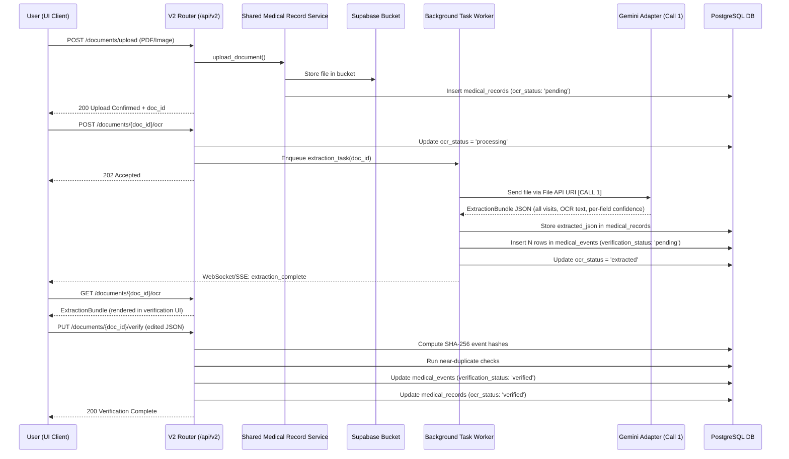
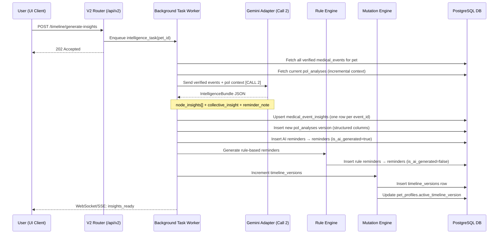
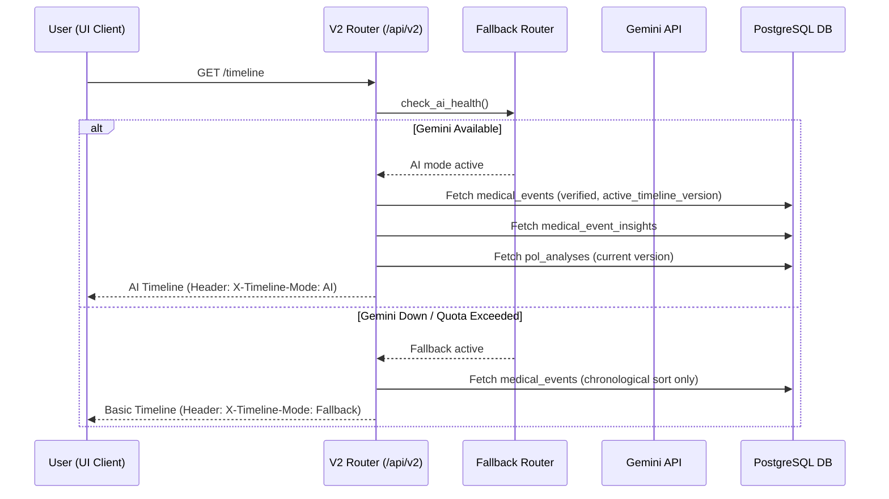
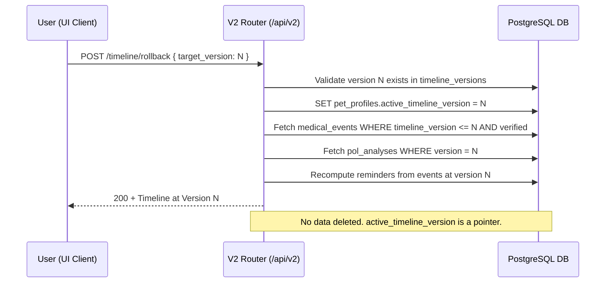

# PetOLife AI Timeline — Backend & Database Implementation Specification
## Version 5.0 (2-Call Architecture)

**Previous Version:** 4.0
**Change Summary:** Added `medical_event_insights` table, restructured `pol_analyses` into typed columns, added `extracted_json` and `active_timeline_version` fields, added `medical_event_insights` router, added async task endpoints, added rollback endpoint, updated all sequence diagrams to reflect 2-call flow, added token logging to Gemini adapter, and defined near-duplicate thresholds.

---

## 1. System Overview & Integration Strategy

This document defines the backend API, service layout, and database schema for the PetOLife AI Timeline feature.

The AI Timeline is integrated directly into the existing PetOLife MVP V2 application. The integration follows an **isolated V2 architecture** to prevent regressions in the base V1 app:

1. **Routing Isolation:** Existing V1 endpoints (`/api/...`) remain unchanged and active. All new AI Timeline features are exposed under `/api/v2/...`.
2. **Logic Reusability:** Common database operations are extracted into a **Shared Service Layer**. Both V1 and V2 routers delegate to this shared layer.
3. **Timeline Feature Isolation:** All timeline-specific AI processing logic, Gemini adapters, extraction schemas, and mutation logic are encapsulated under `backend/app/timeline/`.
4. **Database Backward Compatibility:** Database updates are strictly additive. New columns on existing V1 tables are nullable with defaults.
5. **2-Call Gemini Constraint:** Every upload produces exactly two Gemini calls regardless of diary size. Both calls are backgrounded and never block HTTP request threads.

---

## 2. Integrated Backend Folder Architecture

```text
backend/
├── app/
│   ├── main.py                          # Updated to mount V2 routers under /api/v2
│   ├── config.py                        # Loads SUPABASE_URL, GEMINI_API_KEY, etc.
│   ├── supabase_client.py               # Central Supabase client wrapper
│   ├── routers/
│   │   ├── auth.py                      # V1 Auth router (unchanged)
│   │   ├── checklist.py                 # V1 Checklist router (unchanged)
│   │   ├── location.py                  # V1 Location/Pincode router (unchanged)
│   │   ├── medical_records.py           # V1 Medical Records (refactored → shared service)
│   │   ├── pet_health_id.py             # V1 Pet Health ID router (unchanged)
│   │   ├── pet_profile.py               # V1 Pet Profile (refactored → shared service)
│   │   ├── user_profile.py              # V1 User Profile router (unchanged)
│   │   └── v2/                          # [NEW] Version 2 Routers
│   │       ├── __init__.py
│   │       ├── pet_profile.py           # [NEW] V2 Pet router
│   │       ├── medical_records.py       # [NEW] V2 Medical Records
│   │       ├── ocr.py                   # [NEW] V2 OCR extraction routes
│   │       ├── timeline.py              # [NEW] V2 Timeline + rollback endpoint
│   │       ├── insights.py              # [NEW] V2 Node, Collective, & POL Bot queries
│   │       ├── reminders.py             # [NEW] V2 Reminders calendar endpoint
│   │       └── community.py             # [NEW] V2 Consent and community queries
│   ├── services/                        # [NEW] Shared Service Layer
│   │   ├── __init__.py
│   │   ├── pet_service.py               # [NEW] Reusable Pet CRUD operations
│   │   └── medical_record_service.py    # [NEW] Reusable storage upload and retrieval
│   ├── timeline/                        # [NEW] Isolated Timeline Sub-Package
│   │   ├── __init__.py
│   │   ├── schemas/
│   │   │   ├── extraction.py            # [NEW] ExtractionBundle Pydantic models
│   │   │   ├── intelligence.py          # [NEW] IntelligenceBundle Pydantic models
│   │   │   ├── events.py                # [NEW] MedicalEventNode schemas
│   │   │   ├── insights.py              # [NEW] NodeInsight and CollectiveInsight models
│   │   │   └── reminders.py             # [NEW] Reminder models
│   │   ├── services/
│   │   │   ├── ocr_service.py           # [NEW] Call 1 — Unified Extraction orchestration
│   │   │   ├── insight_engine.py        # [NEW] Call 2 — Unified Intelligence orchestration
│   │   │   ├── event_builder.py         # [NEW] Verified JSON → MedicalEventNode
│   │   │   ├── mutation_engine.py       # [NEW] Immutable append-only version increments
│   │   │   ├── reminder_engine.py       # [NEW] Rule engine + AI reminder merge
│   │   │   ├── community_engine.py      # [NEW] Similarity matching and anonymisation
│   │   │   └── fallback_router.py       # [NEW] Health monitor + rule-based fallback
│   │   └── adapters/
│   │       ├── ai_provider_base.py      # [NEW] Abstract AI provider interface
│   │       └── gemini_adapter.py        # [NEW] Gemini client with token logging
│   └── utils/
│       └── auth.py                      # JWT validation (reused by V2)
```

---

## 3. Shared Service Layer Design

```python
# app/services/pet_service.py
from app.supabase_client import supabase

class PetService:
    @staticmethod
    async def get_all_user_pets(user_id: str):
        response = supabase.table("pet_profiles").select("*").eq("user_id", user_id).execute()
        return response.data

    @staticmethod
    async def get_pet_by_id(pet_id: str, user_id: str):
        response = supabase.table("pet_profiles").select("*, pet_ids(*)").eq("id", pet_id).execute()
        return response.data[0] if response.data else None
```

```python
# app/routers/pet_profile.py (V1 Router — refactored)
from fastapi import APIRouter, Depends
from app.services.pet_service import PetService
from app.utils.auth import get_current_user

router = APIRouter(prefix="/api/pet-profile", tags=["V1 Pet Profile"])

@router.get("/")
async def get_pets(current_user = Depends(get_current_user)):
    return await PetService.get_all_user_pets(current_user.id)
```

```python
# app/routers/v2/pet_profile.py (V2 Router — reuses service)
from fastapi import APIRouter, Depends
from app.services.pet_service import PetService
from app.utils.auth import get_current_user

router = APIRouter(prefix="/api/v2/pets", tags=["V2 Pet Profile"])

@router.get("/")
async def get_pets_v2(current_user = Depends(get_current_user)):
    pets = await PetService.get_all_user_pets(current_user.id)
    return {"status": "success", "data": pets}
```

---

## 4. Gemini Adapter with Token Logging

Every Gemini call logs usage data. This is mandatory, not optional.

```python
# app/timeline/adapters/gemini_adapter.py

class GeminiAdapter(AIProviderBase):

    async def call_extraction(self, file_uri: str, pet_id: str) -> ExtractionBundle:
        """Call 1 — Unified Extraction."""
        response = await self._client.generate_content(
            model="gemini-2.0-flash",
            contents=[file_uri, EXTRACTION_PROMPT],
            generation_config={"response_mime_type": "application/json"}
        )
        await self._log_token_usage(
            operation="call_1_extraction",
            pet_id=pet_id,
            input_tokens=response.usage_metadata.prompt_token_count,
            output_tokens=response.usage_metadata.candidates_token_count,
        )
        return ExtractionBundle.model_validate_json(response.text)

    async def call_intelligence(self, verified_events: list, pol_context: dict, pet_id: str) -> IntelligenceBundle:
        """Call 2 — Unified Intelligence."""
        payload = {
            "verified_events": verified_events,
            "existing_summary": pol_context
        }
        response = await self._client.generate_content(
            model="gemini-2.0-flash",
            contents=[json.dumps(payload), INTELLIGENCE_PROMPT],
            generation_config={"response_mime_type": "application/json"}
        )
        await self._log_token_usage(
            operation="call_2_intelligence",
            pet_id=pet_id,
            input_tokens=response.usage_metadata.prompt_token_count,
            output_tokens=response.usage_metadata.candidates_token_count,
        )
        return IntelligenceBundle.model_validate_json(response.text)

    async def _log_token_usage(self, operation: str, pet_id: str, input_tokens: int, output_tokens: int):
        supabase.table("ai_token_logs").insert({
            "operation": operation,
            "pet_id": pet_id,
            "input_tokens": input_tokens,
            "output_tokens": output_tokens,
            "model_version": self.model_version,
            "logged_at": datetime.utcnow().isoformat()
        }).execute()
```

---

## 5. Near-Duplicate Detection Thresholds

These thresholds are applied in `mutation_engine.py` during conflict resolution:

```python
# app/timeline/services/mutation_engine.py

NEAR_DUPLICATE_CONFIG = {
    "date_proximity_days": 3,       # Visit dates within 3 days = same visit candidate
    "doctor_similarity_score": 0.80, # Levenshtein ratio threshold
    "diagnosis_overlap_pct": 0.60,   # 60% of diagnosis tokens must overlap
    "medication_overlap_pct": 0.50,  # 50% of medication names must overlap
}

# Resolution logic:
# All four conditions exceed threshold → auto-merge
# Two or three conditions exceed threshold → flag for manual user review
# Fewer than two → treat as a distinct new event
```

---

## 6. Reminder Engine Boundary

```python
# app/timeline/services/reminder_engine.py

RULE_ENGINE_OWNS = [
    "vaccination",      # Annual / schedule-based
    "deworming",        # Every 90 days
    "anti_tick",        # Schedule-based
    "medication_end",   # End-of-course reminder
]

AI_REMINDER_INTERPRETS = [
    "follow_up",        # Doctor note implies future review without explicit date
    "monitoring",       # Doctor note implies condition/weight monitoring
    "conditional",      # "Review if symptoms persist" style notes
]

# Rule engine always runs first.
# AI reminder rows (from IntelligenceBundle.reminder_note) are only inserted
# for AI_REMINDER_INTERPRETS types, with is_ai_generated=true.
# Both sets are deduplicated before frontend queries.
```

---

## 7. FastAPI V2 Router Hierarchy

All V2 endpoints require a valid Supabase JWT in `Authorization: Bearer <token>`.

### 7.1. V2 Documents & Uploads

`POST /api/v2/pets/{pet_id}/documents/upload`
- Uploads medical files (PDFs/Images) to Supabase Storage
- Inserts row in `medical_records` with `ocr_status = 'pending'`
- Returns `doc_id`

`GET /api/v2/pets/{pet_id}/documents`
- Lists all records including `ocr_status`

`DELETE /api/v2/pets/{pet_id}/documents/{doc_id}`
- Deletes record row and storage file

### 7.2. V2 OCR Pipeline (Call 1 — Async)

`POST /api/v2/pets/{pet_id}/documents/{doc_id}/ocr`
- Enqueues background extraction task
- Immediately updates `ocr_status = 'processing'`
- Returns `202 Accepted`
- Background task executes Call 1 (Gemini Unified Extraction)
- On completion: stores `ExtractionBundle` in `medical_records.extracted_json`, inserts `medical_events` rows (status: `pending`), updates `ocr_status = 'extracted'`, sends WebSocket/SSE notification

`GET /api/v2/pets/{pet_id}/documents/{doc_id}/ocr`
- Polls extraction status and returns `ExtractionBundle` when ready

### 7.3. V2 Verification

`PUT /api/v2/pets/{pet_id}/documents/{doc_id}/verify`
- Receives user-reviewed and edited JSON
- Computes SHA-256 event hash
- Runs duplicate/near-duplicate checks
- Updates `medical_events` rows to `verification_status = 'verified'`
- Updates `medical_records.ocr_status = 'verified'`

### 7.4. V2 Intelligence Generation (Call 2 — Async)

`POST /api/v2/pets/{pet_id}/timeline/generate-insights`
- Enqueues background intelligence task
- Returns `202 Accepted`
- Background task fetches all verified `medical_events` + current `pol_analyses` context
- Executes Call 2 (Gemini Unified Intelligence)
- On completion:
  - Upserts `medical_event_insights` rows (one per `event_id`)
  - Updates `pol_analyses` (new version, structured columns)
  - Inserts AI reminders into `reminders` (`is_ai_generated = true`)
  - Runs rule engine → inserts rule-based reminders (`is_ai_generated = false`)
  - Runs `mutation_engine.py` → increments `timeline_versions`
  - Sends WebSocket/SSE notification

`GET /api/v2/pets/{pet_id}/timeline/insights-status`
- Polls Call 2 processing status

### 7.5. V2 Timeline

`GET /api/v2/pets/{pet_id}/timeline`
- Returns chronological list of events for the pet's `active_timeline_version`
- Checks Gemini health: sets `X-Timeline-Mode: AI` or `X-Timeline-Mode: Fallback` header

`POST /api/v2/pets/{pet_id}/timeline/fallback-form`
- Submits manual Vet Visit Form when AI is unavailable
- Inserts a rule-based `medical_events` row (same schema as AI path)

`POST /api/v2/pets/{pet_id}/timeline/rollback`
- Body: `{ "target_version": N }`
- Sets `pet_profiles.active_timeline_version = N`
- Returns timeline at version N without deleting any data

### 7.6. V2 AI Insights

`GET /api/v2/pets/{pet_id}/insights/node/{event_id}`
- Returns `medical_event_insights` row for a single event
- Includes `human_summary`, `visit_understanding`, `suggested_actions`, `medical_disclaimer`

`GET /api/v2/pets/{pet_id}/insights/collective`
- Returns `pol_analyses` structured columns for the current version

### 7.7. V2 Reminders

`GET /api/v2/pets/{pet_id}/reminders`
- Returns merged rule-based + AI reminders from `reminders` table
- Supports query params: `?type=vaccination&status=pending&range=monthly`

### 7.8. V2 Community Insights

`PUT /api/v2/pets/{pet_id}/community/consent`
- Toggles `community_consent.mode` between `private` and `anonymous`
- On revocation: triggers deletion of associated `experience_cards` rows

`GET /api/v2/community/insights`
- Query similarity cases based on species, breed, diagnosis, age range

---

## 8. Database Schema & Versioning Strategy

All changes are strictly additive. V1 app runs on the updated database without modification.

### 8.1. Migration File Naming

```
backend/supabase/migrations/20260714120000_add_v2_timeline_tables.sql
```

### 8.2. Additive Updates to Existing V1 Tables

#### Table: `medical_records` (V1 table — additive columns)

```sql
ALTER TABLE medical_records
ADD COLUMN IF NOT EXISTS ocr_status TEXT DEFAULT 'pending'
    CHECK (ocr_status IN ('pending', 'processing', 'extracted', 'verified', 'failed')),
ADD COLUMN IF NOT EXISTS ocr_extracted_at TIMESTAMPTZ,
ADD COLUMN IF NOT EXISTS ocr_error TEXT,
ADD COLUMN IF NOT EXISTS extracted_json JSONB;
-- extracted_json stores the full ExtractionBundle from Call 1
```

#### Table: `pet_profiles` (V1 table — additive column)

```sql
ALTER TABLE pet_profiles
ADD COLUMN IF NOT EXISTS active_timeline_version INTEGER DEFAULT NULL;
-- NULL means no timeline yet. Used by rollback endpoint.
```

### 8.3. New V2 Tables

#### Table: `timeline_versions`

```sql
CREATE TABLE IF NOT EXISTS timeline_versions (
    id UUID PRIMARY KEY DEFAULT gen_random_uuid(),
    pet_id UUID NOT NULL REFERENCES pet_profiles(id) ON DELETE CASCADE,
    version_number INTEGER NOT NULL,
    created_at TIMESTAMPTZ NOT NULL DEFAULT now(),
    changelog TEXT,
    UNIQUE(pet_id, version_number)
);

CREATE INDEX IF NOT EXISTS idx_timeline_versions_pet ON timeline_versions(pet_id);
```

#### Table: `medical_events`

```sql
CREATE TABLE IF NOT EXISTS medical_events (
    id UUID PRIMARY KEY DEFAULT gen_random_uuid(),
    pet_id UUID NOT NULL REFERENCES pet_profiles(id) ON DELETE CASCADE,
    timeline_version INTEGER NOT NULL,
    source_document_id UUID REFERENCES medical_records(id) ON DELETE SET NULL,
    source_page_range JSONB,                          -- e.g. [1, 3] from ExtractionBundle
    event_hash VARCHAR(64) NOT NULL,
    confidence FLOAT NOT NULL CHECK (confidence >= 0.0 AND confidence <= 1.0),
    field_confidence JSONB NOT NULL DEFAULT '{}',     -- per-field confidence scores
    verification_status TEXT NOT NULL DEFAULT 'pending'
        CHECK (verification_status IN ('pending', 'verified', 'rejected', 'superseded')),
    event_type TEXT NOT NULL,
    event_data JSONB NOT NULL DEFAULT '{}',
    created_at TIMESTAMPTZ NOT NULL DEFAULT now(),
    updated_at TIMESTAMPTZ NOT NULL DEFAULT now(),
    ai_version VARCHAR(32)
);

CREATE INDEX IF NOT EXISTS idx_medical_events_pet_version ON medical_events(pet_id, timeline_version);
CREATE INDEX IF NOT EXISTS idx_medical_events_hash ON medical_events(event_hash);
CREATE INDEX IF NOT EXISTS idx_medical_events_data ON medical_events USING gin (event_data);
CREATE INDEX IF NOT EXISTS idx_medical_events_status ON medical_events(pet_id, verification_status);
```

#### Table: `medical_event_insights` ← NEW in v5.0

Stores per-node AI insights from `IntelligenceBundle.node_insights[]`. This table was missing in v4.0.

```sql
CREATE TABLE IF NOT EXISTS medical_event_insights (
    id UUID PRIMARY KEY DEFAULT gen_random_uuid(),
    event_id UUID NOT NULL REFERENCES medical_events(id) ON DELETE CASCADE,
    pet_id UUID NOT NULL REFERENCES pet_profiles(id) ON DELETE CASCADE,
    human_summary TEXT,
    visit_understanding TEXT,
    suggested_actions JSONB NOT NULL DEFAULT '[]',
    medical_disclaimer TEXT NOT NULL
        DEFAULT 'This is informational only and not a substitute for veterinary advice.',
    ai_model_version VARCHAR(32),
    generated_at TIMESTAMPTZ NOT NULL DEFAULT now(),
    UNIQUE(event_id)                                  -- one insight row per event
);

CREATE INDEX IF NOT EXISTS idx_event_insights_pet ON medical_event_insights(pet_id);
CREATE INDEX IF NOT EXISTS idx_event_insights_event ON medical_event_insights(event_id);
```

#### Table: `pol_analyses` ← Restructured in v5.0 (typed columns replace single JSONB blob)

```sql
CREATE TABLE IF NOT EXISTS pol_analyses (
    id UUID PRIMARY KEY DEFAULT gen_random_uuid(),
    pet_id UUID NOT NULL REFERENCES pet_profiles(id) ON DELETE CASCADE,
    version INTEGER NOT NULL,
    -- Structured columns replacing single summary JSONB blob
    overall_summary TEXT,
    hierarchical_summary JSONB NOT NULL DEFAULT '{}',  -- by_year, by_condition, treatment_progression
    active_conditions JSONB NOT NULL DEFAULT '[]',
    vaccination_status JSONB NOT NULL DEFAULT '{}',
    -- Metadata
    insight_version INTEGER NOT NULL DEFAULT 1,
    token_count INTEGER,                               -- total tokens used to generate this version
    created_at TIMESTAMPTZ NOT NULL DEFAULT now(),
    UNIQUE(pet_id, version)
);

CREATE INDEX IF NOT EXISTS idx_pol_analyses_pet ON pol_analyses(pet_id);
```

#### Table: `reminders`

```sql
CREATE TABLE IF NOT EXISTS reminders (
    id UUID PRIMARY KEY DEFAULT gen_random_uuid(),
    pet_id UUID NOT NULL REFERENCES pet_profiles(id) ON DELETE CASCADE,
    source_event_id UUID REFERENCES medical_events(id) ON DELETE CASCADE,
    type TEXT NOT NULL CHECK (type IN (
        'vaccination', 'deworming', 'anti_tick', 'medication_end',
        'follow_up', 'monitoring', 'conditional'
    )),
    title TEXT NOT NULL,
    due_date DATE NOT NULL,
    frequency TEXT CHECK (frequency IN ('daily', 'weekly', 'monthly', 'quarterly', 'yearly')),
    priority TEXT NOT NULL DEFAULT 'medium' CHECK (priority IN ('high', 'medium', 'low')),
    status TEXT NOT NULL DEFAULT 'pending' CHECK (status IN ('pending', 'completed', 'missed')),
    is_ai_generated BOOLEAN NOT NULL DEFAULT false,
    created_at TIMESTAMPTZ NOT NULL DEFAULT now()
);

CREATE INDEX IF NOT EXISTS idx_reminders_pet_date ON reminders(pet_id, due_date);
CREATE INDEX IF NOT EXISTS idx_reminders_pet_status ON reminders(pet_id, status);
```

#### Table: `community_consent`

```sql
CREATE TABLE IF NOT EXISTS community_consent (
    pet_id UUID PRIMARY KEY REFERENCES pet_profiles(id) ON DELETE CASCADE,
    mode TEXT NOT NULL DEFAULT 'private' CHECK (mode IN ('private', 'anonymous')),
    updated_at TIMESTAMPTZ NOT NULL DEFAULT now()
);
```

#### Table: `experience_cards`

```sql
CREATE TABLE IF NOT EXISTS experience_cards (
    id UUID PRIMARY KEY DEFAULT gen_random_uuid(),
    anonymous_pet_id UUID NOT NULL,   -- SHA-256 hash of real pet_id — never a FK
    species TEXT NOT NULL,
    breed TEXT,
    diagnosis TEXT NOT NULL,
    medication TEXT,
    age_at_event INTEGER,
    weight_at_event FLOAT,
    outcome_stats JSONB NOT NULL DEFAULT '{}',
    created_at TIMESTAMPTZ NOT NULL DEFAULT now()
);

CREATE INDEX IF NOT EXISTS idx_exp_cards_lookup ON experience_cards(species, breed, diagnosis);
```

#### Table: `ai_token_logs` ← NEW in v5.0

```sql
CREATE TABLE IF NOT EXISTS ai_token_logs (
    id UUID PRIMARY KEY DEFAULT gen_random_uuid(),
    operation TEXT NOT NULL,           -- 'call_1_extraction' | 'call_2_intelligence'
    pet_id UUID REFERENCES pet_profiles(id) ON DELETE SET NULL,
    input_tokens INTEGER NOT NULL,
    output_tokens INTEGER NOT NULL,
    model_version VARCHAR(32),
    logged_at TIMESTAMPTZ NOT NULL DEFAULT now()
);

CREATE INDEX IF NOT EXISTS idx_token_logs_pet ON ai_token_logs(pet_id);
CREATE INDEX IF NOT EXISTS idx_token_logs_operation ON ai_token_logs(operation, logged_at);
```

---

## 9. End-to-End Integrated Workflows

### 9.1. Upload, Call 1 Extraction & Verification Flow



### 9.2. Call 2 Intelligence Generation Flow



### 9.3. Fallback Healthcheck & Timeline Generation Flow



### 9.4. Rollback Flow



---

## 10. Migration & Rollback Strategy

### Deployment Order

1. Apply SQL migrations to Supabase (additive — V1 app continues running safely)
2. Deploy backend with V2 routers, shared services, and timeline module
3. Deploy frontend with updated `TimelinePage.jsx` calling `/api/v2/...` endpoints

### Revert Strategy

- Frontend rolled back to timeline placeholder — V1 endpoints unaffected
- `app/routers/v2/` directory reverted — V1 routers continue unchanged
- Database changes are additive: reverting code does not require schema rollback

### Schema Change Summary (v4.0 → v5.0)

| Change | Table | Type |
|---|---|---|
| Add `extracted_json JSONB` | `medical_records` | Additive column |
| Add `active_timeline_version INTEGER` | `pet_profiles` | Additive column |
| Add `source_page_range JSONB`, `field_confidence JSONB`, `superseded` status | `medical_events` | Additive columns + check constraint update |
| New table | `medical_event_insights` | New |
| Replace `summary JSONB` with typed columns | `pol_analyses` | Restructured |
| Add `frequency`, `priority`, `anti_tick`, `monitoring`, `conditional` types | `reminders` | Additive columns + check constraint update |
| New table | `ai_token_logs` | New |