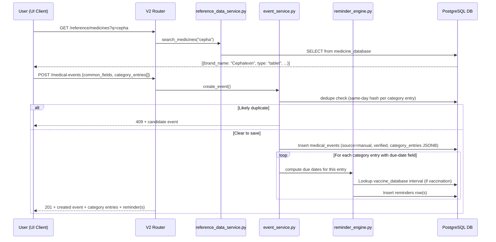
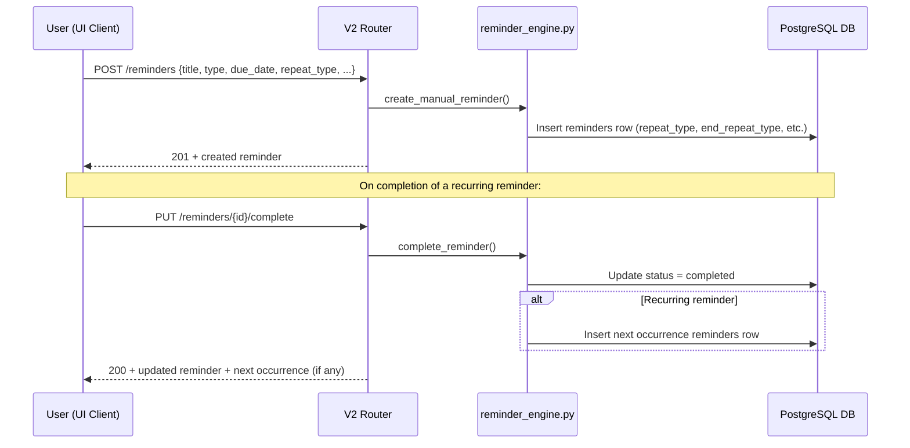
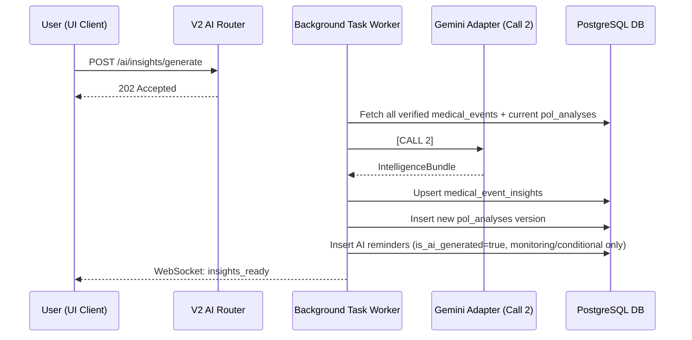

# PetOLife AI Timeline — Backend & Database Implementation Specification
## Version 7.0 (Master Form + Generalized Form Types / AI-Optional Overlay)

**Previous Version:** 6.0 (Category-first, single-category-per-entry form)

**Change Summary (v6.0 → v7.0):** Major form-architecture restructure. The Vet Visit Form becomes a **Master Form** with common fields + dynamically added category sections, replacing the single-category-per-submission model. `medical_events` is restructured: visit-level common fields (event_time, visit_type, reason_for_visit, overall_notes, follow_up_notes) are added as first-class columns, and category-specific data moves to a `category_entries JSONB` array supporting the 3 generalized form types (Consultation & Vitals, Treatment & Medication, Procedure & Diagnostics). New reference data tables added: `medicine_database`, `vaccine_database`, `shampoo_database`, `clinic_database`. The `reminders` table expands to support manual creation, recurring schedules, and the full Add/Edit Reminder form fields. PDF Export API expands with format/template/preview options. All Phase 2 (AI) schemas remain unchanged and additive.

---

## 1. System Overview & Integration Strategy

This document defines the backend API, service layout, and database schema for the PetOLife medical record feature, split cleanly into **Phase 1 (core, no AI)** and **Phase 2 (optional AI overlay)**.

Integration strategy, unchanged from v6.0:

1. **Routing Isolation:** Existing V1 endpoints (`/api/...`) remain unchanged. New features live under `/api/v2/...`.
2. **Logic Reusability:** Common database operations sit in a **Shared Service Layer**, used by both V1 and V2 routers.
3. **Feature Isolation:** Category/timeline/reminder/document logic lives under `backend/app/timeline/`. AI-specific code (extraction, insights, Gemini adapter) lives under `backend/app/timeline/ai/`, a clearly separated sub-package that can be entirely absent from a Phase 1-only deployment.
4. **Database Backward Compatibility:** All schema changes remain additive.
5. **Zero AI Dependency for Phase 1:** No endpoint required for F1–F6 (Ch. 3 of the architecture doc) calls Gemini, directly or indirectly. Phase 1 endpoints have no async task queue requirement — they are synchronous CRUD.
6. **Phase 2 keeps the 2-Call Gemini constraint** from v6.0: one call for diary extraction, one call for intelligence generation, both backgrounded.

---

## 2. Integrated Backend Folder Architecture

```text
backend/
├── app/
│   ├── main.py                          # Mounts V2 routers under /api/v2
│   ├── config.py                        # SUPABASE_URL always required; GEMINI_API_KEY optional
│   ├── supabase_client.py
│   ├── routers/
│   │   ├── auth.py                      # V1 (unchanged)
│   │   ├── checklist.py                 # V1 (unchanged)
│   │   ├── location.py                  # V1 (unchanged)
│   │   ├── medical_records.py           # V1 (refactored → shared service)
│   │   ├── pet_health_id.py             # V1 (unchanged)
│   │   ├── pet_profile.py               # V1 (refactored → shared service)
│   │   ├── user_profile.py              # V1 (unchanged)
│   │   └── v2/
│   │       ├── __init__.py
│   │       ├── pet_profile.py           # [Phase 1] V2 Pet router
│   │       ├── medical_events.py        # [Phase 1] Master Vet Visit Form CRUD
│   │       ├── timeline.py              # [Phase 1] Category + chronological views
│   │       ├── reminders.py             # [Phase 1] Reminder CRUD + calendar endpoint
│   │       ├── documents.py             # [Phase 1] Documents vault CRUD
│   │       ├── export.py                # [Phase 1] PDF/CSV/Excel export + preview
│   │       ├── reference_data.py        # [Phase 1] Medicine/Vaccine/Shampoo/Clinic lookups
│   │       └── ai/                      # [Phase 2 — only mounted if GEMINI_API_KEY is set]
│   │           ├── __init__.py
│   │           ├── extraction.py        # [Phase 2] Diary upload + Call 1
│   │           ├── insights.py          # [Phase 2] Call 2 + insight queries
│   │           └── community.py         # [Phase 3, stub only]
│   ├── services/                        # Shared Service Layer
│   │   ├── __init__.py
│   │   ├── pet_service.py
│   │   └── medical_record_service.py    # V1 document upload/retrieval (reused)
│   ├── timeline/                        # Phase 1 — pure logic, no AI import allowed
│   │   ├── __init__.py
│   │   ├── schemas/
│   │   │   ├── medical_event.py         # [Phase 1] MedicalEventNode schema (master form model)
│   │   │   ├── category_entry.py        # [Phase 1] Category entry schemas (3 form types)
│   │   │   ├── reminder.py              # [Phase 1] Reminder schema (auto + manual + recurring)
│   │   │   └── reference_data.py        # [Phase 1] Medicine/Vaccine/Shampoo/Clinic schemas
│   │   ├── services/
│   │   │   ├── event_service.py         # [Phase 1] Create/update/delete medical_events
│   │   │   ├── category_engine.py       # [Phase 1] Category-grouped + chronological queries
│   │   │   ├── reminder_engine.py       # [Phase 1] Auto-generated + manual + recurring logic
│   │   │   ├── document_service.py      # [Phase 1] Attachment upload/retrieval
│   │   │   ├── export_service.py        # [Phase 1] PDF/CSV/Excel generation + preview
│   │   │   ├── reference_data_service.py # [Phase 1] Medicine/Vaccine/Clinic search & lookup
│   │   │   └── dedupe_service.py        # [Phase 1] Same-day hash duplicate warning
│   │   └── ai/                          # Phase 2 — isolated, optional package
│   │       ├── schemas/
│   │       │   ├── extraction.py        # ExtractionBundle / draft_events models
│   │       │   └── intelligence.py      # IntelligenceBundle models
│   │       ├── services/
│   │       │   ├── extraction_service.py   # Call 1 orchestration → drafts into medical_events
│   │       │   ├── insight_engine.py       # Call 2 orchestration
│   │       │   └── ai_reminder_merge.py    # Merges AI reminders into reminder_engine output
│   │       └── adapters/
│   │           ├── ai_provider_base.py
│   │           └── gemini_adapter.py    # Token logging built in
│   └── utils/
│       └── auth.py
```

**Deployment note:** `app/timeline/ai/` and `app/routers/v2/ai/` can be omitted entirely from a build with `GEMINI_API_KEY` unset. `app/timeline/services/` has no import dependency on anything under `ai/` — this is enforced by code review, not just convention, so Phase 1 genuinely cannot be broken by Phase 2 code.

---

## 3. Shared Service Layer (unchanged from v6.0)

```python
# app/services/pet_service.py
from app.supabase_client import supabase

class PetService:
    @staticmethod
    async def get_all_user_pets(user_id: str):
        response = supabase.table("pet_profiles").select("*").eq("user_id", user_id).execute()
        return response.data

    @staticmethod
    async def get_pet_by_id(pet_id: str, user_id: str):
        response = supabase.table("pet_profiles").select("*").eq("id", pet_id).execute()
        return response.data[0] if response.data else None
```

---

## 4. Phase 1 — FastAPI V2 Router Hierarchy (No AI, Fully Synchronous)

All V2 endpoints require a valid Supabase JWT in `Authorization: Bearer <token>`.

### 4.1 Pet Profile

`POST /api/v2/pets` — create pet profile (name, species, breed, DOB, health conditions)
`GET /api/v2/pets` / `GET /api/v2/pets/{pet_id}` — list / fetch
`PUT /api/v2/pets/{pet_id}` — update profile fields

### 4.2 Master Vet Visit Form → Medical Events

`POST /api/v2/pets/{pet_id}/medical-events`
- Body:
```json
{
  "event_date": "2025-03-04",
  "event_time": "10:30",
  "clinic_id": "uuid-or-null",
  "clinic_name": "New Clinic Name",
  "vet_name": "Dr. Smith",
  "visit_type": ["routine_checkup", "vaccination"],
  "reason_for_visit": "Annual checkup",
  "overall_notes": "Pet is generally healthy",
  "follow_up_date": "2025-03-18",
  "follow_up_notes": "Check wound healing",
  "attachments": ["file-id-1", "file-id-2"],
  "category_entries": [
    {
      "category": "diagnosis",
      "form_type": "consultation_vitals",
      "item_name": "Routine Checkup",
      "date_logged": "2025-03-04",
      "status": "normal",
      "next_due_date": null,
      "notes": "All vitals normal",
      "category_fields": {
        "weight": 12.5,
        "weight_unit": "kg",
        "temperature": 38.5,
        "temperature_unit": "celsius",
        "body_condition_score": 5,
        "diagnoses": [
          {
            "diagnosis_category": "general",
            "diagnosis_name": "Healthy",
            "status": "confirmed",
            "clinical_notes": "No concerns"
          }
        ]
      }
    },
    {
      "category": "vaccination",
      "form_type": "treatment_medication",
      "item_name": "Rabies",
      "date_logged": "2025-03-04",
      "status": "up_to_date",
      "next_due_date": "2026-03-04",
      "notes": "Annual booster administered",
      "category_fields": {
        "dose": "1ml",
        "route": "injection",
        "site": "scruff"
      }
    }
  ]
}
```
- Runs `dedupe_service` same-day hash check per category entry → if a likely duplicate exists, returns `409` with the candidate for the client to show a "save anyway?" prompt (client can resubmit with `force=true`)
- Auto-computes rule-engine-suggested due dates (vaccination/deworming/anti-tick) server-side and returns them for the client to render as pre-filled/editable
- Inserts row with `source='manual'`, `verification_status='verified'`, `visit_group_id` auto-generated
- Synchronously runs `reminder_engine.py` for each category entry and inserts the resulting `reminders` row(s)
- Returns `201` with the created event, all category entries, and any reminder(s) created — this powers the "Added to [Category] · Next reminder: [date]" confirmation toast

`GET /api/v2/pets/{pet_id}/medical-events?category=vaccination` — filtered list by category, newest first
`GET /api/v2/pets/{pet_id}/medical-events/{event_id}` — single event with all category entries
`PUT /api/v2/pets/{pet_id}/medical-events/{event_id}` — edit common fields and/or category entries; writes one `edit_history` row per update, re-runs the reminder engine if a due-date-relevant field changed
`DELETE /api/v2/pets/{pet_id}/medical-events/{event_id}` — soft-delete; cascades to linked `reminders` and `medical_documents`
`POST /api/v2/pets/{pet_id}/medical-events/{event_id}/entries` — add a new category entry to an existing visit

### 4.3 Timeline

`GET /api/v2/pets/{pet_id}/timeline` — default: category-grouped response, one bucket per category, each sorted `event_date DESC`
`GET /api/v2/pets/{pet_id}/timeline?view=chronological` — flat, all-category, date-sorted feed
`GET /api/v2/pets/{pet_id}/timeline/visit/{visit_group_id}` — reconstructs all entries from one physical visit

### 4.4 Reminders

`GET /api/v2/pets/{pet_id}/reminders` — merged reminder list; query params `?type=&status=&range=monthly&repeat=`
`POST /api/v2/pets/{pet_id}/reminders` — create a manual or recurring reminder (uses the Add/Edit Reminder form fields)
- Body:
```json
{
  "title": "Monthly Flea Treatment",
  "type": "anti_tick",
  "description": "Apply Frontline Plus",
  "due_date": "2025-04-01",
  "due_time": "09:00",
  "priority": "medium",
  "repeat_type": "monthly",
  "custom_repeat_interval": null,
  "custom_repeat_unit": null,
  "end_repeat_type": "never",
  "linked_event_id": null,
  "notes": "Apply between shoulder blades"
}
```
`PUT /api/v2/pets/{pet_id}/reminders/{reminder_id}` — edit any reminder field
`PUT /api/v2/pets/{pet_id}/reminders/{reminder_id}/complete` — mark completed; auto-generates next occurrence for recurring reminders
`PUT /api/v2/pets/{pet_id}/reminders/{reminder_id}/snooze` — reschedule
`DELETE /api/v2/pets/{pet_id}/reminders/{reminder_id}` — delete reminder (and all future recurrences)

### 4.5 Documents Vault

`POST /api/v2/pets/{pet_id}/documents/upload` — upload a file, optionally linked to `event_id`
`GET /api/v2/pets/{pet_id}/documents` — list, optional `?event_id=`
`DELETE /api/v2/pets/{pet_id}/documents/{doc_id}`

### 4.6 Export (PDF / CSV / Excel)

`POST /api/v2/pets/{pet_id}/export`
- Body:
```json
{
  "format": "pdf",
  "template": "full_report",
  "date_from": "2024-01-01",
  "date_to": "2025-03-04",
  "categories": ["vaccination", "medication"],
  "include_attachments": true,
  "include_vet_notes": true
}
```
- `format`: `pdf` | `csv` | `excel`
- `template` (PDF only): `full_report` | `summary_only` | `vaccination_card` | `medication_list`
- Returns a generated file (or a signed URL to one) — no AI involvement, direct template rendering from `medical_events` rows

`POST /api/v2/pets/{pet_id}/export/preview`
- Same body as above, returns a lightweight preview (first page PDF render or summary data) for in-app display before download

### 4.7 Reference Data Lookups

`GET /api/v2/reference/medicines?q=&type=&limit=` — searchable medicine database (brand name, composition, type)
`GET /api/v2/reference/vaccines?species=` — species-filtered vaccine list with auto-due-date rules
`GET /api/v2/reference/shampoos?category=` — medicated shampoo brands by category
`GET /api/v2/reference/clinics?q=&limit=` — searchable clinic database
`POST /api/v2/reference/clinics` — add a new clinic (from "Add New" in the form dropdown)
`GET /api/v2/reference/diagnoses?category=` — diagnosis names filtered by diagnosis category
`GET /api/v2/reference/injection-sites?route=` — injection sites filtered by route (IV/IM/SC)

None of the above endpoints touch `app/timeline/ai/` in any way.

---

## 5. Phase 1 — Database Schema

### 5.1 `pet_profiles` (V1 table — additive columns)

```sql
ALTER TABLE pet_profiles
ADD COLUMN IF NOT EXISTS species TEXT,
ADD COLUMN IF NOT EXISTS breed TEXT,
ADD COLUMN IF NOT EXISTS date_of_birth DATE,
ADD COLUMN IF NOT EXISTS health_conditions JSONB DEFAULT '[]';
```

### 5.2 `medical_events` (Master Form model)

```sql
CREATE TABLE IF NOT EXISTS medical_events (
    id UUID PRIMARY KEY DEFAULT gen_random_uuid(),
    pet_id UUID NOT NULL REFERENCES pet_profiles(id) ON DELETE CASCADE,
    visit_group_id UUID NOT NULL DEFAULT gen_random_uuid(),

    -- Common Fields (top of master form)
    event_date DATE NOT NULL,
    event_time TIME,
    clinic_id UUID REFERENCES clinic_database(id) ON DELETE SET NULL,
    clinic_name TEXT,                              -- denormalised for display; synced with clinic_database
    vet_name TEXT,
    visit_type JSONB NOT NULL DEFAULT '[]',        -- multi-select chips: ["routine_checkup", "vaccination"]
    reason_for_visit TEXT,                         -- max 500 chars
    overall_notes TEXT,                            -- max 1000 chars
    follow_up_date DATE,
    follow_up_notes TEXT,                          -- max 300 chars

    -- Category Entries (JSONB array — one entry per category section added)
    -- Each entry has: category, form_type, item_name, date_logged, status, next_due_date,
    -- notes, attachments, category_fields (the 30% context-specific JSONB)
    category_entries JSONB NOT NULL DEFAULT '[]',

    -- Metadata
    event_hash VARCHAR(64),
    source TEXT NOT NULL DEFAULT 'manual' CHECK (source IN ('manual', 'ai_extracted')),
    verification_status TEXT NOT NULL DEFAULT 'verified'
        CHECK (verification_status IN ('verified', 'pending', 'rejected')),
    created_at TIMESTAMPTZ NOT NULL DEFAULT now(),
    updated_at TIMESTAMPTZ NOT NULL DEFAULT now()
);

CREATE INDEX IF NOT EXISTS idx_medical_events_pet_date
    ON medical_events(pet_id, event_date DESC);
CREATE INDEX IF NOT EXISTS idx_medical_events_visit_group
    ON medical_events(visit_group_id);
CREATE INDEX IF NOT EXISTS idx_medical_events_hash
    ON medical_events(pet_id, event_hash);
CREATE INDEX IF NOT EXISTS idx_medical_events_status
    ON medical_events(pet_id, verification_status);

-- GIN index for querying category_entries by category
CREATE INDEX IF NOT EXISTS idx_medical_events_categories
    ON medical_events USING GIN (category_entries jsonb_path_ops);
```

**`category_entries` JSONB Structure** (per entry in the array):

```json
{
  "entry_id": "uuid",
  "category": "medication",
  "form_type": "treatment_medication",
  "item_name": "Cephalexin",
  "date_logged": "2025-03-04",
  "status": "active",
  "next_due_date": "2025-03-14",
  "notes": "Complete full course",
  "attachments": ["file-id"],
  "category_fields": {
    "medicine_type": "tablet",
    "dose": "1",
    "dose_unit": "tablet",
    "frequency": ["morning", "night"],
    "food_relation": "after_food",
    "duration": 10,
    "duration_unit": "days",
    "route": "oral",
    "composition": "Cephalexin 500mg",
    "strength": "500mg"
  }
}
```

**`category_fields` JSONB Schemas by Form Type:**

**Form Type 1 — Consultation & Vitals** (`form_type: "consultation_vitals"`):
```json
{
  "weight": 12.5,
  "weight_unit": "kg",
  "temperature": 38.5,
  "temperature_unit": "celsius",
  "body_condition_score": 5,
  "heart_rate": 80,
  "respiration_rate": 20,
  "hydration": "normal",
  "behaviour": "normal",
  "mucous_membrane": "normal",
  "diagnoses": [
    {
      "diagnosis_category": "respiratory",
      "diagnosis_name": "Kennel Cough",
      "status": "confirmed",
      "clinical_notes": "Mild cough, no fever",
      "attachment": "file-id"
    }
  ]
}
```

**Form Type 2 — Treatment & Medication** (`form_type: "treatment_medication"`):
```json
{
  "medicine_type": "tablet|syrup|injection|eye_drop|ointment|shampoo|vaccine|dewormer|anti_tick",
  "dose": "1",
  "dose_unit": "tablet|ml|mg|drops|application",
  "frequency": ["morning", "night"],
  "food_relation": "before_food|with_food|after_food",
  "duration": 10,
  "duration_unit": "days|weeks|months|ongoing",
  "route": "oral|topical|injection|subcutaneous|intramuscular|intravenous",
  "composition": "text",
  "strength": "text",

  "injection_details": {
    "route_type": "iv|im|sc",
    "site": "cephalic_vein|saphenous_vein|jugular_vein|epaxial_muscles|quadriceps|hamstrings|triceps|scruff|flank|lateral_thorax"
  },

  "eye_drop_details": {
    "drops_count": 2,
    "eye": "left|right|both"
  },

  "shampoo_details": {
    "shampoo_category": "anti_fungal|tick_flea|anti_itch|anti_dandruff|general",
    "frequency": "once_weekly|twice_weekly|alternate_days",
    "duration_weeks": 4,
    "instructions": ["leave_5_10_minutes", "avoid_eyes", "rinse_thoroughly"]
  },

  "vaccine_details": {
    "vaccine_name": "text",
    "batch_number": "text",
    "site": "text",
    "species": "dog|cat",
    "auto_next_due_days": 365
  }
}
```

**Form Type 3 — Procedure & Diagnostics** (`form_type: "procedure_diagnostics"`):
```json
{
  "procedure_type": "elective_surgery|emergency_surgery|blood_chemistry|cbc|urinalysis|xray|ultrasound|grooming|dental_cleaning|custom",
  "detailed_findings": "text"
}
```

`source` and `verification_status` exist in Phase 1's schema even though Phase 1 only ever writes `manual` / `verified` — this is deliberate, so Phase 2 requires no migration to the core table, only additive columns elsewhere.

### 5.3 `medical_documents`

```sql
CREATE TABLE IF NOT EXISTS medical_documents (
    id UUID PRIMARY KEY DEFAULT gen_random_uuid(),
    pet_id UUID NOT NULL REFERENCES pet_profiles(id) ON DELETE CASCADE,
    event_id UUID REFERENCES medical_events(id) ON DELETE SET NULL,
    file_url TEXT NOT NULL,
    file_type TEXT,
    label TEXT,
    uploaded_at TIMESTAMPTZ NOT NULL DEFAULT now()
);

CREATE INDEX IF NOT EXISTS idx_documents_pet ON medical_documents(pet_id);
CREATE INDEX IF NOT EXISTS idx_documents_event ON medical_documents(event_id);
```

### 5.4 `reminders` (Auto-generated + Manual + Recurring)

```sql
CREATE TABLE IF NOT EXISTS reminders (
    id UUID PRIMARY KEY DEFAULT gen_random_uuid(),
    pet_id UUID NOT NULL REFERENCES pet_profiles(id) ON DELETE CASCADE,
    source_event_id UUID REFERENCES medical_events(id) ON DELETE CASCADE,
    linked_event_id UUID REFERENCES medical_events(id) ON DELETE SET NULL,
    type TEXT NOT NULL CHECK (type IN (
        -- Auto-generated types (from visit log rule engine)
        'vaccination', 'deworming', 'anti_tick', 'medication_end', 'follow_up',
        -- Manual reminder types
        'medication', 'vet_visit', 'grooming', 'weight_check', 'custom',
        -- Phase 2 AI types (reserved)
        'monitoring', 'conditional'
    )),
    title TEXT NOT NULL,                           -- max 100 chars
    description TEXT,                              -- max 300 chars
    due_date DATE NOT NULL,
    due_time TIME,
    priority TEXT NOT NULL DEFAULT 'medium'
        CHECK (priority IN ('high', 'medium', 'low')),
    status TEXT NOT NULL DEFAULT 'pending'
        CHECK (status IN ('pending', 'completed', 'missed', 'snoozed')),

    -- Recurring fields
    repeat_type TEXT NOT NULL DEFAULT 'none'
        CHECK (repeat_type IN (
            'none', 'daily', 'weekly', 'bi_weekly', 'monthly',
            'quarterly', 'bi_annually', 'annually', 'custom'
        )),
    custom_repeat_interval INTEGER,                -- Every [X]...
    custom_repeat_unit TEXT                         -- days | weeks | months
        CHECK (custom_repeat_unit IS NULL OR custom_repeat_unit IN ('days', 'weeks', 'months')),
    end_repeat_type TEXT DEFAULT 'never'
        CHECK (end_repeat_type IN ('never', 'after_count', 'on_date')),
    end_repeat_date DATE,
    end_repeat_count INTEGER,

    notes TEXT,                                     -- max 300 chars
    is_ai_generated BOOLEAN NOT NULL DEFAULT false,
    created_at TIMESTAMPTZ NOT NULL DEFAULT now()
);

CREATE INDEX IF NOT EXISTS idx_reminders_pet_date ON reminders(pet_id, due_date);
CREATE INDEX IF NOT EXISTS idx_reminders_pet_status ON reminders(pet_id, status);
CREATE INDEX IF NOT EXISTS idx_reminders_pet_type ON reminders(pet_id, type);
```

### 5.5 `edit_history`

```sql
CREATE TABLE IF NOT EXISTS edit_history (
    id UUID PRIMARY KEY DEFAULT gen_random_uuid(),
    event_id UUID NOT NULL REFERENCES medical_events(id) ON DELETE CASCADE,
    pet_id UUID NOT NULL REFERENCES pet_profiles(id) ON DELETE CASCADE,
    previous_value JSONB NOT NULL,
    changed_fields JSONB NOT NULL,
    changed_by TEXT NOT NULL DEFAULT 'user',       -- 'user' in Phase 1; 'user' or 'system' in Phase 2
    changed_at TIMESTAMPTZ NOT NULL DEFAULT now()
);

CREATE INDEX IF NOT EXISTS idx_edit_history_event ON edit_history(event_id);
```

### 5.6 Reference Data Tables

#### `clinic_database`

```sql
CREATE TABLE IF NOT EXISTS clinic_database (
    id UUID PRIMARY KEY DEFAULT gen_random_uuid(),
    name TEXT NOT NULL,
    address TEXT,
    phone TEXT,
    created_by UUID REFERENCES auth.users(id),     -- user who added it
    created_at TIMESTAMPTZ NOT NULL DEFAULT now()
);

CREATE INDEX IF NOT EXISTS idx_clinic_name ON clinic_database USING GIN (to_tsvector('english', name));
```

#### `medicine_database`

```sql
CREATE TABLE IF NOT EXISTS medicine_database (
    id UUID PRIMARY KEY DEFAULT gen_random_uuid(),
    brand_name TEXT NOT NULL,
    composition TEXT,
    medicine_type TEXT NOT NULL CHECK (medicine_type IN (
        'tablet', 'syrup', 'injection', 'eye_drop', 'ointment', 'shampoo'
    )),
    strength TEXT,
    is_preloaded BOOLEAN NOT NULL DEFAULT true,    -- false for user-added
    created_at TIMESTAMPTZ NOT NULL DEFAULT now()
);

CREATE INDEX IF NOT EXISTS idx_medicine_brand ON medicine_database USING GIN (to_tsvector('english', brand_name));
CREATE INDEX IF NOT EXISTS idx_medicine_type ON medicine_database(medicine_type);
```

#### `vaccine_database`

```sql
CREATE TABLE IF NOT EXISTS vaccine_database (
    id UUID PRIMARY KEY DEFAULT gen_random_uuid(),
    vaccine_name TEXT NOT NULL,
    species TEXT NOT NULL CHECK (species IN ('dog', 'cat')),
    default_interval_days INTEGER NOT NULL,        -- auto-due-date rule
    is_preloaded BOOLEAN NOT NULL DEFAULT true,
    created_at TIMESTAMPTZ NOT NULL DEFAULT now()
);

CREATE INDEX IF NOT EXISTS idx_vaccine_species ON vaccine_database(species);
```

**Seed Data — Vaccines:**

```sql
INSERT INTO vaccine_database (vaccine_name, species, default_interval_days) VALUES
    ('Rabies', 'dog', 365),
    ('DHPP', 'dog', 365),
    ('Leptospirosis', 'dog', 365),
    ('Bordetella', 'dog', 180),
    ('Canine Influenza', 'dog', 365),
    ('Rabies', 'cat', 365),
    ('FVRCP', 'cat', 365),
    ('FeLV', 'cat', 365);
```

#### `shampoo_database`

```sql
CREATE TABLE IF NOT EXISTS shampoo_database (
    id UUID PRIMARY KEY DEFAULT gen_random_uuid(),
    brand_name TEXT NOT NULL,
    category TEXT NOT NULL CHECK (category IN (
        'anti_fungal', 'tick_flea', 'anti_itch', 'anti_dandruff', 'general'
    )),
    is_preloaded BOOLEAN NOT NULL DEFAULT true,
    created_at TIMESTAMPTZ NOT NULL DEFAULT now()
);

CREATE INDEX IF NOT EXISTS idx_shampoo_category ON shampoo_database(category);
```

**Seed Data — Shampoos:**

```sql
INSERT INTO shampoo_database (brand_name, category) VALUES
    ('Ketochlor', 'anti_fungal'),
    ('Micodin', 'anti_fungal'),
    ('Ketohex', 'anti_fungal'),
    ('Malaseb', 'anti_fungal'),
    ('Sebolytic', 'anti_dandruff'),
    ('Erina EP', 'tick_flea'),
    ('Scaboma', 'tick_flea'),
    ('Tick Free', 'tick_flea'),
    ('Clinar M', 'anti_fungal'),
    ('Allermyl', 'anti_itch'),
    ('Dermavet', 'general'),
    ('Canifur', 'anti_fungal'),
    ('Himalaya Erina Coat Cleanser', 'general'),
    ('Sebolytic Plus', 'anti_dandruff'),
    ('Selco', 'anti_dandruff'),
    ('Coatex', 'general'),
    ('Virbac Epi-Soothe', 'anti_itch'),
    ('Petben', 'anti_dandruff'),
    ('Savavet Kiskin', 'anti_itch'),
    ('Vetoquinol Skingel', 'anti_itch');
```

### 5.7 Reminder Rule Constants (application-level, not a table)

```python
# app/timeline/services/reminder_engine.py

RULE_ENGINE_OWNS = {
    "vaccination": lambda vaccine_name, species: get_vaccine_interval(vaccine_name, species),
    "deworming": 90,
    "anti_tick": 30,          # default; overridable per product in the form
    "medication_end": None,   # computed as start_date + duration
    "follow_up": None,        # explicit follow_up_date from the form
}

def get_vaccine_interval(vaccine_name: str, species: str) -> int:
    """Looks up default_interval_days from vaccine_database table.
    Falls back to constants if DB lookup fails."""
    FALLBACK_INTERVALS = {
        ("Rabies", "dog"): 365,
        ("DHPP", "dog"): 365,
        ("Leptospirosis", "dog"): 365,
        ("Bordetella", "dog"): 180,
        ("Canine Influenza", "dog"): 365,
        ("Rabies", "cat"): 365,
        ("FVRCP", "cat"): 365,
        ("FeLV", "cat"): 365,
    }
    return FALLBACK_INTERVALS.get((vaccine_name, species), 365)

# Diagnosis category → allowed diagnosis names (application-level reference)
DIAGNOSIS_TAXONOMY = {
    "respiratory": ["Kennel Cough", "Pneumonia"],
    "gastrointestinal": ["Gastritis", "Vomiting"],
    "dermatological": ["Pyoderma"],
    "musculoskeletal": ["Arthritis"],
    "neurological": ["Epilepsy"],
    "general": ["Fever"],
}

# Injection route → allowed sites
INJECTION_SITES = {
    "iv": ["Cephalic Vein", "Saphenous Vein", "Jugular Vein"],
    "im": ["Epaxial Muscles", "Quadriceps", "Hamstrings", "Triceps"],
    "sc": ["Scruff", "Flank", "Lateral Thorax"],
}
```

---

## 6. Phase 2 — Database Schema (Additive, Optional)

Applied only when Phase 2 is deployed. All tables/columns below are additive to the Phase 1 schema above; nothing in Phase 1 is altered.

### 6.1 `medical_records` (V1 table — additive, for raw diary uploads only)

```sql
ALTER TABLE medical_records
ADD COLUMN IF NOT EXISTS ocr_status TEXT DEFAULT 'pending'
    CHECK (ocr_status IN ('pending', 'processing', 'extracted', 'failed')),
ADD COLUMN IF NOT EXISTS extracted_json JSONB;   -- full ExtractionBundle from Call 1
```

### 6.2 `medical_event_insights`

```sql
CREATE TABLE IF NOT EXISTS medical_event_insights (
    id UUID PRIMARY KEY DEFAULT gen_random_uuid(),
    event_id UUID NOT NULL REFERENCES medical_events(id) ON DELETE CASCADE,
    pet_id UUID NOT NULL REFERENCES pet_profiles(id) ON DELETE CASCADE,
    human_summary TEXT,
    visit_understanding TEXT,
    suggested_actions JSONB NOT NULL DEFAULT '[]',
    medical_disclaimer TEXT NOT NULL
        DEFAULT 'This is informational only and not a substitute for veterinary advice.',
    ai_model_version VARCHAR(32),
    generated_at TIMESTAMPTZ NOT NULL DEFAULT now(),
    UNIQUE(event_id)
);

CREATE INDEX IF NOT EXISTS idx_event_insights_pet ON medical_event_insights(pet_id);
```

### 6.3 `pol_analyses`

```sql
CREATE TABLE IF NOT EXISTS pol_analyses (
    id UUID PRIMARY KEY DEFAULT gen_random_uuid(),
    pet_id UUID NOT NULL REFERENCES pet_profiles(id) ON DELETE CASCADE,
    version INTEGER NOT NULL,
    overall_summary TEXT,
    hierarchical_summary JSONB NOT NULL DEFAULT '{}',
    active_conditions JSONB NOT NULL DEFAULT '[]',
    vaccination_status JSONB NOT NULL DEFAULT '{}',
    insight_version INTEGER NOT NULL DEFAULT 1,
    token_count INTEGER,
    created_at TIMESTAMPTZ NOT NULL DEFAULT now(),
    UNIQUE(pet_id, version)
);

CREATE INDEX IF NOT EXISTS idx_pol_analyses_pet ON pol_analyses(pet_id);
```

### 6.4 `ai_token_logs`

```sql
CREATE TABLE IF NOT EXISTS ai_token_logs (
    id UUID PRIMARY KEY DEFAULT gen_random_uuid(),
    operation TEXT NOT NULL,           -- 'call_1_extraction' | 'call_2_intelligence'
    pet_id UUID REFERENCES pet_profiles(id) ON DELETE SET NULL,
    input_tokens INTEGER NOT NULL,
    output_tokens INTEGER NOT NULL,
    model_version VARCHAR(32),
    logged_at TIMESTAMPTZ NOT NULL DEFAULT now()
);

CREATE INDEX IF NOT EXISTS idx_token_logs_pet ON ai_token_logs(pet_id);
```

### 6.5 `community_consent` / `experience_cards` (Phase 3, schema reserved)

```sql
CREATE TABLE IF NOT EXISTS community_consent (
    pet_id UUID PRIMARY KEY REFERENCES pet_profiles(id) ON DELETE CASCADE,
    mode TEXT NOT NULL DEFAULT 'private' CHECK (mode IN ('private', 'anonymous')),
    updated_at TIMESTAMPTZ NOT NULL DEFAULT now()
);

CREATE TABLE IF NOT EXISTS experience_cards (
    id UUID PRIMARY KEY DEFAULT gen_random_uuid(),
    anonymous_pet_id UUID NOT NULL,     -- one-way SHA-256 hash, never a FK
    species TEXT NOT NULL,
    breed TEXT,
    diagnosis TEXT NOT NULL,
    medication TEXT,
    age_at_event INTEGER,
    outcome_stats JSONB NOT NULL DEFAULT '{}',
    created_at TIMESTAMPTZ NOT NULL DEFAULT now()
);
```

---

## 7. Phase 2 — API Endpoints (Optional, Only Mounted When Gemini Is Configured)

### 7.1 Diary Extraction (Call 1)

`POST /api/v2/pets/{pet_id}/ai/documents/upload` — upload the diary file
`POST /api/v2/pets/{pet_id}/ai/documents/{doc_id}/extract`
- Sets `ocr_status='processing'`, enqueues background task, returns `202 Accepted`
- Background task calls `gemini_adapter.call_extraction()`, stores `ExtractionBundle` in `medical_records.extracted_json`, and inserts one `medical_events` row **per detected visit** with `source='ai_extracted'`, `verification_status='pending'`, `category_entries` populated from `draft_events[]`, sharing `visit_group_id` where the bundle indicates the same visit
- Notifies frontend via WebSocket/SSE on completion

`GET /api/v2/pets/{pet_id}/ai/documents/{doc_id}/status` — polls `ocr_status`

Verification of AI-extracted drafts reuses the **Phase 1 endpoints exactly**:
`PUT /api/v2/pets/{pet_id}/medical-events/{event_id}` with `verification_status` flipped to `verified` on save — there is no separate "verify" endpoint for AI data; it's the same edit endpoint every manual correction uses.

### 7.2 Intelligence Generation (Call 2)

`POST /api/v2/pets/{pet_id}/ai/insights/generate`
- Enqueues background task, returns `202 Accepted`
- Background task fetches all `verification_status='verified'` `medical_events` (manual + AI, undistinguished) + current `pol_analyses`, calls `gemini_adapter.call_intelligence()`, upserts `medical_event_insights`, inserts new `pol_analyses` version, and inserts AI reminders (`monitoring`/`conditional` only) into `reminders` with `is_ai_generated=true`

`GET /api/v2/pets/{pet_id}/ai/insights/status` — polls Call 2 status
`GET /api/v2/pets/{pet_id}/ai/insights/node/{event_id}` — single node insight
`GET /api/v2/pets/{pet_id}/ai/insights/collective` — current `pol_analyses`

### 7.3 Community (Phase 3, stub)

`PUT /api/v2/pets/{pet_id}/ai/community/consent`
`GET /api/v2/community/insights`

---

## 8. Sequence Diagrams

### 8.1 Manual Entry — Master Form (Phase 1 — the primary flow)



### 8.2 Manual Reminder Creation (Phase 1)



### 8.3 Diary Extraction + Verification (Phase 2)

```mermaid
sequenceDiagram
    participant User as User (UI Client)
    participant V2R as V2 AI Router
    participant BG as Background Task Worker
    participant Gemini as Gemini Adapter (Call 1)
    participant DB as PostgreSQL DB

    User->>V2R: POST /ai/documents/upload
    V2R->>DB: Insert medical_records (ocr_status: pending)
    User->>V2R: POST /ai/documents/{doc_id}/extract
    V2R->>DB: ocr_status = processing
    V2R-->>User: 202 Accepted

    BG->>Gemini: file URI [CALL 1]
    Gemini-->>BG: ExtractionBundle (draft_events[], category-tagged)
    BG->>DB: extracted_json stored; medical_events rows inserted
             (source=ai_extracted, verification_status=pending, category_entries JSONB)
    BG-->>User: WebSocket: extraction_complete

    User->>V2R: PUT /medical-events/{event_id} (same Phase 1 edit endpoint)
    V2R->>DB: verification_status = verified
    Note over V2R,DB: Indistinguishable from a manual entry from here on
```

### 8.4 Intelligence Generation (Phase 2)



---

## 9. Migration & Deployment Strategy

### Deployment order

1. Apply Phase 1 SQL migrations (Section 5) — including reference data tables and seed data — the whole product is usable at this point, with zero Gemini configuration required
2. Deploy backend with Phase 1 V2 routers only (including reference_data.py)
3. Deploy frontend: Master Vet Visit Form (with searchable dropdowns from reference data), Category Timeline, Reminders (auto + manual + recurring), Documents, Export (PDF/CSV/Excel with preview)
4. **(Later, independently)** apply Phase 2 additive migrations (Section 6), deploy `app/routers/v2/ai/`, and enable the "Upload a Pet Diary" entry point in the frontend once `GEMINI_API_KEY` is set

### Revert strategy

- Phase 2 can be disabled at any time by unsetting `GEMINI_API_KEY` and un-mounting `app/routers/v2/ai/` — Phase 1 is entirely unaffected, since it has no code path into `app/timeline/ai/`
- All schema changes are additive in both phases; no destructive rollback is ever required

### Schema Change Summary (v6.0 → v7.0)

| Change | Table | Type | Phase |
|---|---|---|---|
| Restructured to master form: added `event_time`, `visit_type`, `reason_for_visit`, `overall_notes`, `follow_up_notes`, `category_entries` JSONB; removed flat category columns | `medical_events` | Restructured | 1 |
| New — searchable clinic reference | `clinic_database` | New | 1 |
| New — searchable medicine reference | `medicine_database` | New | 1 |
| New — species-filtered vaccine reference with auto-due-date rules | `vaccine_database` | New | 1 |
| New — medicated shampoo reference by category | `shampoo_database` | New | 1 |
| Expanded: added `linked_event_id`, `description`, `due_time`, `repeat_type`, `custom_repeat_*`, `end_repeat_*`, `notes`; expanded `type` and `status` enums | `reminders` | Restructured | 1 |
| Unchanged | `medical_documents` | Unchanged | 1 |
| Unchanged | `edit_history` | Unchanged | 1 |
| Add `species`, `breed`, `date_of_birth`, `health_conditions` | `pet_profiles` | Additive columns | 1 |
| Add `ocr_status`, `extracted_json` (raw diary only) | `medical_records` | Additive columns | 2 |
| Unchanged | `medical_event_insights` | Unchanged | 2 |
| Unchanged | `pol_analyses` | Unchanged | 2 |
| Unchanged | `ai_token_logs` | Unchanged | 2 |
