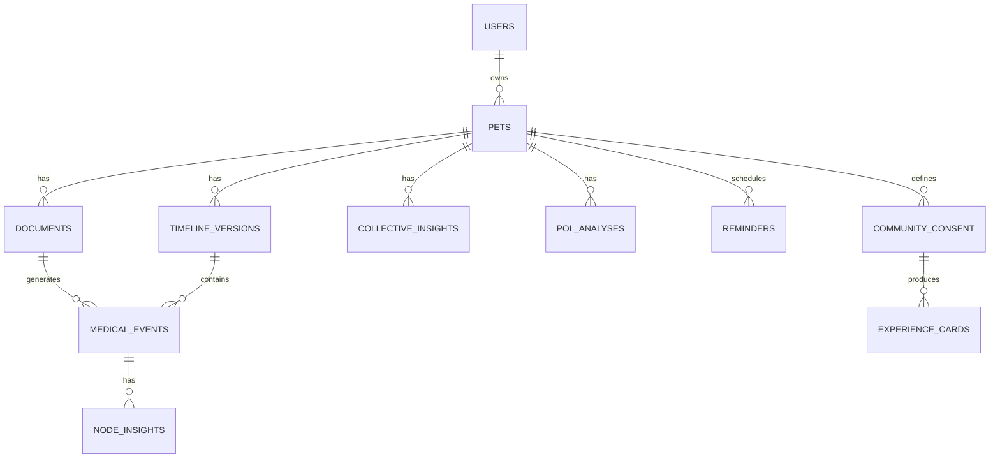
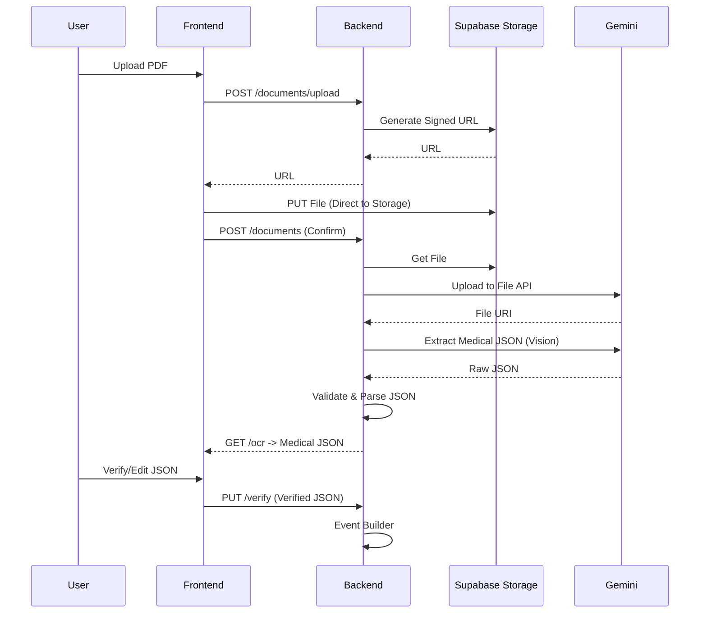
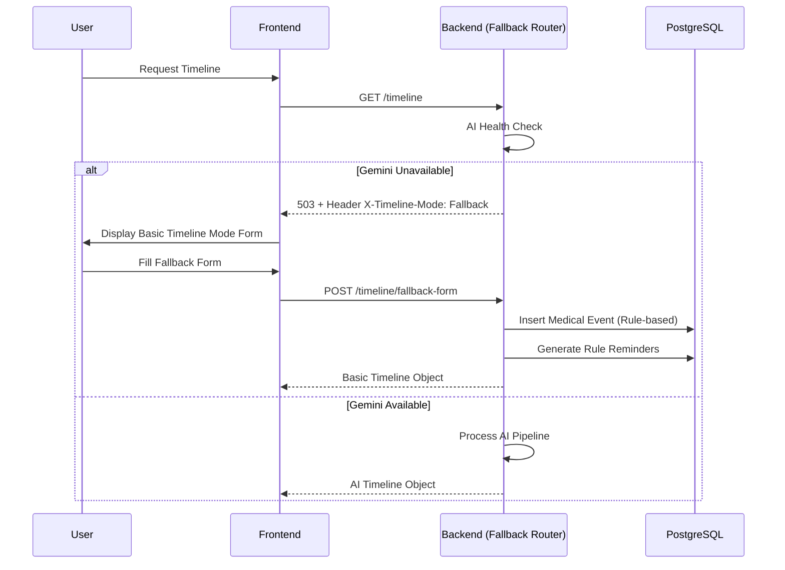

# PetOLife AI Timeline - Backend & Database Implementation Specification
**Version:** 3.0
**Stack:** FastAPI, Supabase PostgreSQL, Supabase Auth, Supabase Storage, React+Vite, Tailwind, Gemini API, Google File API

---

## 1. Backend Folder Architecture
```text
app/
├── main.py                     # FastAPI app initialization, lifespan events
├── core/                       # Core configurations and security
│   ├── config.py               # Pydantic BaseSettings (Env vars)
│   ├── security.py             # JWT validation, Supabase Auth integration
│   ├── exceptions.py           # Custom domain exceptions
│   └── logging.py              # Structured logging setup
├── api/                        # API Layer (Routers)
│   └── v1/
│       ├── __init__.py
│       ├── auth.py
│       ├── pets.py
│       ├── documents.py
│       ├── ocr.py
│       ├── medical_events.py
│       ├── timeline.py
│       ├── insights.py
│       ├── reminders.py
│       └── community.py
├── schemas/                    # Pydantic Request/Response models
│   ├── auth.py
│   ├── pet.py
│   ├── document.py
│   ├── medical_json.py
│   ├── medical_event.py
│   ├── timeline.py
│   ├── insight.py
│   ├── reminder.py
│   ├── community.py
│   └── common.py               # Pagination, error responses
├── models/                     # SQLAlchemy/Supabase DB mappings (if using ORM) or raw SQL refs
│   └── ... 
├── services/                   # Business Logic Layer
│   ├── auth_service.py
│   ├── pet_service.py
│   ├── document_service.py
│   ├── ocr_service.py
│   ├── verification_service.py
│   ├── timeline_builder.py
│   ├── event_builder.py
│   ├── node_insight_engine.py
│   ├── collective_insight_engine.py
│   ├── pol_analysis_service.py
│   ├── mutation_engine.py
│   ├── reminder_engine.py
│   ├── community_engine.py
│   ├── similarity_engine.py
│   ├── insight_fusion_engine.py
│   └── fallback_router_service.py
├── repositories/               # Data Access Layer
│   ├── base.py                 # Generic CRUD
│   ├── pet_repo.py
│   ├── document_repo.py
│   ├── medical_event_repo.py
│   ├── timeline_repo.py
│   ├── insight_repo.py
│   ├── reminder_repo.py
│   ├── community_repo.py
│   └── audit_repo.py
├── adapters/                   # External Provider Adapters
│   ├── ai_provider_base.py     # Abstract AI Interface
│   ├── gemini_adapter.py       # Gemini API + File API
│   └── storage_adapter.py      # Supabase Storage wrapper
├── workers/                    # Background tasks / Queue interfaces
│   ├── ai_processing_worker.py
│   └── community_aggregation_worker.py
└── dependencies/               # FastAPI Depends
    ├── auth.py                 # get_current_user, require_role
    ├── database.py             # get_db connection
    └── services.py             # Service DI containers
```

## 2. FastAPI Router Hierarchy
Routers are mounted under `/api/v1`. 
- `auth_router`: `/auth`
- `pet_router`: `/pets`
- `document_router`: `/pets/{pet_id}/documents`
- `ocr_router`: `/pets/{pet_id}/documents/{doc_id}/ocr`
- `verification_router`: `/pets/{pet_id}/documents/{doc_id}/verify`
- `medical_event_router`: `/pets/{pet_id}/medical-events`
- `timeline_router`: `/pets/{pet_id}/timeline`
- `insight_router`: `/pets/{pet_id}/insights`
- `reminder_router`: `/pets/{pet_id}/reminders`
- `community_router`: `/community`

## 3. Service Layer Architecture
Services implement the business logic defined in the Context Document. They orchestrate repositories and adapters.
- **Strict Boundaries:** No service directly manipulates another service's DB state. Cross-domain communication occurs via the API layer or domain events.
- **State Ownership:** The backend owns all state. Frontend is a strict display/upload/edit proxy.
- **AI Encapsulation:** AI logic is isolated to `node_insight_engine`, `collective_insight_engine`, `pol_analysis_service`, and `gemini_adapter`.

## 4. Repository Layer Architecture
Implements the Repository Pattern. All database interactions are encapsulated here.
- **Base Class:** Provides `get_by_id`, `get_multi`, `create`, `update`.
- **Supabase Specific:** Uses `supabase-py` or `psycopg2` with PostgREST compatibility. Transaction management handled via PostgreSQL transactions.

## 5. Dependency Injection Design
FastAPI's `Depends` is used extensively.
- **Database:** `get_db()` yields a Supabase client or DB session.
- **Auth:** `get_current_user()` extracts JWT, validates via Supabase Auth, returns user DTO.
- **Services:** `get_pet_service()` injects `PetRepo` and `AuditRepo` into `PetService`.

## 6. Middleware
1. **CORS Middleware:** Allows React frontend origin.
2. **Authentication Middleware:** Intercepts requests, validates Supabase JWT, attaches user context.
3. **Exception Handler Middleware:** Catches domain exceptions and maps them to standard error schemas.
4. **Mode Header Middleware:** Attaches `X-Timeline-Mode: AI` or `X-Timeline-Mode: Fallback` to responses based on Gemini availability.

## 7. Authentication and Authorization Flow
- **Provider:** Supabase Auth (Email/Password, OAuth).
- **Flow:** Frontend obtains JWT -> Sends in `Authorization: Bearer <token>` -> Backend validates JWT against Supabase JWKS -> Extracts `user_id`.
- **RLS:** PostgreSQL Row Level Security is enabled. Backend connects to Supabase using the user's JWT for data access where applicable, or uses service role key with explicit `user_id` filtering.

## 8. RBAC and Permission Model
- **Roles:** `pet_owner`, `admin` (future).
- **Ownership Model:** A User owns Pets. A Pet owns Medical Events, Timelines, etc.
- **Validation:** `pet_owner` can only CRUD entities linked to their `user_id`. Service layer enforces `pet_id` belongs to `request.user_id`.

## 9. API Versioning Strategy
- URL-based versioning: `/api/v1/...`
- Future versions will introduce `/api/v2/` without breaking v1 contract.

## 10. Background Workers
- **AI Processing:** OCR extraction, Node Insight generation, Collective Insight generation are offloaded to background workers to prevent HTTP timeouts.
- **Implementation:** FastAPI `BackgroundTasks` for light jobs; dedicated worker process (e.g., Celery/ARQ + Redis) for heavy AI pipelines (Production).

## 11. Queue Architecture (Future-Ready)
- **Current:** FastAPI `BackgroundTasks`.
- **Future-Ready Interface:** `QueueAdapter` interface with `enqueue(task_name, payload)` method. Current implementation uses in-memory async queue; can be swapped to Redis/RabbitMQ without changing service layer.

## 12. Complete REST API Endpoint Specification

### Auth
- `POST /api/v1/auth/signup` -> Creates user
- `POST /api/v1/auth/login` -> Returns JWT
- `POST /api/v1/auth/logout` -> Invalidates session (if applicable)

### Pets
- `POST /api/v1/pets` -> Create pet
- `GET /api/v1/pets` -> List user's pets
- `GET /api/v1/pets/{pet_id}` -> Get pet details
- `PATCH /api/v1/pets/{pet_id}` -> Update pet (weight, age, etc.)

### Documents & Storage
- `POST /api/v1/pets/{pet_id}/documents/upload` -> Get presigned URL / upload file
- `POST /api/v1/pets/{pet_id}/documents` -> Create document metadata
- `GET /api/v1/pets/{pet_id}/documents` -> List documents
- `DELETE /api/v1/pets/{pet_id}/documents/{doc_id}` -> Delete document

### OCR & Verification
- `POST /api/v1/pets/{pet_id}/documents/{doc_id}/ocr` -> Trigger OCR
- `GET /api/v1/pets/{pet_id}/documents/{doc_id}/ocr` -> Get Medical JSON
- `PUT /api/v1/pets/{pet_id}/documents/{doc_id}/verify` -> Approve/Edit/Reject Medical JSON

### Medical Events
- `GET /api/v1/pets/{pet_id}/medical-events` -> List events
- `GET /api/v1/pets/{pet_id}/medical-events/{event_id}` -> Get event details

### Timeline
- `GET /api/v1/pets/{pet_id}/timeline` -> Get computed timeline
- `POST /api/v1/pets/{pet_id}/timeline/fallback-form` -> Submit manual fallback form

### Insights
- `GET /api/v1/pets/{pet_id}/insights/node/{event_id}` -> Get node insight
- `GET /api/v1/pets/{pet_id}/insights/collective` -> Get collective insight
- `GET /api/v1/pets/{pet_id}/insights/pol` -> Get POL Bot Analysis

### Reminders
- `GET /api/v1/pets/{pet_id}/reminders` -> List computed reminders

### Community
- `PUT /api/v1/pets/{pet_id}/community/consent` -> Update consent mode
- `GET /api/v1/community/insights` -> Get community fusion insights (requires query: species, breed, diagnosis)

## 13. Request/Response Schemas
*(Defined in conjunction with Pydantic Models in Section 14)*

## 14. Pydantic Models

### Medical JSON (Extraction Output)
```python
class MedicalJSON(BaseModel):
    pet_info: PetInfoExtraction
    visit: VisitExtraction
    diagnosis: List[DiagnosisExtraction]
    medications: List[MedicationExtraction]
    vaccinations: List[VaccinationExtraction]
    deworming: List[DewormingExtraction]
    anti_tick: List[AntiTickExtraction]
    weight: WeightExtraction
    follow_up: FollowUpExtraction
    doctor_notes: str
    confidence: float
    misc: Dict[str, Any] # Unmapped data
```

### Medical Event Node
```python
class MedicalEventNode(BaseModel):
    id: UUID
    pet_id: UUID
    timeline_version: int
    source_document_id: UUID
    source_page: Optional[int]
    event_hash: str
    confidence: float
    verification_status: Literal['verified', 'rejected', 'pending']
    event_type: str
    event_data: Dict[str, Any] # Contains visit, diagnosis, meds, etc.
    created_at: datetime
    updated_at: datetime
    ai_version: Optional[str]
```

### Fallback Vet Visit Form
```python
class FallbackVetVisitForm(BaseModel):
    pet_id: UUID
    visit_date: date
    reason: str
    diagnosis: Optional[str]
    medication: Optional[str]
    vaccination: Optional[str]
    weight: Optional[float]
    follow_up_date: Optional[date]
    doctor_notes: Optional[str]
    treatment_status: Optional[str]
```

## 15. Validation Rules
- **Medical JSON:** `confidence` must be `0.0 <= x <= 1.0`. `misc` is required (can be empty dict).
- **Verification:** User must explicitly set `verification_status` to `verified` to proceed.
- **Timeline:** `timeline_version` is read-only on update; mutations increment it.
- **Fallback Form:** `visit_date` cannot be in the future.

## 16. Error Response Standards
```json
{
  "error_code": "PET_001",
  "message": "Pet not found or access denied.",
  "detail": {}
}
```
Standard HTTP Codes: 400 (Validation), 401 (Auth), 403 (Forbidden), 404 (Not Found), 409 (Conflict/Duplicate), 503 (AI Unavailable - triggers fallback).

## 17. Supabase Database Schema
*(See sections 18-28 for detailed table definitions)*

## 18. ER Diagrams (Mermaid)


## 19. Tables with columns, data types, constraints, defaults, indexes

### `users` (Managed by Supabase Auth, referenced as `auth.users`)
*Assumption: We use Supabase default users table and reference `auth.uid()`.*

### `pets`
| Column | Type | Constraints | Default | Index |
|---|---|---|---|---|
| id | UUID | PK | `gen_random_uuid()` | |
| user_id | UUID | FK `auth.users.id`, NOT NULL | | `idx_pets_user_id` |
| name | VARCHAR | NOT NULL | | |
| species | VARCHAR | NOT NULL | | |
| breed | VARCHAR | | | |
| age | INTEGER | | | |
| gender | VARCHAR | | | |
| latest_weight | FLOAT | | | |
| anonymous_id | UUID | UNIQUE | `gen_random_uuid()` | `idx_pets_anon_id` |
| created_at | TIMESTAMPTZ | NOT NULL | `now()` | |
| updated_at | TIMESTAMPTZ | NOT NULL | `now()` | |

### `documents`
| Column | Type | Constraints | Default | Index |
|---|---|---|---|---|
| id | UUID | PK | `gen_random_uuid()` | |
| pet_id | UUID | FK `pets.id` CASCADE | | `idx_docs_pet_id` |
| storage_path | TEXT | NOT NULL | | |
| file_type | VARCHAR(10) | CHECK (pdf, image) | | |
| upload_status | VARCHAR | NOT NULL | 'pending' | |

### `medical_events`
| Column | Type | Constraints | Default | Index |
|---|---|---|---|---|
| id | UUID | PK | `gen_random_uuid()` | |
| pet_id | UUID | FK `pets.id` CASCADE | | `idx_events_pet_id` |
| timeline_version | INTEGER | NOT NULL | | |
| source_document_id | UUID | FK `documents.id` SET NULL | | |
| source_page | INTEGER | | | |
| event_hash | VARCHAR(64) | NOT NULL | | `idx_events_hash` |
| confidence | FLOAT | CHECK (0.0 <= confidence <= 1.0) | | |
| verification_status | VARCHAR | CHECK (pending, verified, rejected) | 'pending' | |
| event_data | JSONB | NOT NULL | '{}' | `gin_idx_events_data` |
| created_at | TIMESTAMPTZ | NOT NULL | `now()` | |
| updated_at | TIMESTAMPTZ | NOT NULL | `now()` | |
| ai_version | VARCHAR | | NULL | |

*(Additional tables for Insights, Timeline, Community defined below)*

## 20. Foreign Key Relationships
- `pets.user_id` -> `auth.users.id` (Restrict Delete)
- `documents.pet_id` -> `pets.id` (Cascade Delete)
- `medical_events.pet_id` -> `pets.id` (Cascade Delete)
- `medical_events.source_document_id` -> `documents.id` (Set Null on delete - retains event if doc removed)
- `node_insights.event_id` -> `medical_events.id` (Cascade Delete)

## 21. Timeline Versioning Schema
*Assumption: Timeline is append-only. Versions are explicitly tracked.*
**Table: `timeline_versions`**
- `id` (UUID, PK)
- `pet_id` (UUID, FK)
- `version_number` (INT, UNIQUE per pet)
- `created_at` (TIMESTAMPTZ)
- `changelog` (TEXT)

## 22. Medical Event Node Schema
See Section 19 (`medical_events` table). 
- `event_hash`: SHA-256 of `event_data` JSONB for duplicate detection.
- `event_data`: Stores visit, diagnosis, medication, vaccination, etc., in structured JSONB.

## 23. POL Bot Analysis Schema
**Table: `pol_analyses`**
- `id` (UUID, PK)
- `pet_id` (UUID, FK)
- `version` (INT) - Incremented on new analysis
- `collective_insight_id` (UUID, FK)
- `summary` (JSONB) - Structured summary output
- `reminder_dataset` (JSONB) - Context for reminders
- `medical_status` (JSONB)
- `created_at` (TIMESTAMPTZ)

## 24. Community Insight Schema
**Table: `experience_cards`**
- `id` (UUID, PK)
- `anonymous_pet_id` (UUID) - Links to `pets.anonymous_id`
- `diagnosis` (VARCHAR)
- `medication` (VARCHAR)
- `age_at_event` (INT)
- `weight_at_event` (FLOAT)
- `outcome_stats` (JSONB) - Aggregated, no PII

## 25. Reminder Schema
**Table: `reminders`**
- `id` (UUID, PK)
- `pet_id` (UUID, FK)
- `source_event_id` (UUID, FK `medical_events.id`)
- `type` (VARCHAR) - vaccination, deworming, follow_up, medication
- `due_date` (DATE)
- `status` (VARCHAR) - pending, completed, missed
- `is_ai_generated` (BOOLEAN) - False if rule-based

## 26. Audit Log Schema
**Table: `audit_logs`**
- `id` (UUID, PK)
- `user_id` (UUID)
- `action` (VARCHAR) - e.g., VERIFY_EVENT, UPDATE_CONSENT
- `entity_type` (VARCHAR)
- `entity_id` (UUID)
- `changes` (JSONB)
- `created_at` (TIMESTAMPTZ)

## 27. File Metadata Schema
Handled within `documents` table (storage_path, file_type) + Supabase Storage object metadata.

## 28. Storage Bucket Organization
- **Bucket Name:** `medical-documents`
- **Path Structure:** `{user_id}/{pet_id}/{document_uuid}.{ext}`
- **Access:** Private. Backend generates Signed URLs for upload (PUT) and download (GET).

## 29. Row Level Security (RLS) Policies
*Assumption: Backend uses Service Role Key for AI workers/Aggregations, but user-facing endpoints enforce RLS via user JWT where applicable, or strictly filter via repository.*

**Policy Example (Pets):**
```sql
CREATE POLICY "Users can CRUD their own pets" ON pets
  FOR ALL USING (auth.uid() = user_id);
```

**Policy Example (Medical Events):**
```sql
CREATE POLICY "Users can view their pets events" ON medical_events
  FOR SELECT USING (EXISTS (SELECT 1 FROM pets WHERE pets.id = medical_events.pet_id AND pets.user_id = auth.uid()));
```

**Policy Example (Community):**
```sql
-- Anon access for reading cards for similarity matching (via service role)
CREATE POLICY "Service role can read experience cards" ON experience_cards
  FOR SELECT USING (true); -- Only exposed via secure backend endpoint
```

## 30. SQL Indexes and Optimization Strategy
- B-Tree indexes on all Foreign Keys (`pet_id`, `user_id`, `source_document_id`).
- GIN Index on `medical_events.event_data` for JSONB querying (searching diagnoses/medications).
- B-Tree Index on `medical_events.event_hash` for fast duplicate detection.
- Composite Index on `reminders (pet_id, due_date, status)` for calendar fetches.

## 31. Transaction Boundaries
- **Medical Event Creation:** `BEGIN` -> Insert `medical_event` -> Update `timeline_version` -> `COMMIT`.
- **Verification:** `BEGIN` -> Update `medical_event.verification_status` -> Insert `audit_log` -> `COMMIT`.
- **Community Consent Change:** `BEGIN` -> Update/Insert `community_consent` -> Anonymize/Remove `experience_cards` if revoked -> `COMMIT`.

## 32. Duplicate Detection Implementation
1. Compute SHA-256 hash of canonical `event_data` JSON string on the backend.
2. Query `medical_events` WHERE `pet_id` = X AND `event_hash` = Y.
3. If exists, flag as duplicate. Reject or version accordingly based on Conflict Resolution.

## 33. Conflict Resolution Implementation
- **Near Duplicates:** If hashes differ but `visit_date` + `diagnosis` are similar (fuzzy matching).
- **Resolution:** Create new timeline version. Append new event with metadata linking to potential duplicate, flagging for user review in "Timeline Update Review" UI. Rejected updates never affect the timeline.

## 34. AI Adapter Interface
```python
class AIProvider(ABC):
    @abstractmethod
    async def upload_file(self, file_path: str, mime_type: str) -> str: pass

    @abstractmethod
    async def extract_medical_json(self, file_uri: str) -> MedicalJSON: pass

    @abstractmethod
    async def generate_node_insight(self, event_data: dict) -> NodeInsightDTO: pass

    @abstractmethod
    async def generate_collective_insight(self, events: list, prev_insight: dict) -> CollectiveInsightDTO: pass

    @abstractmethod
    async def generate_pol_analysis(self, latest_pol: dict, new_events: list) -> POLAnalysisDTO: pass
```

## 35. Gemini Integration Contracts
- **File API:** Upload PDF/Image -> Retrieve `file_uri`.
- **Gemini Vision:** System Instruction (Strict JSON output) + `file_uri` -> Medical JSON.
- **Gemini Pro:** System Instruction (Structured summary generation) + Prompt (Medical Event Data) -> Node/Collective/POL Insights.

## 36. Prompt Input/Output Contracts
- **Rule:** NO PROMPTS OR RAW RESPONSES STORED.
- **Input:** Structured DTOs (Pydantic models serialized to JSON/Markdown).
- **Output:** Pydantic models parsed from Gemini JSON response. Validation enforced. If validation fails -> Fallback mode or Retry.

## 37. Community Consent Architecture
- **Table:** `community_consent`
  - `pet_id`, `mode` (private, anonymous), `updated_at`
- **Anonymous Mode:** Generates/maps to `pets.anonymous_id`. Strips all PII (owner name, pet name, clinic). Only structured medical parameters pushed to `experience_cards`.
- **Private Mode:** Zero records in `experience_cards` for that `anonymous_id`.

## 38. Similarity Engine Interface
```python
class SimilarityEngine:
    def find_similar_cases(self, species: str, breed: str, diagnosis: str, age: int, weight: float) -> List[ExperienceCard]:
        # 1. Query experience_cards via SQL/Vector search
        # 2. Rank by matching criteria
        # 3. Return aggregated stats (counts, common meds), NO raw user data
```

## 39. Insight Fusion Interface
```python
class InsightFusionEngine:
    def fuse_insights(self, personal_insight: CollectiveInsightDTO, community_stats: List[dict]) -> FusionInsightDTO:
        # 1. Merge personal AI summary with community statistics
        # 2. Format: "Your pet's diagnosis is X. In Y% of similar cases, medication Z was effective."
        # 3. Community NEVER replaces personal, only augments.
```

## 40. Sequence Diagrams for Major Workflows

### OCR and Verification Flow


### Fallback Mechanism Flow


## 41. API Testing Strategy
- **Unit Tests:** Pytest for Service Layer, Repository Layer, and AI Adapter parsing (mocked Gemini).
- **Integration Tests:** Test actual DB inserts (Test Supabase instance), Auth flows, and Storage uploads.
- **Contract Tests:** Verify Pydantic schemas match expected JSON structures.
- **End-to-End API Tests:** `httpx` testing FastAPI app directly, covering OCR -> Verify -> Timeline flow.

## 42. Database Migration Strategy
- **Tool:** Supabase CLI (`supabase db diff` and `supabase migration new`).
- **Process:** Local schema changes -> Generate migration -> Apply to local -> Test -> Push to staging -> Push to prod.
- **Zero Downtime:** Additive changes only (add columns, add tables). Alterations require multi-step migrations (add new, backfill, drop old).

## 43. Security Checklist
- [x] Supabase RLS enabled on all tables.
- [x] Backend validates `user_id` ownership on every request.
- [x] Storage Signed URLs expire in 60 mins.
- [x] No raw AI prompts stored.
- [x] PII stripped before Community Knowledge Base insertion.
- [x] Input validation via Pydantic on all endpoints.
- [x] SQL Injection prevented via Supabase client/parameterized queries.

## 44. Performance Optimization Checklist
- [x] JSONB GIN index on `medical_events.event_data`.
- [x] Background workers for Gemini calls.
- [x] Caching POL Analysis state to prevent regeneration.
- [x] Signed URLs for storage (offload download traffic from FastAPI).
- [x] Pagination on all list endpoints (`GET /medical-events`, `GET /reminders`).

## 45. Production Deployment Considerations
- **Compute:** FastAPI deployed on auto-scaling container (Cloud Run / AWS App Runner / Render).
- **Workers:** Separate worker nodes for AI processing queue to prevent API web-thread starvation.
- **Environment:** Secrets (Supabase URL, Gemini Key) injected via Secret Manager.
- **Monitoring:** Structured logs (JSON) to Google Cloud Logging / Datadog. Alert on Fallback Mode activation (AI availability drops).
- **Healthcheck:** `GET /health` endpoint checking DB connection, Storage connection, and Gemini API ping.

---