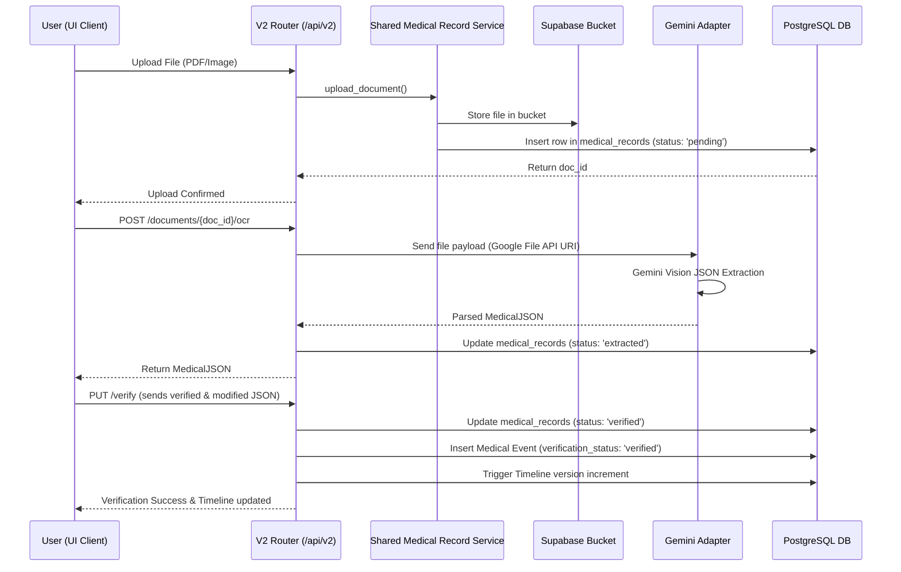
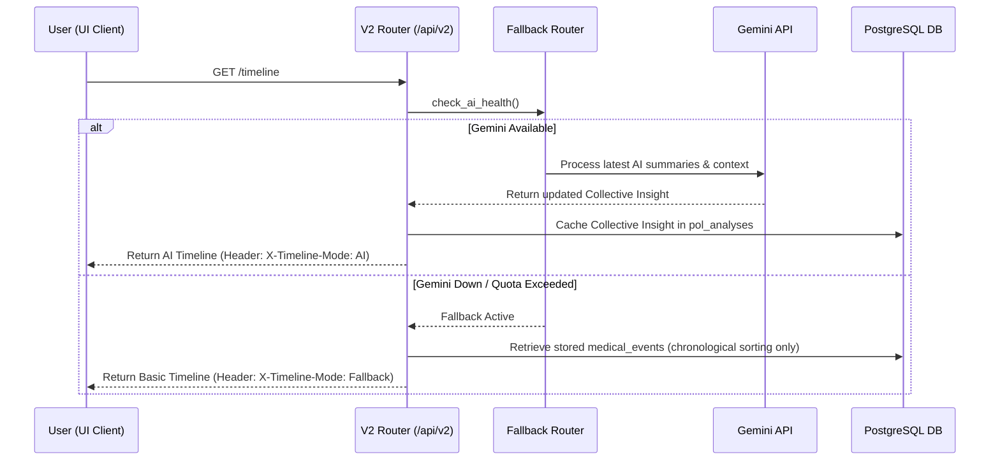

# PetOLife AI Timeline - Backend & Database Implementation Specification
## Version 4.0 (Integrated V2 Architecture)

---

## 1. System Overview & Integration Strategy

This document defines the backend API, service layout, and database schema for the PetOLife AI Timeline feature. 

Unlike a standalone greenfield application, **the AI Timeline is integrated directly into the existing PetOLife MVP V2 application**. The integration follows an **isolated V2 architecture** to prevent regressions in the base V1 app:

1. **Routing Isolation**: Existing V1 endpoints (`/api/...`) remain unchanged and active. All new AI Timeline and version-enhanced features are exposed through a dedicated routing namespace under `/api/v2/...`.
2. **Logic Reusability**: Common database operations (such as CRUD actions on pet profiles and medical document uploads) are extracted from V1 routes and placed into a **Shared Service Layer**. Both V1 and V2 routers delegate requests to this shared layer, preventing code redundancy.
3. **Timeline Feature Isolation**: All timeline-specific AI processing logic, Gemini adapters, extraction schemas, and mutation logic are encapsulated under a modular sub-package (`backend/app/timeline/`).
4. **Database Backward Compatibility**: Database updates are strictly additive. New columns added to existing V1 tables are nullable with defaults, and all new timeline features use separate tables. This ensures the live V1 codebase can run seamlessly on the updated database without requiring code changes.

---

## 2. Integrated Backend Folder Architecture

The new files (indicated by `[NEW]`) are structured to slot into the existing FastAPI folder layout:

```text
backend/
├── app/
│   ├── main.py                     # Updated to mount V2 routers under /api/v2
│   ├── config.py                   # Standard config (loads SUPABASE_URL, GEMINI_API_KEY, etc.)
│   ├── supabase_client.py          # Central Supabase client wrapper
│   ├── routers/                    # Routing Layer
│   │   ├── auth.py                 # V1 Auth router (unchanged)
│   │   ├── checklist.py            # V1 Checklist router (unchanged)
│   │   ├── location.py             # V1 Location/Pincode router (unchanged)
│   │   ├── medical_records.py      # V1 Medical Records router (refactored to call shared service)
│   │   ├── pet_health_id.py        # V1 Pet Health ID router (unchanged)
│   │   ├── pet_profile.py          # V1 Pet Profile router (refactored to call shared service)
│   │   ├── user_profile.py         # V1 User Profile router (unchanged)
│   │   └── v2/                     # [NEW] Version 2 Routers (isolated)
│   │       ├── __init__.py
│   │       ├── pet_profile.py      # [NEW] V2 Pet router (calls shared service + handles V2 responses)
│   │       ├── medical_records.py  # [NEW] V2 Medical Records (handles uploads + ocr_status querying)
│   │       ├── ocr.py              # [NEW] V2 OCR extraction routes (Gemini File API triggers)
│   │       ├── timeline.py         # [NEW] V2 Timeline query and manual fallback visit form
│   │       ├── insights.py         # [NEW] V2 Node, Collective, & POL Bot insight queries
│   │       ├── reminders.py        # [NEW] V2 Reminders calendar query endpoint
│   │       └── community.py        # [NEW] V2 Consent and community similarities query
│   ├── services/                   # [NEW] Shared Service Layer (common logic reused by V1 and V2)
│   │   ├── __init__.py
│   │   ├── pet_service.py          # [NEW] Reusable Pet CRUD operations
│   │   └── medical_record_service.py # [NEW] Reusable storage uploading and records retrieval
│   ├── timeline/                   # [NEW] Isolated Timeline Sub-Package (AI business logic)
│   │   ├── __init__.py
│   │   ├── schemas/                # [NEW] Pydantic validation schemas
│   │   │   ├── extraction.py       # [NEW] Medical JSON structure parsed from raw documents
│   │   │   ├── events.py           # [NEW] Medical Event schemas
│   │   │   ├── insights.py         # [NEW] Node and Collective insight models
│   │   │   └── reminders.py        # [NEW] Reminder models
│   │   ├── services/               # [NEW] Timeline-specific engines
│   │   │   ├── ocr_service.py      # [NEW] Document parser orchestration
│   │   │   ├── event_builder.py    # [NEW] Converts MedicalJSON to MedicalEventNode
│   │   │   ├── mutation_engine.py  # [NEW] Handles immutable append-only version increments
│   │   │   ├── insight_engine.py   # [NEW] AI summary and collective insight generation
│   │   │   ├── reminder_engine.py  # [NEW] Rule-based + AI assisted calendar builder
│   │   │   ├── community_engine.py # [NEW] Similarity matching and Experience Card aggregation
│   │   │   └── fallback_router.py  # [NEW] Health monitor and rule-based fallback processor
│   │   └── adapters/               # [NEW] External AI Provider Adapters
│   │       ├── ai_provider_base.py # [NEW] Abstract class for AI models
│   │       └── gemini_adapter.py   # [NEW] Gemini API client implementation
│   └── utils/
│       └── auth.py                 # JWT validation utility (reused by V2)
```

---

## 3. Shared Service Layer Design (Code Reusability)

To avoid duplicating database access code between V1 routers (`app/routers/`) and V2 routers (`app/routers/v2/`), core CRUD actions are delegated to a unified Service Layer:

```python
# app/services/pet_service.py
from app.supabase_client import supabase

class PetService:
    @staticmethod
    async def get_all_user_pets(user_id: str):
        # Queries Supabase and returns list of pets
        response = supabase.table("pet_profiles").select("*").eq("user_id", user_id).execute()
        return response.data

    @staticmethod
    async def get_pet_by_id(pet_id: str, user_id: str):
        # Core retrieval logic shared between V1 and V2
        response = supabase.table("pet_profiles").select("*, pet_ids(*)").eq("id", pet_id).execute()
        return response.data[0] if response.data else None
```

```python
# app/routers/pet_profile.py (V1 Router refactored)
from fastapi import APIRouter, Depends
from app.services.pet_service import PetService
from app.utils.auth import get_current_user

router = APIRouter(prefix="/api/pet-profile", tags=["V1 Pet Profile"])

@router.get("/")
async def get_pets(current_user = Depends(get_current_user)):
    return await PetService.get_all_user_pets(current_user.id)
```

```python
# app/routers/v2/pet_profile.py (V2 Router reuse)
from fastapi import APIRouter, Depends
from app.services.pet_service import PetService
from app.utils.auth import get_current_user

router = APIRouter(prefix="/api/v2/pets", tags=["V2 Pet Profile"])

@router.get("/")
async def get_pets_v2(current_user = Depends(get_current_user)):
    # Reuses service method but formats output payload according to V2 specs
    pets = await PetService.get_all_user_pets(current_user.id)
    return {"status": "success", "data": pets}
```

---

## 4. FastAPI V2 Router Hierarchy

V2 routers are mounted in `app/main.py` under the `/api/v2` namespace. All endpoints require a valid Supabase JWT sent in the `Authorization: Bearer <token>` header:

### 4.1. V2 Documents & Uploads
* `POST /api/v2/pets/{pet_id}/documents/upload`
  * Uploads medical files (PDFs/Images) to Supabase Storage.
  * Reuses `medical_record_service` but writes V2 specific columns like `ocr_status = 'pending'`.
* `GET /api/v2/pets/{pet_id}/documents`
  * List all records, including their `ocr_status`.
* `DELETE /api/v2/pets/{pet_id}/documents/{doc_id}`
  * Deletes record row and storage file.

### 4.2. V2 OCR Pipeline
* `POST /api/v2/pets/{pet_id}/documents/{doc_id}/ocr`
  * Triggers background OCR extraction task (via Gemini API + File API).
  * Immediately updates document `ocr_status = 'processing'`.
* `GET /api/v2/pets/{pet_id}/documents/{doc_id}/ocr`
  * Fetches the extracted `MedicalJSON` and extraction confidence.

### 4.3. V2 Verification
* `PUT /api/v2/pets/{pet_id}/documents/{doc_id}/verify`
  * Receives user-reviewed and edited JSON.
  * Writes to database, transitions state of document to `ocr_status = 'verified'`, and creates a new timeline `medical_event` row.

### 4.4. V2 Timeline
* `GET /api/v2/pets/{pet_id}/timeline`
  * Computes and returns the chronological list of events for the pet's active timeline version.
  * Checks Gemini health: attaches headers `X-Timeline-Mode: AI` or `X-Timeline-Mode: Fallback`.
* `POST /api/v2/pets/{pet_id}/timeline/fallback-form`
  * Submits manual Vet Visit Form when AI is unavailable. Inserts a rule-based `medical_event` row.

### 4.5. V2 AI Insights
* `GET /api/v2/pets/{pet_id}/insights/node/{event_id}`
  * Returns specific AI summary and visit suggestion details for a single event.
* `GET /api/v2/pets/{pet_id}/insights/collective`
  * Returns the accumulated diagnostic and medical history summaries.

### 4.6. V2 Reminders
* `GET /api/v2/pets/{pet_id}/reminders`
  * Fetches vaccination schedules, deworming reminders, and medication calendar dates.

### 4.7. V2 Community Insights
* `PUT /api/v2/pets/{pet_id}/community/consent`
  * Toggles anonymous medical experience sharing on/off.
* `GET /api/v2/community/insights`
  * Query similarity cases based on breed, species, diagnosis, and age range.

---

## 5. Database Schema & Versioning Strategy

To support parallel deployment where V1 and V2 codebase run on the same Supabase database, database changes are **strictly additive**. 

### 5.1. Database Migration Setup
Migrations are written in SQL and stored under `backend/supabase/migrations/` using standard time-based file naming:
`backend/supabase/migrations/20260714104500_add_v2_timeline_tables.sql`

This ensures that:
1. Local changes are cleanly generated with `supabase db diff`.
2. Schema deployments to live Supabase database are run via `supabase db push`.

### 5.2. Additive Updates to Existing V1 Tables

#### Table: `medical_records` (V1 table updated for V2)
We add columns to track the progress of OCR extraction. These are nullable and default to safely isolate V1:
```sql
ALTER TABLE medical_records 
ADD COLUMN IF NOT EXISTS ocr_status TEXT DEFAULT 'pending' CHECK (ocr_status IN ('pending', 'processing', 'extracted', 'verified', 'failed')),
ADD COLUMN IF NOT EXISTS ocr_extracted_at TIMESTAMPTZ,
ADD COLUMN IF NOT EXISTS ocr_error TEXT;
```

### 5.3. Isolated V2 Tables

#### Table: `timeline_versions`
Tracks the current version number of a pet's medical timeline.
```sql
CREATE TABLE IF NOT EXISTS timeline_versions (
    id UUID PRIMARY KEY DEFAULT gen_random_uuid(),
    pet_id UUID NOT NULL REFERENCES pet_profiles(id) ON DELETE CASCADE,
    version_number INTEGER NOT NULL,
    created_at TIMESTAMPTZ NOT NULL DEFAULT now(),
    changelog TEXT,
    UNIQUE(pet_id, version_number)
);

CREATE INDEX IF NOT EXISTS idx_timeline_versions_pet ON timeline_versions(pet_id);
```

#### Table: `medical_events`
Stores the canonical events making up the timeline.
```sql
CREATE TABLE IF NOT EXISTS medical_events (
    id UUID PRIMARY KEY DEFAULT gen_random_uuid(),
    pet_id UUID NOT NULL REFERENCES pet_profiles(id) ON DELETE CASCADE,
    timeline_version INTEGER NOT NULL,
    source_document_id UUID REFERENCES medical_records(id) ON DELETE SET NULL,
    source_page INTEGER,
    event_hash VARCHAR(64) NOT NULL,
    confidence FLOAT NOT NULL CHECK (confidence >= 0.0 AND confidence <= 1.0),
    verification_status TEXT NOT NULL DEFAULT 'pending' CHECK (verification_status IN ('pending', 'verified', 'rejected')),
    event_type TEXT NOT NULL,
    event_data JSONB NOT NULL DEFAULT '{}',
    created_at TIMESTAMPTZ NOT NULL DEFAULT now(),
    updated_at TIMESTAMPTZ NOT NULL DEFAULT now(),
    ai_version VARCHAR(32)
);

CREATE INDEX IF NOT EXISTS idx_medical_events_pet_version ON medical_events(pet_id, timeline_version);
CREATE INDEX IF NOT EXISTS idx_medical_events_hash ON medical_events(event_hash);
CREATE INDEX IF NOT EXISTS idx_medical_events_data ON medical_events USING gin (event_data);
```

#### Table: `pol_analyses`
Holds persistent structured bot analysis summaries.
```sql
CREATE TABLE IF NOT EXISTS pol_analyses (
    id UUID PRIMARY KEY DEFAULT gen_random_uuid(),
    pet_id UUID NOT NULL REFERENCES pet_profiles(id) ON DELETE CASCADE,
    version INTEGER NOT NULL,
    summary JSONB NOT NULL DEFAULT '{}',
    reminder_dataset JSONB NOT NULL DEFAULT '{}',
    medical_status JSONB NOT NULL DEFAULT '{}',
    created_at TIMESTAMPTZ NOT NULL DEFAULT now(),
    UNIQUE(pet_id, version)
);

CREATE INDEX IF NOT EXISTS idx_pol_analyses_pet ON pol_analyses(pet_id);
```

#### Table: `reminders`
Holds active, upcoming, and completed reminders (vaccines, deworming, etc.).
```sql
CREATE TABLE IF NOT EXISTS reminders (
    id UUID PRIMARY KEY DEFAULT gen_random_uuid(),
    pet_id UUID NOT NULL REFERENCES pet_profiles(id) ON DELETE CASCADE,
    source_event_id UUID REFERENCES medical_events(id) ON DELETE CASCADE,
    type TEXT NOT NULL CHECK (type IN ('vaccination', 'deworming', 'medication', 'follow_up')),
    title TEXT NOT NULL,
    due_date DATE NOT NULL,
    status TEXT NOT NULL DEFAULT 'pending' CHECK (status IN ('pending', 'completed', 'missed')),
    is_ai_generated BOOLEAN NOT NULL DEFAULT false,
    created_at TIMESTAMPTZ NOT NULL DEFAULT now()
);

CREATE INDEX IF NOT EXISTS idx_reminders_pet_date ON reminders(pet_id, due_date);
```

#### Table: `community_consent`
Manages opt-in preferences for sharing.
```sql
CREATE TABLE IF NOT EXISTS community_consent (
    pet_id UUID PRIMARY KEY REFERENCES pet_profiles(id) ON DELETE CASCADE,
    mode TEXT NOT NULL DEFAULT 'private' CHECK (mode IN ('private', 'anonymous')),
    updated_at TIMESTAMPTZ NOT NULL DEFAULT now()
);
```

#### Table: `experience_cards`
Aggregated anonymized medical cards.
```sql
CREATE TABLE IF NOT EXISTS experience_cards (
    id UUID PRIMARY KEY DEFAULT gen_random_uuid(),
    anonymous_pet_id UUID NOT NULL,
    species TEXT NOT NULL,
    breed TEXT,
    diagnosis TEXT NOT NULL,
    medication TEXT,
    age_at_event INTEGER,
    weight_at_event FLOAT,
    outcome_stats JSONB NOT NULL DEFAULT '{}',
    created_at TIMESTAMPTZ NOT NULL DEFAULT now()
);

CREATE INDEX IF NOT EXISTS idx_exp_cards_lookup ON experience_cards(species, breed, diagnosis);
```

---

## 6. End-to-End Integrated Workflows

### 6.1. OCR Upload, Processing & Verification Flow


### 6.2. Fallback Healthcheck & Timeline Generation Flow


---

## 7. Migration & Rollback Strategy

1. **Step-by-step deploy**:
   - Apply SQL migrations to Supabase database first. (V1 app handles it safely since changes are additive).
   - Deploy backend code including V2 routers, shared services, and timeline module.
   - Deploy frontend code featuring the updated `TimelinePage.jsx` calling `/api/v2/...` endpoints.
2. **Revert Strategy**:
   - If the V2 feature fails in production, the frontend can be rolled back to point to the base timeline placeholder.
   - V1 endpoints continue to work because the DB updates did not alter original data schemas or constraints.
   - Delete/revert the `app/routers/v2/` directory if required without affecting `app/routers/` core files.