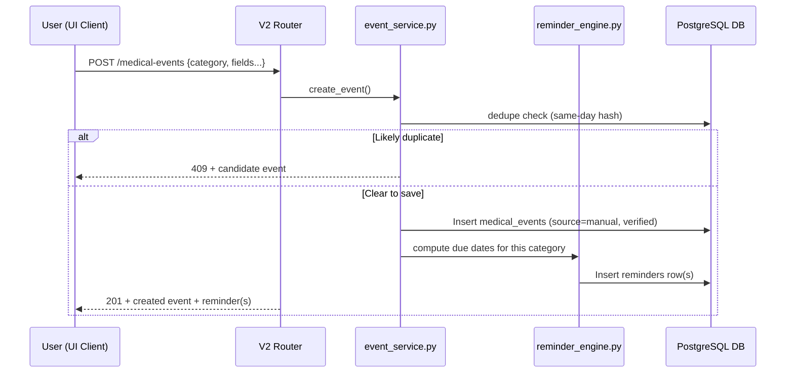
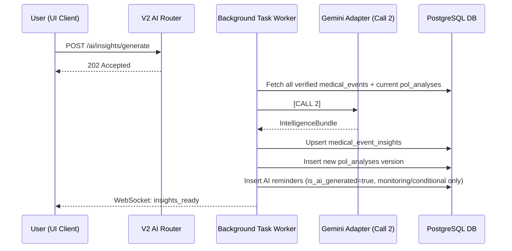

# PetOLife AI Timeline — Backend & Database Implementation Specification
## Version 6.0 (Manual-First Core / AI-Optional Overlay)

**Previous Version:** 5.0 (2-Call AI-first Architecture)

**Change Summary (v5.0 → v6.0):** Major re-scope. Phase 1 is now a fully manual, logic-only medical record system with zero Gemini dependency — `medical_events` is restructured around `category` as the primary key dimension (with a composite index on `(pet_id, category, event_date DESC)`) instead of AI-extraction metadata. Removed from the required path: `ExtractionBundle`/`medical_records.extracted_json`, async task infra, fallback-mode headers, immutable append-only versioning, and `timeline_versions`/rollback — these all move to Phase 2 or are simplified. Added `visit_group_id`, `source`, `edit_history`, and `medical_documents` for Phase 1. Phase 2 (AI) tables (`medical_event_insights`, `pol_analyses`, `ai_token_logs`) are unchanged in shape from v5.0 but are now explicitly optional/additive and are only created when Phase 2 is deployed.

---

## 1. System Overview & Integration Strategy

This document defines the backend API, service layout, and database schema for the PetOLife medical record feature, split cleanly into **Phase 1 (core, no AI)** and **Phase 2 (optional AI overlay)**.

Integration strategy, unchanged from v5.0:

1. **Routing Isolation:** Existing V1 endpoints (`/api/...`) remain unchanged. New features live under `/api/v2/...`.
2. **Logic Reusability:** Common database operations sit in a **Shared Service Layer**, used by both V1 and V2 routers.
3. **Feature Isolation:** Category/timeline/reminder/document logic lives under `backend/app/timeline/`. AI-specific code (extraction, insights, Gemini adapter) lives under `backend/app/timeline/ai/`, a clearly separated sub-package that can be entirely absent from a Phase 1-only deployment.
4. **Database Backward Compatibility:** All schema changes remain additive.
5. **Zero AI Dependency for Phase 1:** No endpoint required for F1–F6 (Ch. 3 of the architecture doc) calls Gemini, directly or indirectly. Phase 1 endpoints have no async task queue requirement — they are synchronous CRUD.
6. **Phase 2 keeps the 2-Call Gemini constraint** from v5.0: one call for diary extraction, one call for intelligence generation, both backgrounded.

---

## 2. Integrated Backend Folder Architecture

```text
backend/
├── app/
│   ├── main.py                          # Mounts V2 routers under /api/v2
│   ├── config.py                        # SUPABASE_URL always required; GEMINI_API_KEY optional
│   ├── supabase_client.py
│   ├── routers/
│   │   ├── auth.py                      # V1 (unchanged)
│   │   ├── checklist.py                 # V1 (unchanged)
│   │   ├── location.py                  # V1 (unchanged)
│   │   ├── medical_records.py           # V1 (refactored → shared service)
│   │   ├── pet_health_id.py             # V1 (unchanged)
│   │   ├── pet_profile.py               # V1 (refactored → shared service)
│   │   ├── user_profile.py              # V1 (unchanged)
│   │   └── v2/
│   │       ├── __init__.py
│   │       ├── pet_profile.py           # [Phase 1] V2 Pet router
│   │       ├── medical_events.py        # [Phase 1] Manual Vet Visit Form CRUD
│   │       ├── timeline.py              # [Phase 1] Category + chronological views
│   │       ├── reminders.py             # [Phase 1] Reminder calendar endpoint
│   │       ├── documents.py             # [Phase 1] Documents vault CRUD
│   │       ├── export.py                # [Phase 1] PDF export
│   │       └── ai/                      # [Phase 2 — only mounted if GEMINI_API_KEY is set]
│   │           ├── __init__.py
│   │           ├── extraction.py        # [Phase 2] Diary upload + Call 1
│   │           ├── insights.py          # [Phase 2] Call 2 + insight queries
│   │           └── community.py         # [Phase 3, stub only]
│   ├── services/                        # Shared Service Layer
│   │   ├── __init__.py
│   │   ├── pet_service.py
│   │   └── medical_record_service.py    # V1 document upload/retrieval (reused)
│   ├── timeline/                        # Phase 1 — pure logic, no AI import allowed
│   │   ├── __init__.py
│   │   ├── schemas/
│   │   │   ├── medical_event.py         # [Phase 1] MedicalEventNode schema (category-first)
│   │   │   └── reminder.py              # [Phase 1] Reminder schema
│   │   ├── services/
│   │   │   ├── event_service.py         # [Phase 1] Create/update/delete medical_events
│   │   │   ├── category_engine.py       # [Phase 1] Category-grouped + chronological queries
│   │   │   ├── reminder_engine.py       # [Phase 1] RULE_ENGINE_OWNS logic
│   │   │   ├── document_service.py      # [Phase 1] Attachment upload/retrieval
│   │   │   ├── export_service.py        # [Phase 1] PDF generation
│   │   │   └── dedupe_service.py        # [Phase 1] Same-day hash duplicate warning
│   │   └── ai/                          # Phase 2 — isolated, optional package
│   │       ├── schemas/
│   │       │   ├── extraction.py        # ExtractionBundle / draft_events models
│   │       │   └── intelligence.py      # IntelligenceBundle models
│   │       ├── services/
│   │       │   ├── extraction_service.py   # Call 1 orchestration → drafts into medical_events
│   │       │   ├── insight_engine.py       # Call 2 orchestration
│   │       │   └── ai_reminder_merge.py    # Merges AI reminders into reminder_engine output
│   │       └── adapters/
│   │           ├── ai_provider_base.py
│   │           └── gemini_adapter.py    # Token logging built in
│   └── utils/
│       └── auth.py
```

**Deployment note:** `app/timeline/ai/` and `app/routers/v2/ai/` can be omitted entirely from a build with `GEMINI_API_KEY` unset. `app/timeline/services/` has no import dependency on anything under `ai/` — this is enforced by code review, not just convention, so Phase 1 genuinely cannot be broken by Phase 2 code.

---

## 3. Shared Service Layer (unchanged from v5.0)

```python
# app/services/pet_service.py
from app.supabase_client import supabase

class PetService:
    @staticmethod
    async def get_all_user_pets(user_id: str):
        response = supabase.table("pet_profiles").select("*").eq("user_id", user_id).execute()
        return response.data

    @staticmethod
    async def get_pet_by_id(pet_id: str, user_id: str):
        response = supabase.table("pet_profiles").select("*").eq("id", pet_id).execute()
        return response.data[0] if response.data else None
```

---

## 4. Phase 1 — FastAPI V2 Router Hierarchy (No AI, Fully Synchronous)

All V2 endpoints require a valid Supabase JWT in `Authorization: Bearer <token>`.

### 4.1 Pet Profile

`POST /api/v2/pets` — create pet profile (name, species, breed, DOB, health conditions)
`GET /api/v2/pets` / `GET /api/v2/pets/{pet_id}` — list / fetch
`PUT /api/v2/pets/{pet_id}` — update profile fields

### 4.2 Manual Vet Visit Form → Medical Events

`POST /api/v2/pets/{pet_id}/medical-events`
- Body: `{ category, visit_group_id?, event_date, clinic?, doctor?, fields: {...category-specific...}, attachments?: [...], notes? }`
- Runs `dedupe_service` same-day hash check → if a likely duplicate exists, returns `409` with the candidate for the client to show a "save anyway?" prompt (client can resubmit with `force=true`)
- Computes any rule-engine-suggested due dates (vaccination/deworming/anti-tick) server-side and returns them for the client to render as pre-filled/editable
- Inserts row with `source='manual'`, `verification_status='verified'`
- Synchronously runs `reminder_engine.py` for the relevant type and inserts the resulting `reminders` row(s)
- Returns `201` with the created event and any reminder(s) created — this is what powers the "Added to [Category] · Next reminder: [date]" confirmation toast

`GET /api/v2/pets/{pet_id}/medical-events?category=vaccination` — filtered list, newest first
`GET /api/v2/pets/{pet_id}/medical-events/{event_id}` — single event
`PUT /api/v2/pets/{pet_id}/medical-events/{event_id}` — edit; writes one `edit_history` row per update, re-runs the reminder engine if a due-date-relevant field changed
`DELETE /api/v2/pets/{pet_id}/medical-events/{event_id}` — soft-appropriate delete; cascades to linked `reminders` and `medical_documents`
`POST /api/v2/pets/{pet_id}/medical-events/{event_id}/link` — add another category entry to an existing `visit_group_id` ("Add another entry for this visit")

### 4.3 Timeline

`GET /api/v2/pets/{pet_id}/timeline` — default: category-grouped response, one bucket per category, each sorted `event_date DESC`
`GET /api/v2/pets/{pet_id}/timeline?view=chronological` — flat, all-category, date-sorted feed
`GET /api/v2/pets/{pet_id}/timeline/visit/{visit_group_id}` — reconstructs all nodes from one physical visit

### 4.4 Reminders

`GET /api/v2/pets/{pet_id}/reminders` — merged reminder list; query params `?type=&status=&range=monthly`
`PUT /api/v2/pets/{pet_id}/reminders/{reminder_id}/complete` — mark completed
`PUT /api/v2/pets/{pet_id}/reminders/{reminder_id}/snooze` — reschedule

### 4.5 Documents Vault

`POST /api/v2/pets/{pet_id}/documents/upload` — upload a file, optionally linked to `event_id`
`GET /api/v2/pets/{pet_id}/documents` — list, optional `?event_id=`
`DELETE /api/v2/pets/{pet_id}/documents/{doc_id}`

### 4.6 PDF Export

`POST /api/v2/pets/{pet_id}/export/pdf`
- Body: `{ category?: TEXT, date_from?: DATE, date_to?: DATE }`
- Returns a generated PDF (or a signed URL to one) — no AI involvement, direct template rendering from `medical_events` rows

None of the above endpoints touch `app/timeline/ai/` in any way.

---

## 5. Phase 1 — Database Schema

### 5.1 `pet_profiles` (V1 table — additive columns)

```sql
ALTER TABLE pet_profiles
ADD COLUMN IF NOT EXISTS species TEXT,
ADD COLUMN IF NOT EXISTS breed TEXT,
ADD COLUMN IF NOT EXISTS date_of_birth DATE,
ADD COLUMN IF NOT EXISTS health_conditions JSONB DEFAULT '[]';
```

### 5.2 `medical_events` (new shape, category-first)

```sql
CREATE TABLE IF NOT EXISTS medical_events (
    id UUID PRIMARY KEY DEFAULT gen_random_uuid(),
    pet_id UUID NOT NULL REFERENCES pet_profiles(id) ON DELETE CASCADE,
    visit_group_id UUID,                      -- links multiple category entries from one physical visit
    category TEXT NOT NULL CHECK (category IN (
        'vet_visit', 'vaccination', 'medication', 'deworming',
        'anti_tick', 'weight', 'lab_test', 'surgery', 'custom'
    )),
    event_date DATE NOT NULL,
    clinic TEXT,
    doctor TEXT,
    reason TEXT,
    diagnosis JSONB NOT NULL DEFAULT '[]',
    treatment_plan TEXT,
    medications JSONB NOT NULL DEFAULT '[]',     -- {name, dosage, frequency, start_date, duration_days, end_date}
    vaccinations JSONB NOT NULL DEFAULT '[]',     -- {vaccine_name, dose, next_due_date}
    deworming JSONB NOT NULL DEFAULT '[]',        -- {product, date_given, next_due_date}
    anti_tick JSONB NOT NULL DEFAULT '[]',        -- {product, date_given, next_due_date}
    weight FLOAT,
    weight_unit TEXT CHECK (weight_unit IN ('kg', 'lb')),
    lab_test_type TEXT,
    lab_result_summary TEXT,
    surgery_procedure TEXT,
    surgery_recovery_notes TEXT,
    follow_up_date DATE,
    treatment_status TEXT DEFAULT 'completed' CHECK (treatment_status IN ('ongoing', 'completed')),
    doctor_notes TEXT,
    event_hash VARCHAR(64),
    source TEXT NOT NULL DEFAULT 'manual' CHECK (source IN ('manual', 'ai_extracted')),
    verification_status TEXT NOT NULL DEFAULT 'verified'
        CHECK (verification_status IN ('verified', 'pending', 'rejected')),
    created_at TIMESTAMPTZ NOT NULL DEFAULT now(),
    updated_at TIMESTAMPTZ NOT NULL DEFAULT now()
);

CREATE INDEX IF NOT EXISTS idx_medical_events_pet_category
    ON medical_events(pet_id, category, event_date DESC);
CREATE INDEX IF NOT EXISTS idx_medical_events_pet_date
    ON medical_events(pet_id, event_date DESC);          -- for the chronological view
CREATE INDEX IF NOT EXISTS idx_medical_events_visit_group
    ON medical_events(visit_group_id);
CREATE INDEX IF NOT EXISTS idx_medical_events_hash
    ON medical_events(pet_id, event_hash);
CREATE INDEX IF NOT EXISTS idx_medical_events_status
    ON medical_events(pet_id, verification_status);
```

`source` and `verification_status` exist in Phase 1's schema even though Phase 1 only ever writes `manual` / `verified` — this is deliberate, so Phase 2 requires no migration to the core table, only additive columns elsewhere.

### 5.3 `medical_documents`

```sql
CREATE TABLE IF NOT EXISTS medical_documents (
    id UUID PRIMARY KEY DEFAULT gen_random_uuid(),
    pet_id UUID NOT NULL REFERENCES pet_profiles(id) ON DELETE CASCADE,
    event_id UUID REFERENCES medical_events(id) ON DELETE SET NULL,
    file_url TEXT NOT NULL,
    file_type TEXT,
    label TEXT,
    uploaded_at TIMESTAMPTZ NOT NULL DEFAULT now()
);

CREATE INDEX IF NOT EXISTS idx_documents_pet ON medical_documents(pet_id);
CREATE INDEX IF NOT EXISTS idx_documents_event ON medical_documents(event_id);
```

### 5.4 `reminders`

```sql
CREATE TABLE IF NOT EXISTS reminders (
    id UUID PRIMARY KEY DEFAULT gen_random_uuid(),
    pet_id UUID NOT NULL REFERENCES pet_profiles(id) ON DELETE CASCADE,
    source_event_id UUID REFERENCES medical_events(id) ON DELETE CASCADE,
    type TEXT NOT NULL CHECK (type IN (
        'vaccination', 'deworming', 'anti_tick', 'medication_end', 'follow_up',
        'monitoring', 'conditional'                 -- reserved; only ever inserted by Phase 2
    )),
    title TEXT NOT NULL,
    due_date DATE NOT NULL,
    frequency TEXT CHECK (frequency IN ('once', 'weekly', 'monthly', 'quarterly', 'yearly')),
    priority TEXT NOT NULL DEFAULT 'medium' CHECK (priority IN ('high', 'medium', 'low')),
    status TEXT NOT NULL DEFAULT 'pending' CHECK (status IN ('pending', 'completed', 'missed')),
    is_ai_generated BOOLEAN NOT NULL DEFAULT false,
    created_at TIMESTAMPTZ NOT NULL DEFAULT now()
);

CREATE INDEX IF NOT EXISTS idx_reminders_pet_date ON reminders(pet_id, due_date);
CREATE INDEX IF NOT EXISTS idx_reminders_pet_status ON reminders(pet_id, status);
```

### 5.5 `edit_history`

```sql
CREATE TABLE IF NOT EXISTS edit_history (
    id UUID PRIMARY KEY DEFAULT gen_random_uuid(),
    event_id UUID NOT NULL REFERENCES medical_events(id) ON DELETE CASCADE,
    pet_id UUID NOT NULL REFERENCES pet_profiles(id) ON DELETE CASCADE,
    previous_value JSONB NOT NULL,
    changed_fields JSONB NOT NULL,
    changed_by TEXT NOT NULL DEFAULT 'user',       -- 'user' in Phase 1; 'user' or 'system' in Phase 2
    changed_at TIMESTAMPTZ NOT NULL DEFAULT now()
);

CREATE INDEX IF NOT EXISTS idx_edit_history_event ON edit_history(event_id);
```

### 5.6 Reminder Rule Constants (application-level, not a table)

```python
# app/timeline/services/reminder_engine.py

RULE_ENGINE_OWNS = {
    "vaccination": lambda vaccine_name: BOOSTER_INTERVALS.get(vaccine_name, 365),
    "deworming": 90,
    "anti_tick": 30,          # default; overridable per product in the form
    "medication_end": None,   # computed as start_date + duration_days
    "follow_up": None,        # explicit follow_up_date from the form
}

BOOSTER_INTERVALS = {
    "Rabies": 365, "DHPP": 365, "Bordetella": 180, "FVRCP": 365, "FeLV": 365,
}
```

---

## 6. Phase 2 — Database Schema (Additive, Optional)

Applied only when Phase 2 is deployed. All tables/columns below are additive to the Phase 1 schema above; nothing in Phase 1 is altered.

### 6.1 `medical_records` (V1 table — additive, for raw diary uploads only)

```sql
ALTER TABLE medical_records
ADD COLUMN IF NOT EXISTS ocr_status TEXT DEFAULT 'pending'
    CHECK (ocr_status IN ('pending', 'processing', 'extracted', 'failed')),
ADD COLUMN IF NOT EXISTS extracted_json JSONB;   -- full ExtractionBundle from Call 1
```

### 6.2 `medical_event_insights`

```sql
CREATE TABLE IF NOT EXISTS medical_event_insights (
    id UUID PRIMARY KEY DEFAULT gen_random_uuid(),
    event_id UUID NOT NULL REFERENCES medical_events(id) ON DELETE CASCADE,
    pet_id UUID NOT NULL REFERENCES pet_profiles(id) ON DELETE CASCADE,
    human_summary TEXT,
    visit_understanding TEXT,
    suggested_actions JSONB NOT NULL DEFAULT '[]',
    medical_disclaimer TEXT NOT NULL
        DEFAULT 'This is informational only and not a substitute for veterinary advice.',
    ai_model_version VARCHAR(32),
    generated_at TIMESTAMPTZ NOT NULL DEFAULT now(),
    UNIQUE(event_id)
);

CREATE INDEX IF NOT EXISTS idx_event_insights_pet ON medical_event_insights(pet_id);
```

### 6.3 `pol_analyses`

```sql
CREATE TABLE IF NOT EXISTS pol_analyses (
    id UUID PRIMARY KEY DEFAULT gen_random_uuid(),
    pet_id UUID NOT NULL REFERENCES pet_profiles(id) ON DELETE CASCADE,
    version INTEGER NOT NULL,
    overall_summary TEXT,
    hierarchical_summary JSONB NOT NULL DEFAULT '{}',
    active_conditions JSONB NOT NULL DEFAULT '[]',
    vaccination_status JSONB NOT NULL DEFAULT '{}',
    insight_version INTEGER NOT NULL DEFAULT 1,
    token_count INTEGER,
    created_at TIMESTAMPTZ NOT NULL DEFAULT now(),
    UNIQUE(pet_id, version)
);

CREATE INDEX IF NOT EXISTS idx_pol_analyses_pet ON pol_analyses(pet_id);
```

### 6.4 `ai_token_logs`

```sql
CREATE TABLE IF NOT EXISTS ai_token_logs (
    id UUID PRIMARY KEY DEFAULT gen_random_uuid(),
    operation TEXT NOT NULL,           -- 'call_1_extraction' | 'call_2_intelligence'
    pet_id UUID REFERENCES pet_profiles(id) ON DELETE SET NULL,
    input_tokens INTEGER NOT NULL,
    output_tokens INTEGER NOT NULL,
    model_version VARCHAR(32),
    logged_at TIMESTAMPTZ NOT NULL DEFAULT now()
);

CREATE INDEX IF NOT EXISTS idx_token_logs_pet ON ai_token_logs(pet_id);
```

### 6.5 `community_consent` / `experience_cards` (Phase 3, schema reserved)

```sql
CREATE TABLE IF NOT EXISTS community_consent (
    pet_id UUID PRIMARY KEY REFERENCES pet_profiles(id) ON DELETE CASCADE,
    mode TEXT NOT NULL DEFAULT 'private' CHECK (mode IN ('private', 'anonymous')),
    updated_at TIMESTAMPTZ NOT NULL DEFAULT now()
);

CREATE TABLE IF NOT EXISTS experience_cards (
    id UUID PRIMARY KEY DEFAULT gen_random_uuid(),
    anonymous_pet_id UUID NOT NULL,     -- one-way SHA-256 hash, never a FK
    species TEXT NOT NULL,
    breed TEXT,
    diagnosis TEXT NOT NULL,
    medication TEXT,
    age_at_event INTEGER,
    outcome_stats JSONB NOT NULL DEFAULT '{}',
    created_at TIMESTAMPTZ NOT NULL DEFAULT now()
);
```

---

## 7. Phase 2 — API Endpoints (Optional, Only Mounted When Gemini Is Configured)

### 7.1 Diary Extraction (Call 1)

`POST /api/v2/pets/{pet_id}/ai/documents/upload` — upload the diary file
`POST /api/v2/pets/{pet_id}/ai/documents/{doc_id}/extract`
- Sets `ocr_status='processing'`, enqueues background task, returns `202 Accepted`
- Background task calls `gemini_adapter.call_extraction()`, stores `ExtractionBundle` in `medical_records.extracted_json`, and inserts one `medical_events` row **per `draft_events[]` entry** with `source='ai_extracted'`, `verification_status='pending'`, sharing `visit_group_id` where the bundle indicates the same visit
- Notifies frontend via WebSocket/SSE on completion

`GET /api/v2/pets/{pet_id}/ai/documents/{doc_id}/status` — polls `ocr_status`

Verification of AI-extracted drafts reuses the **Phase 1 endpoints exactly**:
`PUT /api/v2/pets/{pet_id}/medical-events/{event_id}` with `verification_status` flipped to `verified` on save — there is no separate "verify" endpoint for AI data; it's the same edit endpoint every manual correction uses.

### 7.2 Intelligence Generation (Call 2)

`POST /api/v2/pets/{pet_id}/ai/insights/generate`
- Enqueues background task, returns `202 Accepted`
- Background task fetches all `verification_status='verified'` `medical_events` (manual + AI, undistinguished) + current `pol_analyses`, calls `gemini_adapter.call_intelligence()`, upserts `medical_event_insights`, inserts new `pol_analyses` version, and inserts AI reminders (`monitoring`/`conditional` only) into `reminders` with `is_ai_generated=true`

`GET /api/v2/pets/{pet_id}/ai/insights/status` — polls Call 2 status
`GET /api/v2/pets/{pet_id}/ai/insights/node/{event_id}` — single node insight
`GET /api/v2/pets/{pet_id}/ai/insights/collective` — current `pol_analyses`

### 7.3 Community (Phase 3, stub)

`PUT /api/v2/pets/{pet_id}/ai/community/consent`
`GET /api/v2/community/insights`

---

## 8. Sequence Diagrams

### 8.1 Manual Entry (Phase 1 — the primary flow)



### 8.2 Diary Extraction + Verification (Phase 2)

```mermaid
sequenceDiagram
    participant User as User (UI Client)
    participant V2R as V2 AI Router
    participant BG as Background Task Worker
    participant Gemini as Gemini Adapter (Call 1)
    participant DB as PostgreSQL DB

    User->>V2R: POST /ai/documents/upload
    V2R->>DB: Insert medical_records (ocr_status: pending)
    User->>V2R: POST /ai/documents/{doc_id}/extract
    V2R->>DB: ocr_status = processing
    V2R-->>User: 202 Accepted

    BG->>Gemini: file URI [CALL 1]
    Gemini-->>BG: ExtractionBundle (draft_events[], category-tagged)
    BG->>DB: extracted_json stored; N medical_events rows inserted
             (source=ai_extracted, verification_status=pending)
    BG-->>User: WebSocket: extraction_complete

    User->>V2R: PUT /medical-events/{event_id} (same Phase 1 edit endpoint)
    V2R->>DB: verification_status = verified
    Note over V2R,DB: Indistinguishable from a manual entry from here on
```

### 8.3 Intelligence Generation (Phase 2)



---

## 9. Migration & Deployment Strategy

### Deployment order

1. Apply Phase 1 SQL migrations (Section 5) — the whole product is usable at this point, with zero Gemini configuration required
2. Deploy backend with Phase 1 V2 routers only
3. Deploy frontend: Manual Vet Visit Form, Category Timeline, Reminders, Documents, PDF Export
4. **(Later, independently)** apply Phase 2 additive migrations (Section 6), deploy `app/routers/v2/ai/`, and enable the "Upload a Pet Diary" entry point in the frontend once `GEMINI_API_KEY` is set

### Revert strategy

- Phase 2 can be disabled at any time by unsetting `GEMINI_API_KEY` and un-mounting `app/routers/v2/ai/` — Phase 1 is entirely unaffected, since it has no code path into `app/timeline/ai/`
- All schema changes are additive in both phases; no destructive rollback is ever required

### Schema Change Summary (v5.0 → v6.0)

| Change | Table | Type | Phase |
|---|---|---|---|
| Restructured around `category`, `visit_group_id`, `source` | `medical_events` | Restructured | 1 |
| New | `medical_documents` | New | 1 |
| New | `edit_history` | New | 1 |
| Simplified `type` enum, removed `frequency` complexity | `reminders` | Restructured | 1 |
| Add `species`, `breed`, `date_of_birth`, `health_conditions` | `pet_profiles` | Additive columns | 1 |
| Add `ocr_status`, `extracted_json` (raw diary only) | `medical_records` | Additive columns | 2 |
| New | `medical_event_insights` | New | 2 |
| New | `pol_analyses` | New | 2 |
| New | `ai_token_logs` | New | 2 |
| Removed from required path | `timeline_versions`, rollback endpoint | Deferred | — |
