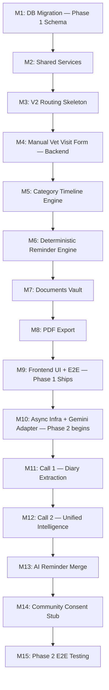

# PetOLife AI Timeline — Incremental Build Plan
## Version 6.0 (Manual-First Core / AI-Optional Overlay)

**Previous Version:** 5.0 (2-Call AI-first Architecture)

**Change Summary (v5.0 → v6.0):** The build is re-sequenced into two independent tracks. **Phase 1 (Milestones 1–9)** builds the complete, functional, no-AI product — pet profiles, manual vet-visit logging via a category-driven form, a category-first timeline, a deterministic reminder engine, a documents vault, and PDF export. Phase 1 ships and is fully usable on its own. **Phase 2 (Milestones 10–15)** adds the optional Gemini overlay — diary auto-extraction that feeds the same manual form, and AI insight generation — reusing the 2-call design from v5.0 but bolted onto the Phase 1 foundation instead of being the foundation itself. Async task infrastructure, the Gemini adapter, token logging, and community insights all move from "core" to "Phase 2 only."

---

## 1. Build Overview

The product is integrated into the existing PetOLife MVP V2 React-FastAPI application. Phase 1 is **9 milestones** and is a complete deliverable on its own — it should be demoed, tested, and considered shippable before Phase 2 work begins. Phase 2 is **6 further milestones**, additive and independently revertible.

---

## 2. Global Build Rules

- **Backward Compatibility First:** Never modify existing V1 routes or tables without ensuring absolute backward compatibility.
- **Shared Service Layer:** Move core CRUD and storage operations into `app/services/` to avoid duplication between V1 and V2.
- **Isolated V2 Routing Namespace:** All new features live under `/api/v2/`.
- **Phase 1 has zero AI dependency:** No code under `app/timeline/services/` may import anything from `app/timeline/ai/`. This is a lint/CI rule, not just a convention, enforced from Milestone 1 onward.
- **Category is a first-class field:** Every `medical_events` row carries a required `category`; the timeline's default query groups by it.
- **Vanilla CSS:** Frontend UI components use strict Vanilla CSS (imported `.css` files adjacent to components). Tailwind is not allowed.
- **Phase 2 Token Logging:** Every Gemini call must log input tokens, output tokens, model version, operation name, and pet_id to `ai_token_logs`. Not optional, but also not relevant until Phase 2 begins.

---

## 3. Milestones

---

# PHASE 1 — Core Product, No AI

### Milestone 1: Database Migration (Phase 1 Schema)

**Objective:** Stand up the category-first schema with zero AI-related tables.

**Tasks:**
- Create migration `backend/supabase/migrations/<timestamp>_add_v2_core_tables.sql`
- `ALTER TABLE pet_profiles` to add `species`, `breed`, `date_of_birth`, `health_conditions`
- `CREATE TABLE medical_events` with `category`, `visit_group_id`, `source`, `verification_status`, and all category-specific columns (see API/DB Spec §5.2)
- `CREATE TABLE medical_documents`, `CREATE TABLE edit_history`, `CREATE TABLE reminders` (simplified `type` enum, no AI types active yet)
- Indexes: `(pet_id, category, event_date DESC)`, `(pet_id, event_date DESC)`, `(visit_group_id)`, `(pet_id, event_hash)`

**Deliverable:** Version-controlled SQL migration applied to local and staging Supabase.

**Tests:**
- Verify all existing V1 endpoints continue to function post-migration
- Verify all check constraints (category enum, verification_status enum, weight_unit enum)
- Confirm no table in this milestone references anything AI-related

**Exit Criteria:** Phase 1 schema is live. V1 app is unaffected.

---

### Milestone 2: Refactor V1 Routers for Shared Service Layer

**Objective:** Eliminate duplication between V1 and the new V2 pet/document logic.

**Tasks:**
- Create `backend/app/services/pet_service.py` and `medical_record_service.py`
- Refactor `backend/app/routers/pet_profile.py` and `medical_records.py` to use these services

**Deliverable:** Shared services layer; unchanged V1 behaviour.

**Tests:**
- Run V1 signup, login, pet list, and document upload flows; confirm identical behaviour pre/post refactor

**Exit Criteria:** All pet/medical-record DB access flows through the shared layer with no V1 regressions.

---

### Milestone 3: V2 API Routing Skeleton

**Objective:** Mount the V2 namespace and the `app/timeline/` package — Phase 1 only, no async task infra yet (none is needed).

**Tasks:**
- Create `backend/app/routers/v2/`: `pet_profile.py`, `medical_events.py`, `timeline.py`, `reminders.py`, `documents.py`, `export.py`
- Mount under `/api/v2` in `main.py`
- Create `backend/app/timeline/schemas/medical_event.py` and `reminder.py` (Pydantic models matching the Milestone 1 schema)
- Create `backend/app/timeline/services/` package (empty service stubs: `event_service.py`, `category_engine.py`, `reminder_engine.py`, `document_service.py`, `export_service.py`, `dedupe_service.py`)
- **Do not** create `app/timeline/ai/` yet — it doesn't exist until Milestone 10

**Deliverable:** Active `/api/v2/...` routing namespace with mocked/stubbed responses.

**Tests:**
- Verify all V2 routes return expected mock responses
- Confirm JWT auth blocks unauthorised access
- Confirm none of these endpoints are async/backgrounded (Phase 1 is synchronous by design)

**Exit Criteria:** V2 routers mounted; all Phase 1 service stubs exist and are wired to routers.

---

### Milestone 4: Manual Vet Visit Form — Backend

**Objective:** Implement the core data-entry path: category-driven creation, edit, and delete of Medical Event Nodes.

**Tasks:**
- Implement `event_service.py`:
  - `create_event()` — validates category-specific required fields, computes `event_hash`, runs `dedupe_service` same-day check, inserts row with `source='manual'`, `verification_status='verified'`
  - `update_event()` — writes an `edit_history` row per change, re-triggers reminder recomputation if a due-date-relevant field changed
  - `delete_event()` — cascades to `reminders` and `medical_documents`
  - `link_to_visit_group()` — attaches a new category entry to an existing `visit_group_id`
- Implement `dedupe_service.py`: `event_hash = SHA256(pet_id + category + event_date + primary_field)`; same-day collision → `409` with candidate
- Wire up `POST /medical-events`, `GET /medical-events`, `GET /medical-events/{id}`, `PUT /medical-events/{id}`, `DELETE /medical-events/{id}`, `POST /medical-events/{id}/link`

**Deliverable:** Full CRUD for manually entered medical events, category-validated.

**Tests:**
- Verify each category enforces its own required fields (e.g. vaccination requires `vaccine_name`)
- Verify duplicate same-day submissions return `409` with a candidate event
- Verify `edit_history` gets a row on every update, with correct `previous_value` snapshot
- Verify `visit_group_id` correctly links multiple category entries from one visit
- Verify deleting an event cascades reminders and documents correctly

**Exit Criteria:** A user can create, edit, link, and delete medical events of every category through the API, with no AI code path touched.

---

### Milestone 5: Category Timeline Engine

**Objective:** Implement the category-first read model.

**Tasks:**
- Implement `category_engine.py`:
  - `get_category_grouped(pet_id)` — one query per category (or one grouped query, grouped in application code), sorted `event_date DESC`
  - `get_chronological(pet_id)` — flat, all-category, date-sorted
  - `get_visit_group(pet_id, visit_group_id)` — reconstructs all nodes sharing a `visit_group_id`
- Wire up `GET /timeline` (default: category-grouped), `GET /timeline?view=chronological`, `GET /timeline/visit/{visit_group_id}`

**Deliverable:** Category-grouped and chronological timeline endpoints.

**Tests:**
- Verify category grouping returns each category correctly bucketed and internally sorted
- Verify chronological view merges all categories correctly by date
- Verify visit-group reconstruction returns all linked entries regardless of category
- Performance: verify the composite index `(pet_id, category, event_date DESC)` is used (query plan check) for pets with 100+ events

**Exit Criteria:** Category view is the default; chronological view works as a toggle; both are backed by indexed queries.

---

### Milestone 6: Deterministic Reminder Engine

**Objective:** Implement rule-based reminder generation with zero AI.

**Tasks:**
- Implement `reminder_engine.py`:
  - `RULE_ENGINE_OWNS` handling for `vaccination` (via `BOOSTER_INTERVALS` lookup), `deworming` (+90 days), `anti_tick` (per-product or default), `medication_end` (`start_date + duration_days`), `follow_up` (explicit `follow_up_date` from the form)
  - Called synchronously from `event_service.create_event()` / `update_event()`
  - Priority assignment: high (missed follow-up, critical medication ending), medium (vaccination/deworming/anti-tick due), low (weight check-in)
- Wire up `GET /reminders` with `?type=&status=&range=`, `PUT /reminders/{id}/complete`, `PUT /reminders/{id}/snooze`

**Deliverable:** Fully rule-based reminder engine, wired into the event creation/edit flow.

**Tests:**
- Verify Rabies vaccination produces a reminder exactly 365 days out; DHPP 365; Bordetella 180
- Verify deworming produces a reminder exactly 90 days out
- Verify medication end-date reminder matches `start_date + duration_days`
- Verify follow-up reminder uses the exact `follow_up_date` entered
- Verify editing an event's due-date-relevant field recomputes/updates the correct reminder, not a duplicate
- Verify `complete` and `snooze` transitions behave correctly

**Exit Criteria:** Every category that should produce a reminder does so automatically and correctly on save, with no external dependency.

---

### Milestone 7: Documents Vault

**Objective:** Attachment upload/storage for both event-linked and pet-level documents.

**Tasks:**
- Implement `document_service.py`: upload to Supabase Storage, insert `medical_documents` row, optional `event_id` link
- Wire up `POST /documents/upload`, `GET /documents?event_id=`, `DELETE /documents/{id}`

**Deliverable:** Working documents vault.

**Tests:**
- Verify upload without `event_id` attaches at the pet level
- Verify upload with `event_id` attaches to that specific event
- Verify deletion removes both the storage file and the DB row

**Exit Criteria:** Certificates, reports, and lab results can be attached and retrieved reliably.

---

### Milestone 8: PDF Export

**Objective:** Shareable summary generation, no AI.

**Tasks:**
- Implement `export_service.py`: template-based PDF rendering from selected `medical_events` rows (full history, single category, or date range)
- Wire up `POST /export/pdf`

**Deliverable:** Downloadable/shareable PDF summary endpoint.

**Tests:**
- Verify full-history export includes every verified event grouped by category
- Verify category-filtered export includes only that category
- Verify date-range export respects the bounds

**Exit Criteria:** A vet-ready PDF can be generated and shared for any pet.

---

### Milestone 9: Frontend UI + Phase 1 End-to-End — **Phase 1 Ships**

**Objective:** Build the complete manual-first UI and verify the entire no-AI product end-to-end.

**Tasks:**
- Build the **Manual Vet Visit Form**: category chip selector at top, progressive disclosure of category-specific fields, inline editable auto-suggested due dates, "Add another entry for this visit," confirmation toast showing the reminder just created
- Build the **Category Timeline** screen: tabbed/sectioned by category (default), toggle to chronological "All" view
- Build the **Reminders** calendar widget (daily/weekly/monthly/quarterly/yearly views)
- Build the **Documents Vault** screen
- Build the **PDF Export** flow (category/date-range picker → download/share)
- All components under `src/components/Timeline/` using Vanilla CSS

**Deliverable:** A fully usable, AI-free medical record app.

**Tests:**
- E2E: create pet → log a vet visit + vaccination via "Add another entry" → confirm both appear under their categories, sharing a `visit_group_id` → confirm a vaccination reminder was created → export a PDF → confirm it includes both entries
- Verify duplicate same-day submission surfaces the "save anyway?" prompt correctly in the UI
- Verify editing an event updates the timeline and, where relevant, its reminder
- Cross-browser responsiveness check

**Exit Criteria:** Phase 1 (F1–F6) is demoable and shippable as a complete product with `GEMINI_API_KEY` entirely unset.

---

# PHASE 2 — Optional AI Overlay

*Everything below is additive. It must be possible to skip Phase 2 entirely and still have a complete product from Milestone 9.*

### Milestone 10: Async Infrastructure + Gemini Adapter

**Objective:** Stand up the background task pattern and AI abstraction layer, isolated from Phase 1 code.

**Tasks:**
- Create `app/timeline/ai/` package: `schemas/`, `services/`, `adapters/`
- Create `app/timeline/ai/adapters/ai_provider_base.py` and `gemini_adapter.py` with `call_extraction()`, `call_intelligence()`, `_log_token_usage()` stubs
- Set up `FastAPI BackgroundTasks` pattern for the two AI endpoints
- Migration: `ALTER TABLE medical_records ADD ocr_status, extracted_json`; `CREATE TABLE medical_event_insights, pol_analyses, ai_token_logs`
- CI rule: fail the build if anything under `app/timeline/services/` imports from `app/timeline/ai/`

**Deliverable:** Isolated, mountable AI package with async infra and its own schema.

**Tests:**
- Verify Phase 1 test suite still passes unmodified with `app/timeline/ai/` present but unused
- Verify Phase 1 test suite still passes with `app/timeline/ai/` **entirely deleted** from the checkout (proves true isolation)
- Verify the import-boundary CI check catches a deliberately introduced violation

**Exit Criteria:** Phase 2 schema and package exist without touching Phase 1 behaviour.

---

### Milestone 11: Call 1 — Diary Extraction

**Objective:** Implement diary upload → single Gemini call → drafts that pre-fill the Phase 1 form.

**Tasks:**
- Implement `gemini_adapter.call_extraction(file_uri, pet_id)`: upload to Google File API, send unified extraction prompt (schema includes `category` per sub-entry), parse into `ExtractionBundle`, log tokens
- Implement `extraction_service.py`: store `ExtractionBundle` in `medical_records.extracted_json`; insert one `medical_events` row per `draft_events[]` entry with `source='ai_extracted'`, `verification_status='pending'`, `visit_group_id` shared across same-visit entries
- Wire up `POST /ai/documents/upload`, `POST /ai/documents/{doc_id}/extract` (`202 Accepted`, background), `GET /ai/documents/{doc_id}/status`
- **No new verification endpoint** — confirm that draft rows are editable and verifiable through the existing Phase 1 `PUT /medical-events/{event_id}`

**Deliverable:** One-call diary extraction that feeds directly into the Manual Vet Visit Form as pre-filled drafts.

**Tests:**
- Verify exactly one Gemini call per diary upload regardless of visit count
- Verify each `draft_events[]` entry lands as a correctly categorised `medical_events` row
- Verify `visit_group_id` correctly links multi-category entries from the same detected visit
- Verify low-confidence fields (`confidence < 0.75`) are flagged for the frontend
- Verify editing/confirming a draft through `PUT /medical-events/{id}` flips it to `verified` and it then behaves identically to a manual entry (appears in category timeline, triggers reminder engine, etc.)
- Verify `ai_token_logs` gets exactly one row per extraction call

**Exit Criteria:** A diary upload produces reviewable drafts inside the same form used for manual entry, with zero divergence in downstream behaviour once verified.

---

### Milestone 12: Call 2 — Unified Intelligence

**Objective:** Implement one-call insight generation across all verified events (manual + AI-extracted alike).

**Tasks:**
- Implement `gemini_adapter.call_intelligence(verified_events, pol_context, pet_id)`: batched prompt, parse into `IntelligenceBundle`, log tokens
- Implement `insight_engine.py`: fetch all `verification_status='verified'` events (regardless of `source`), fetch current `pol_analyses`, call Gemini, upsert `medical_event_insights`, insert new `pol_analyses` version
- Wire up `POST /ai/insights/generate` (`202`, background), `GET /ai/insights/status`, `GET /ai/insights/node/{event_id}`, `GET /ai/insights/collective`

**Deliverable:** One-call intelligence generation covering the pet's whole verified history.

**Tests:**
- Verify exactly one Gemini call per intelligence run regardless of event count
- Verify `node_insights[]` covers every verified event — manual and AI-extracted both
- Verify every `node_insight` carries a non-empty `medical_disclaimer` — reject at the Pydantic level otherwise
- Verify `pol_analyses` structured columns populate correctly
- Verify `ai_token_logs` gets exactly one row per Call 2 run

**Exit Criteria:** Insight cards can be generated and retrieved for any pet with verified history, independent of how that history was entered.

---

### Milestone 13: AI Reminder Merge

**Objective:** Layer AI-interpreted reminders (`monitoring`, `conditional`) on top of the Phase 1 rule-based set, without disturbing it.

**Tasks:**
- Implement `ai_reminder_merge.py`: insert `IntelligenceBundle.reminder_note.identified_reminders[]` into `reminders` with `is_ai_generated=true`, restricted to `monitoring`/`conditional` types only
- Deduplicate against existing reminders for the same `(source_event_id, type)`
- Confirm `GET /reminders` merges both sets transparently for the frontend

**Deliverable:** AI reminders appear alongside rule-based ones, clearly flagged.

**Tests:**
- Verify AI reminder rows always have `is_ai_generated=true` and type in `{monitoring, conditional}` only — reject anything else at the service layer
- Verify no duplicate reminder is created for the same event+type
- Verify Phase 1 rule-based reminders are unaffected in count or content when Phase 2 runs

**Exit Criteria:** The reminder list is a correct, deduplicated merge of rule-based and AI-interpreted entries.

---

### Milestone 14: Community Consent Stub

**Objective:** Reserve the schema and a minimal consent toggle for Phase 3, without building the matching engine yet.

**Tasks:**
- Migration: `CREATE TABLE community_consent, experience_cards`
- Wire up `PUT /ai/community/consent` (toggle only; no anonymisation pipeline yet)

**Deliverable:** Consent toggle persists; no data is shared anywhere yet.

**Tests:**
- Verify toggle persists and defaults to `private`
- Verify no `experience_cards` rows are ever created by this milestone (matching engine is future work)

**Exit Criteria:** Schema is ready for Phase 3 without any premature data sharing.

---

### Milestone 15: Phase 2 End-to-End Testing

**Objective:** Verify the complete optional overlay, and — critically — that it remains fully optional.

**Tasks:**
- `pytest` integration test: `Upload diary → POST /extract (202) → poll status → verify drafts via PUT /medical-events → POST /ai/insights/generate (202) → poll status → GET timeline → GET insights/node → GET reminders`
- Test asserting Call 1 produces exactly one Gemini call per upload
- Test asserting Call 2 produces exactly one Gemini call per run
- Test asserting `ai_token_logs` has exactly two rows after a full upload-to-insights cycle
- **Isolation test:** run the full Phase 1 test suite with `GEMINI_API_KEY` unset and `app/routers/v2/ai/` un-mounted — confirm zero failures and zero references to AI tables

**Deliverable:** Verified Phase 2 build, with proof that Phase 1 remains independently shippable.

**Tests:**
- E2E integration suite (Milestones 10–14 covered)
- 2-call count assertions
- Token logging assertions
- Phase 1 isolation assertion (the most important test in this milestone)

**Exit Criteria:** Phase 2 works correctly when enabled, and Phase 1 is provably unaffected when it isn't.
