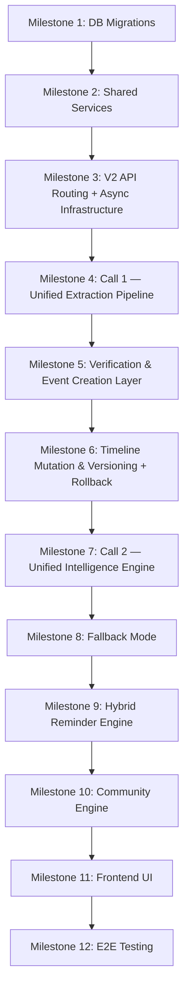

# PetOLife AI Timeline — AI Incremental Build Plan
## Version 5.0 (2-Call Architecture)

**Previous Version:** 4.0
**Change Summary:** Updated Milestone 4 to implement Call 1 (Unified Extraction) as a single async background task replacing the separate OCR + JSON steps. Updated Milestone 7 to implement Call 2 (Unified Intelligence) as a single async batched call replacing per-node + collective + reminder calls. Added `medical_event_insights` table to Milestone 1. Added async task infrastructure to Milestone 3. Added token logging requirement to Milestone 4. Added rollback endpoint to Milestone 6. Added reminder boundary enforcement to Milestone 9.

---

## 1. Build Overview

This document defines the implementation phases for the AI Timeline.

The AI Timeline is integrated into the existing PetOLife MVP V2 React-FastAPI application. The build is structured into **12 milestones**. Each milestone must compile, pass tests, and satisfy integration criteria before proceeding to the next phase.

---

## 2. Global Build Rules

- **Backward Compatibility First:** Never modify existing V1 routes or tables without ensuring absolute backward compatibility.
- **Shared Service Layer:** Move core CRUD and storage operations into `app/services/` to prevent duplication between V1 and V2 controllers.
- **Isolated V2 Routing Namespace:** All new timeline features live under `/api/v2/` and AI logic lives in `app/timeline/`.
- **2-Call Gemini Constraint:** The system makes exactly two Gemini calls per upload — Call 1 (Unified Extraction) and Call 2 (Unified Intelligence). No per-node loops. No separate OCR and JSON steps.
- **Async Gemini Calls:** Both Gemini calls are executed in background tasks. They must never block HTTP request threads.
- **Vanilla CSS:** Frontend UI components must use strict Vanilla CSS (imported `.css` files adjacent to components). Tailwind is not allowed.
- **Token Logging:** Every Gemini call must log input tokens, output tokens, model version, operation name, and pet_id to `ai_token_logs`. This is not optional.

---

## 3. Milestones

---

### Milestone 1: Database Migration & Schema Versioning

**Objective:** Prepare the database schema for V2 tables and additive V1 columns using backwards-compatible migrations.

**Tasks:**
- Create Supabase SQL migration file: `backend/supabase/migrations/20260714120000_add_v2_timeline_tables.sql`
- Write `ALTER TABLE medical_records` statements to add: `ocr_status`, `ocr_extracted_at`, `ocr_error`, `extracted_json` (stores ExtractionBundle from Call 1)
- Write `ALTER TABLE pet_profiles` to add: `active_timeline_version INTEGER` (used by rollback endpoint)
- Write `CREATE TABLE` for: `timeline_versions`, `medical_events` (with `source_page_range`, `field_confidence`, `superseded` status), `medical_event_insights` (new — stores per-node Call 2 output), `pol_analyses` (with typed columns: `overall_summary`, `hierarchical_summary`, `active_conditions`, `vaccination_status`, `insight_version`, `token_count`), `reminders` (with `frequency`, `priority`, extended `type` enum), `community_consent`, `experience_cards`, `ai_token_logs` (new — stores per-call token usage)
- Define all indexes: foreign key indexes on `pet_id`, GIN indexes on all JSONB fields, composite indexes on `(pet_id, verification_status)` and `(pet_id, due_date)`

**Deliverable:** Version-controlled SQL migration scripts applied to local and staging Supabase instances.

**Tests:**
- Verify all existing V1 endpoints continue to function correctly post-migration
- Verify schema constraints, foreign key cascades, unique conditions, and check constraints in Supabase SQL Editor
- Confirm `medical_records.extracted_json` accepts JSONB null (V1 rows unaffected)

**Exit Criteria:** Additive schema is applied to live database. V1 app runs without errors on the updated schema.

---

### Milestone 2: Refactor V1 Routers for Shared Service Layer

**Objective:** Eliminate code redundancy by extracting database queries and storage actions into a shared services layer.

**Tasks:**
- Create `backend/app/services/pet_service.py` with pet profile query and manipulation actions
- Create `backend/app/services/medical_record_service.py` with document upload, file storage, and retrieval logic
- Refactor `backend/app/routers/pet_profile.py` to call `PetService`
- Refactor `backend/app/routers/medical_records.py` to call `MedicalRecordService`

**Deliverable:** New services layer files and clean V1 routers.

**Tests:**
- Run V1 user signup, login, pet list, and document upload flows
- Confirm refactored routers behave identically to original implementations

**Exit Criteria:** All pet and medical record database transactions are successfully channelled through the shared services layer with no V1 regressions.

---

### Milestone 3: V2 API Routing, Isolation Skeleton & Async Infrastructure

**Objective:** Mount the V2 routing namespace, set up the timeline sub-package, and establish the async background task infrastructure that both Gemini calls will use.

**Tasks:**
- Create `backend/app/routers/v2/` and add sub-routers: `pet_profile.py`, `medical_records.py`, `ocr.py`, `timeline.py` (includes rollback endpoint stub), `insights.py`, `reminders.py`, `community.py`
- Mount all V2 routers in `backend/app/main.py` under `/api/v2` prefix
- Create `backend/app/timeline/` sub-package with `schemas/`, `services/`, and `adapters/` directories
- Define Pydantic models: `ExtractionBundle`, `IntelligenceBundle`, `MedicalEventNode`, `NodeInsight`, `CollectiveInsight`, `ReminderNote`, `ReminderObject`
- Set up `FastAPI BackgroundTasks` pattern that will be used by both OCR (Call 1) and intelligence (Call 2) endpoints — stub tasks returning `202 Accepted` with task status tracking
- Create `app/timeline/adapters/ai_provider_base.py` abstract interface
- Create `app/timeline/adapters/gemini_adapter.py` skeleton with `call_extraction()`, `call_intelligence()`, and `_log_token_usage()` method stubs

**Deliverable:** Active `/api/v2/...` routing namespace returning mock responses. Background task infrastructure stubbed and testable.

**Tests:**
- Verify all V2 routing URLs return expected responses (even if mocked)
- Confirm JWT authentication middleware blocks unauthorised access on all V2 endpoints
- Confirm `202 Accepted` is returned immediately from async endpoints (not blocking)

**Exit Criteria:** V2 router controllers are mounted. Background task pattern is operational. Gemini adapter interface is defined.

---

### Milestone 4: Call 1 — Unified Extraction Pipeline

**Objective:** Implement Call 1 as a single async Gemini call that simultaneously performs OCR and medical JSON structuring for all visits in one document.

**Tasks:**
- Complete `gemini_adapter.py` — implement `call_extraction(file_uri, pet_id)`:
  - Upload file to Google File API, get URI
  - Send unified extraction prompt with full `ExtractionBundle` JSON schema
  - Parse and validate response against `ExtractionBundle` Pydantic model
  - Call `_log_token_usage()` with `operation='call_1_extraction'` on every call — no exceptions
- Implement `ocr_service.py`:
  - Accept PDF or image files
  - Upload to Google File API
  - Call `gemini_adapter.call_extraction()`
  - Store full `ExtractionBundle` in `medical_records.extracted_json`
  - Insert one `medical_events` row per visit in `ExtractionBundle.medical_events[]` with `verification_status = 'pending'` and `field_confidence` populated from extraction metadata
  - Update `medical_records.ocr_status = 'extracted'`
  - Dispatch WebSocket/SSE notification on completion
- Wire up `POST /api/v2/pets/{pet_id}/documents/{doc_id}/ocr`:
  - Set `ocr_status = 'processing'` synchronously
  - Enqueue `ocr_service` as background task
  - Return `202 Accepted` immediately
- Wire up `GET /api/v2/pets/{pet_id}/documents/{doc_id}/ocr` to return current `ExtractionBundle` and `ocr_status`

**Deliverable:** Integrated Call 1 pipeline — one Gemini call produces OCR text and all structured medical events for the entire document.

**Tests:**
- Test extraction accuracy using sample veterinary PDFs and JPG images with multiple visits
- Verify `ExtractionBundle` schema validation rejects malformed Gemini responses at the Pydantic level
- Verify `ocr_raw_text` is populated per visit (nothing discarded)
- Verify `field_confidence` is populated per field (not just a global score)
- Verify `ocr_status` transitions: `pending → processing → extracted` (or `failed`)
- Verify `202 Accepted` is returned before Gemini responds — not after
- Verify `ai_token_logs` row is inserted after every call
- Test graceful failure: unreadable file sets `ocr_status = 'failed'`, writes `ocr_error`, does not crash

**Exit Criteria:** A single `POST /ocr` request triggers one Gemini call, produces a complete `ExtractionBundle` for all visits, stores it, and returns asynchronously. Token usage is logged.

---

### Milestone 5: Verification & Event Creation Layer

**Objective:** Implement human verification workflows and generate immutable Medical Event Nodes.

**Tasks:**
- Implement `PUT /api/v2/pets/{pet_id}/documents/{doc_id}/verify`:
  - Accept user-edited JSON (one or all events from the `ExtractionBundle`)
  - Validate all fields (date ranges, non-negative weights, required visit date)
  - Compute `SHA-256 event_hash` from `visit_date + doctor + diagnosis_list + medication_list + source_doc_id`
  - Run near-duplicate check using `NEAR_DUPLICATE_CONFIG` thresholds
  - Update `medical_events` rows to `verification_status = 'verified'` (or flag for review)
  - Update `medical_records.ocr_status = 'verified'`
- Implement `event_builder.py` to map verified JSON to `MedicalEventNode` schema
- Implement near-duplicate logic in `mutation_engine.py` using the four defined thresholds

**Deliverable:** Verification API endpoint, event mapper, and duplicate/near-duplicate filtering.

**Tests:**
- Verify edit validation rejects invalid date ranges and negative weights
- Verify SHA-256 hash produces identical output for identical event data
- Verify exact duplicates are caught by hash match and rejected
- Verify near-duplicates trigger the correct resolution path (auto-merge vs. flag) based on threshold counts
- Verify verified events appear in subsequent timeline queries; pending events do not

**Exit Criteria:** User-verified data successfully creates immutable `medical_events` rows. Duplicates and near-duplicates are handled deterministically.

---

### Milestone 6: Timeline Mutation, Immutable Versioning & Rollback

**Objective:** Handle immutable versioned updates and implement the rollback endpoint.

**Tasks:**
- Complete `mutation_engine.py`:
  - On new verified event: insert row in `timeline_versions`, increment version number, map event to new version
  - Enforce append-only rule: no DELETE or UPDATE on existing verified events (corrections create new `superseded` versions)
  - Update `pet_profiles.active_timeline_version` on each successful mutation
- Implement `POST /api/v2/pets/{pet_id}/timeline/rollback`:
  - Validate `target_version` exists in `timeline_versions` for this pet
  - Set `pet_profiles.active_timeline_version = target_version`
  - Return the timeline filtered to `timeline_version <= target_version` and `verification_status = 'verified'`
  - No data is deleted — `active_timeline_version` is a pointer

**Deliverable:** Version tracking module, immutable timeline constructor, and rollback endpoint.

**Tests:**
- Verify adding a new event increments `timeline_versions` correctly
- Verify that reading the timeline at version N excludes events added after version N
- Verify rollback sets `active_timeline_version` and returns the correct historical state
- Verify rollback does not delete any rows from any table
- Verify historic versions remain independently readable after subsequent updates

**Exit Criteria:** The medical timeline is append-only and versioned. Rollback is a non-destructive pointer operation.

---

### Milestone 7: Call 2 — Unified Intelligence Engine

**Objective:** Implement Call 2 as a single async Gemini call that generates all node insights, the collective insight, and AI-interpreted reminders in one batched request.

**Tasks:**
- Complete `gemini_adapter.py` — implement `call_intelligence(verified_events, pol_context, pet_id)`:
  - Build payload: verified `medical_events` array + current `pol_analyses` structured columns (incremental context)
  - Send unified intelligence prompt with full `IntelligenceBundle` JSON schema
  - Enforce in prompt: every `node_insight` must include `medical_disclaimer`; `overall_summary` must be under 200 words; `reminder_note` only covers `AI_REMINDER_INTERPRETS` types
  - Parse and validate response against `IntelligenceBundle` Pydantic model
  - Call `_log_token_usage()` with `operation='call_2_intelligence'` on every call
- Implement `insight_engine.py`:
  - Fetch all verified `medical_events` for the pet
  - Fetch current `pol_analyses` record as incremental context (not raw historical records)
  - Call `gemini_adapter.call_intelligence()`
  - Upsert each item in `IntelligenceBundle.node_insights[]` into `medical_event_insights` (keyed by `event_id`)
  - Insert new `pol_analyses` version with structured columns populated from `IntelligenceBundle.collective_insight`
  - Store `token_count` in `pol_analyses` from token log
  - Insert AI reminders from `IntelligenceBundle.reminder_note.identified_reminders[]` into `reminders` with `is_ai_generated = true`
- Wire up `POST /api/v2/pets/{pet_id}/timeline/generate-insights`:
  - Enqueue `insight_engine` as background task
  - Return `202 Accepted` immediately
- Wire up `GET /api/v2/pets/{pet_id}/timeline/insights-status` to poll completion
- Wire up `GET /api/v2/pets/{pet_id}/insights/node/{event_id}` to return single `medical_event_insights` row
- Wire up `GET /api/v2/pets/{pet_id}/insights/collective` to return current `pol_analyses` structured columns

**Deliverable:** Integrated Call 2 pipeline — one Gemini call produces all node insights, the collective insight, and AI reminder data for the entire verified history.

**Tests:**
- Verify `IntelligenceBundle.node_insights[]` contains one entry per verified `event_id` — no missing events, no extra events
- Verify each `node_insight.medical_disclaimer` is non-empty — reject `IntelligenceBundle` at Pydantic level if any disclaimer is missing
- Verify `medical_event_insights` upsert: existing rows are updated, new rows are inserted, `UNIQUE(event_id)` constraint holds
- Verify `pol_analyses` structured columns are populated correctly from `collective_insight`
- Verify `token_count` is stored in `pol_analyses`
- Verify AI reminder rows have `is_ai_generated = true` and only cover `AI_REMINDER_INTERPRETS` types
- Verify `202 Accepted` is returned before Gemini responds
- Verify `ai_token_logs` row is inserted for every Call 2 execution
- Profile: verify total time for Call 2 is lower than the equivalent per-node loop would have been

**Exit Criteria:** A single background task executes one Gemini call, populates `medical_event_insights`, `pol_analyses`, and AI `reminders` for all events. Token usage is logged.

---

### Milestone 8: Fallback Mechanism & Manual Form Router

**Objective:** Maintain core system functionality using rule-based processing when Gemini is unavailable.

**Tasks:**
- Implement health monitor in `fallback_router.py` to check Gemini API status and quota
- Wrap both `ocr_service.py` and `insight_engine.py` with the fallback check — if Gemini is unavailable, route to fallback path
- Implement `POST /api/v2/pets/{pet_id}/timeline/fallback-form` for manual Vet Visit entry (Visit Date, Clinic optional, Reason, Diagnosis, Medication, Vaccination, Weight, Follow-up Date, Doctor Notes, Treatment Status)
- Build rule-based timeline compiler in `fallback_router.py`: sort `medical_events` by date, return cards with raw field data (no AI summary), set `X-Timeline-Mode: Fallback` header
- On Gemini recovery: existing `medical_events` rows (from fallback form) are automatically picked up by the next Call 2 execution — no user re-entry required

**Deliverable:** Rule-based backup pipeline and manual form endpoint.

**Tests:**
- Mock Gemini quota exceeded and API timeout — verify automatic fallback activation
- Verify fallback form creates valid `medical_events` rows with the same schema as AI-path rows
- Verify `X-Timeline-Mode: Fallback` header is set in fallback mode; `X-Timeline-Mode: AI` in normal mode
- Verify that after Gemini recovers, a subsequent `generate-insights` call processes fallback-form events correctly

**Exit Criteria:** Timeline remains operational and renders chronological history without Gemini access.

---

### Milestone 9: Hybrid Reminder Engine

**Objective:** Generate reminder dates combining rule-based and AI-interpreted logic with explicit boundary enforcement.

**Tasks:**
- Implement `reminder_engine.py` with the boundary enforced:
  - `RULE_ENGINE_OWNS = ['vaccination', 'deworming', 'anti_tick', 'medication_end']` — generated deterministically, always, regardless of Gemini availability
  - `AI_REMINDER_INTERPRETS = ['follow_up', 'monitoring', 'conditional']` — inserted from `IntelligenceBundle.reminder_note` output by `insight_engine.py`
- Implement rule calculations: Rabies → +365 days, Deworming → +90 days, Anti-tick → per schedule, Medication → end-date from duration, Follow-up → explicit date from `event_data.follow_up`
- Implement deduplication: merge rule-based and AI reminder sets before writing to `reminders` table; do not create duplicate rows for the same event + type combination
- Implement `GET /api/v2/pets/{pet_id}/reminders` with query params: `?type=`, `?status=`, `?range=monthly`
- Ensure reminders are cascaded correctly: when a `medical_events` row is rejected or superseded, its linked `reminders` rows are updated or deleted

**Deliverable:** Hybrid reminder engine with enforced rule/AI boundary and merged output.

**Tests:**
- Verify rule-based reminder dates match expected intervals (e.g., Rabies → exactly +365 days from vaccination date)
- Verify rule-based reminders are generated even when Gemini is unavailable (fallback mode)
- Verify AI reminder rows have `is_ai_generated = true`; rule reminder rows have `is_ai_generated = false`
- Verify no duplicate reminder exists for the same `(source_event_id, type)` combination
- Verify reminders are correctly deleted or rescheduled when parent events are rejected

**Exit Criteria:** A dynamic merged reminder list is computed and stored for every timeline version. Rule/AI boundary is enforced at the code level.

---

### Milestone 10: Community Consent & Shared Insights

**Objective:** Enable anonymous sharing of medical cards and similarity matching with strict consent enforcement.

**Tasks:**
- Implement `PUT /api/v2/pets/{pet_id}/community/consent` to store opt-in/opt-out in `community_consent`
- Implement consent revocation: when mode switches to `private`, permanently delete associated rows from `experience_cards`
- Implement `community_engine.py`:
  - Map verified `medical_events` to `experience_cards` rows
  - Strip all PII: pet name, owner name, clinic, doctor name, source document references
  - Set `anonymous_pet_id` as one-way SHA-256 hash of real `pet_id` — never a foreign key
  - Only share if `community_consent.mode = 'anonymous'`
- Implement `GET /api/v2/community/insights` with similarity queries on `(species, breed, diagnosis, age_range)`

**Deliverable:** Data anonymiser, consent controller, and similarity matching engine.

**Tests:**
- Verify `experience_cards` rows contain no PII fields
- Verify `anonymous_pet_id` is not reversible to the real `pet_id`
- Verify `experience_cards` rows are deleted when consent is revoked
- Verify similarity queries return no data for `private` mode pets

**Exit Criteria:** Anonymised community experience sharing is strictly enforced by user consent and revocation is immediate.

---

### Milestone 11: Frontend UI Integration

**Objective:** Replace the timeline placeholder screen in React with the active V2 dashboard.

**Tasks:**
- Create component subfolders under `src/components/Timeline/` using Vanilla CSS (no Tailwind)
- Implement upload dashboard and Call 1 progress indicator:
  - Show `ocr_status` polling or WebSocket/SSE listener
  - Render "Extracting your diary..." state during background Call 1
- Implement OCR verification interface:
  - Render each `medical_events` row from `ExtractionBundle` for review
  - Highlight fields with `field_confidence < 0.75` for mandatory user attention
  - Allow per-field editing before submission
- Implement Call 2 progress indicator:
  - Show "Generating insights..." state during background Call 2
  - Render insight cards once `insights_ready` notification arrives
- Render chronological timeline cards showing Medical Event Nodes with their `medical_event_insights`
- Render per-node insight cards: human summary, visit understanding, suggested actions, disclaimer
- Render collective insight panel from `pol_analyses` structured columns
- Build manual Vet Visit form for Fallback Mode submissions
- Build reminders calendar widget from `GET /api/v2/pets/{pet_id}/reminders`
- Display `X-Timeline-Mode: Fallback` warning banner when header indicates fallback mode
- Add community consent toggle in settings

**Deliverable:** Responsive, fully featured frontend interface using Vanilla CSS.

**Tests:**
- Verify upload → extraction → verification → insights flow end-to-end in the UI
- Verify fields flagged as low-confidence are visually highlighted
- Verify "Basic Timeline Mode" banner appears in fallback mode
- Test cross-browser responsiveness and all loading states
- Verify `medical_disclaimer` is visible on every insight card

**Exit Criteria:** The frontend timeline dashboard is fully integrated and interacts exclusively with V2 backend endpoints.

---

### Milestone 12: End-to-End Verification & Automated Testing

**Objective:** Run automated integration tests, profile performance, and verify the complete 2-call constraint.

**Tasks:**
- Write `pytest` integration tests covering the complete sequence:
  `Upload Document → POST /ocr (202) → Poll ocr_status → Verify Events → POST /generate-insights (202) → Poll insights-status → GET /timeline → GET /insights/node/{id} → GET /reminders`
- Write test asserting Call 1 produces exactly one Gemini call per upload (mock adapter, count invocations)
- Write test asserting Call 2 produces exactly one Gemini call per intelligence generation (mock adapter, count invocations)
- Write test asserting `ai_token_logs` has exactly two rows after a complete upload-to-insights cycle
- Perform load test: concurrent PDF uploads to verify async task queue handles parallel processing without blocking
- Verify `medical_disclaimer` is present on every `medical_event_insights` row in the database
- Verify no `medical_events` row with `verification_status = 'pending'` appears in any timeline response
- Run full rollback test: generate 3 timeline versions, rollback to version 1, verify version 2 and 3 events do not appear

**Deliverable:** Verified, production-ready V2 build with 2-call constraint enforced by automated tests.

**Tests:**
- E2E integration test suite execution (all milestones covered)
- 2-call count assertion tests
- Token logging assertion tests
- Rollback correctness tests
- Fallback mode activation tests

**Exit Criteria:** All automated integration test assertions pass. The 2-call Gemini constraint is enforced and verified by tests. Build meets all constraints defined in the Global Build Rules.