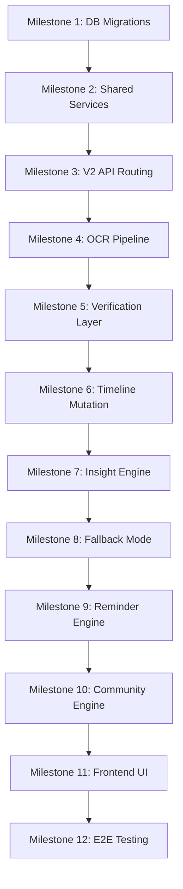

# PetOLife AI Timeline - AI Incremental Build Plan
## Version 4.0 (Integrated V2 Architecture)

---

## 1. Build Overview

This document defines the implementation phases for the AI Timeline. 

Instead of building a separate, standalone application, the AI Timeline is integrated into the existing PetOLife MVP V2 React-FastAPI application. 

The build process is structured into **12 milestones**. Each milestone must compile, pass tests, and satisfy integration criteria before moving to the next phase.

---

## 2. Global Build Rules
* **Backward Compatibility First**: Never modify existing V1 routes or tables without ensuring absolute backward compatibility.
* **Shared Service Layer**: Move core CRUD and storage operations into `app/services/` to prevent duplication between V1 and V2 routing controllers.
* **Isolated V2 Routing Namespace**: Implement all new timeline features under `/api/v2/` and group AI logic in `app/timeline/`.
* **Vanilla CSS**: Frontend UI components must use strict Vanilla CSS (imported `.css` files adjacent to components). **Tailwind is not allowed**.

---

## 3. Milestones

---

### Milestone 1: Database Migration & Schema Versioning

* **Objective**: Prepare the database schema for V2 tables and additive V1 columns using backwards-compatible migrations.
* **Tasks**:
  * Create Supabase SQL migration files under `backend/supabase/migrations/`.
  * Write ALTER statements to add nullable columns to the existing `medical_records` table: `ocr_status`, `ocr_extracted_at`, `ocr_error`.
  * Write CREATE TABLE statements for new tables: `timeline_versions`, `medical_events`, `pol_analyses`, `reminders`, `community_consent`, and `experience_cards`.
  * Define indexes on foreign keys (`pet_id`, `source_document_id`) and GIN indexes on JSONB fields.
* **Deliverable**: Version-controlled SQL migration scripts applied to local and staging Supabase instances.
* **Tests**:
  * Verify that existing V1 application endpoints continue to query the database successfully post-migration.
  * Verify schema constraints, foreign key cascades, and unique conditions in SQL Editor.
* **Exit Criteria**: Additive schema is applied to the live database; V1 app runs correctly without errors.

---

### Milestone 2: Refactor V1 Routers for Shared Service Layer

* **Objective**: Eliminate code redundancy by extracting database queries and storage uploading actions into a shared services layer.
* **Tasks**:
  * Create `backend/app/services/pet_service.py` to contain pet profile query/manipulation actions.
  * Create `backend/app/services/medical_record_service.py` to contain document upload, file storage, and retrieval logic.
  * Refactor `backend/app/routers/pet_profile.py` to call `PetService`.
  * Refactor `backend/app/routers/medical_records.py` to call `MedicalRecordService`.
* **Deliverable**: New services layer files and clean V1 routers.
* **Tests**:
  * Run automated tests (or manual verification) on V1 user signup, login, pet list, and document uploads.
  * Confirm that refactored routers behave identically to original implementations.
* **Exit Criteria**: Pet and medical records database transactions are successfully channeled through the shared services layer.

---

### Milestone 3: V2 API Routing & Isolation Skeleton

* **Objective**: Mount the version 2 routing namespace and set up the isolated timeline sub-package structures.
* **Tasks**:
  * Create directory `backend/app/routers/v2/` and add sub-routers: `pet_profile.py`, `medical_records.py`, `ocr.py`, `timeline.py`, `insights.py`, `reminders.py`, and `community.py`.
  * Mount all V2 routers in `backend/app/main.py` under the `/api/v2` prefix.
  * Create sub-package directory `backend/app/timeline/` with directories for `schemas/`, `services/`, and `adapters/`.
  * Define basic Pydantic models for routing inputs/outputs under `app/timeline/schemas/`.
* **Deliverable**: Active `/api/v2/...` routing namespace returning mock responses.
* **Tests**:
  * Verify routing URLs and CORS access options.
  * Confirm that JWT authentication middleware blocks unauthorized access on V2 endpoints.
* **Exit Criteria**: V2 router controllers are mounted and isolated from V1 directories.

---

### Milestone 4: OCR Extraction Pipeline

* **Objective**: Build the document text parsing adapter using Gemini Vision and Google File APIs.
* **Tasks**:
  * Build Gemini client adapter `backend/app/timeline/adapters/gemini_adapter.py`.
  * Define extraction schema using Pydantic in `app/timeline/schemas/extraction.py`.
  * Write `ocr_service.py` under `app/timeline/services/` to handle PDF/Image conversions, upload to Google File API, trigger Gemini Vision structured output prompts, and parse result.
  * Configure API router `POST /api/v2/pets/{pet_id}/documents/{doc_id}/ocr` to run the extraction process and write extracted JSON and confidence scores.
* **Deliverable**: Integrated OCR parsing service and adapter.
* **Tests**:
  * Test extraction accuracy using sample veterinary PDFs and JPG image files.
  * Verify extraction fails gracefully when files are unreadable, setting `ocr_status = 'failed'` and writing the error details to `ocr_error`.
* **Exit Criteria**: Raw uploaded records can be successfully parsed into structured JSON outputs by the backend.

---

### Milestone 5: Verification & Event Creation Layer

* **Objective**: Implement user editing/verification workflows and generate medical events.
* **Tasks**:
  * Implement endpoint `PUT /api/v2/pets/{pet_id}/documents/{doc_id}/verify` to receive the modified JSON.
  * Write `event_builder.py` under `app/timeline/services/` to map verified JSON to `MedicalEventNode` schemas.
  * Compute SHA-256 hash of event data for duplication checks.
  * Save verification status and write rows to the `medical_events` table.
* **Deliverable**: Verification API router, event mapper, and duplicate filtering logic.
* **Tests**:
  * Verify edit validation logic (e.g. invalid date ranges or negative weights).
  * Confirm duplicate uploads are caught via event hash matching.
* **Exit Criteria**: User-verified data successfully transforms into immutable `medical_events` rows.

---

### Milestone 6: Timeline Mutation & Immutable Versioning

* **Objective**: Handle immutable, versioned updates to the pet's medical history.
* **Tasks**:
  * Build `mutation_engine.py` under `app/timeline/services/` to manage timeline updates.
  * Write version check checks: when a new event is verified, increment `timeline_version` and map associated events to this version.
  * Ensure historic versions are preserved and never deleted or overwritten (append-only history).
* **Deliverable**: Version tracking module and timeline constructor.
* **Tests**:
  * Verify that adding new events increments the pet's version tracking.
  * Confirm historic versions can still be read and returned.
* **Exit Criteria**: The medical timeline is established as an append-only, versioned system.

---

### Milestone 7: AI Insight Engine & Collective Summary

* **Objective**: Generate single-visit summaries and merge cumulative patient histories.
* **Tasks**:
  * Implement prompt adapters in `gemini_adapter.py` for visit node analysis and historical summarization.
  * Write `insight_engine.py` to trigger node insights and collective summaries.
  * Cache computed collective summaries under the `pol_analyses` table to prevent token wastage.
  * Include medical disclaimers on all generated outputs.
* **Deliverable**: Insights services and summaries cache.
* **Tests**:
  * Profile response performance and API latency.
  * Test Pydantic verification on Gemini responses to ensure schema safety.
* **Exit Criteria**: AI-generated summaries and disclaimers are successfully computed and cached.

---

### Milestone 8: Fallback Mechanism & Manual Form Router

* **Objective**: Maintain core system functionality using rule-based compiling if Gemini goes offline.
* **Tasks**:
  * Implement a health monitor in `fallback_router.py` to check Gemini API status/quotas.
  * Implement endpoint `POST /api/v2/pets/{pet_id}/timeline/fallback-form` to support manual entry of visit events.
  * Build rule-based compiler to sort events chronologically and return the timeline with the `X-Timeline-Mode: Fallback` header.
* **Deliverable**: Rule-based backup pipeline and manual form endpoint.
* **Tests**:
  * Mock Gemini API outage (e.g. quota limits or timeout errors) and verify that requests fall back automatically.
  * Verify that manual fallback entries create clean, valid `medical_events` rows.
* **Exit Criteria**: The timeline remains operational and renders chronological history without LLM access.

---

### Milestone 9: Hybrid Reminder Engine

* **Objective**: Generate future reminder dates combining standard veterinary rules and AI advice.
* **Tasks**:
  * Write reminder rules (e.g., Rabies vaccine -> +365 days, Deworming -> +90 days, Follow-up -> specific date).
  * Build Gemini prompt template for extracting custom dosage dates or medicine schedules.
  * Implement scheduler in `reminder_engine.py` to write/update upcoming events in the `reminders` table.
* **Deliverable**: Scheduler service updating the calendar.
* **Tests**:
  * Verify rule-based reminder dates match expected ranges.
  * Confirm that reminders are deleted or rescheduled when parent events are modified/rejected.
* **Exit Criteria**: A dynamic list of reminders is computed and stored for every timeline version.

---

### Milestone 10: Community Consent & Shared Insights

* **Objective**: Enable anonymous sharing of medical cards and similarity matching queries.
* **Tasks**:
  * Create endpoint `PUT /api/v2/pets/{pet_id}/community/consent` to store opt-in/opt-out choice in `community_consent`.
  * Write cleanup/trigger logic: when consent is revoked, permanently delete associated data from `experience_cards`.
  * Implement `community_engine.py` to map events to `experience_cards` (stripping names, documents, and PII).
  * Build similarity queries based on species, breed, age, and weight.
* **Deliverable**: Data anonymizer, consent controller, and similarity matching engine.
* **Tests**:
  * Verify PII removal on shared experience cards.
  * Validate card deletion on consent withdrawal.
* **Exit Criteria**: Anonymized community experience sharing is strictly enforced by user consent.

---

### Milestone 11: Frontend UI Integration

* **Objective**: Replace the timeline placeholder screen in React with the active, versioned V2 dashboard.
* **Tasks**:
  * Create subfolders under `src/components/Timeline/` using Vanilla CSS rules.
  * Implement the record upload dashboard and the OCR verification interface.
  * Render chronological timeline cards, showing V1 vs V2 features.
  * Build the manual Vet Visit form to handle Fallback Mode submissions.
  * Build the reminders calendar widget and settings consent toggles.
* **Deliverable**: Responsive, fully featured frontend interface.
* **Tests**:
  * Test cross-browser responsiveness and loading states.
  * Verify frontend displays "Basic Timeline Mode" warning during fallback.
* **Exit Criteria**: The frontend timeline dashboard is completely integrated and interacts with V2 backend endpoints.

---

### Milestone 12: End-to-End Verification & Automated Testing

* **Objective**: Run automated integration tests, profile performance under load, and finalize the integration.
* **Tasks**:
  * Write `pytest` integration tests covering the complete sequence: Upload Document -> OCR Extraction -> Verify Payload -> Timeline Generation -> Reminder checks.
  * Perform stress checks on concurrent PDF uploads.
  * Check token usage and optimize Gemini queries to minimize API cost.
* **Deliverable**: Verified, production-ready version 2 app build.
* **Tests**:
  * E2E integration test suite execution.
* **Exit Criteria**: All automated integration test assertions pass; build meets all constraints.