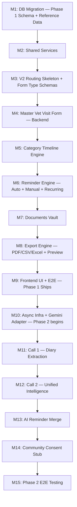

# PetOLife AI Timeline — Incremental Build Plan
## Version 7.0 (Master Form + Generalized Form Types / AI-Optional Overlay)

**Previous Version:** 6.0 (Category-first, single-category-per-entry form)

**Change Summary (v6.0 → v7.0):** The build is re-sequenced to accommodate the new Master Form architecture. **Milestone 1** now includes reference data tables (medicine, vaccine, shampoo, clinic databases) and seed data alongside the restructured `medical_events` schema. **Milestone 3** adds schemas for the 3 generalized form types and reference data services. **Milestone 4** is rewritten around the master form with common fields + category sections + reference data lookups. **Milestone 6** expands from auto-generated-only to auto + manual + recurring reminders with a full Add/Edit form. **Milestone 8** expands to support PDF/CSV/Excel formats, template selection, and in-app preview. **Milestone 9** updates the frontend for the master form UI, searchable reference data dropdowns, reminder form, and export options. Phase 2 milestones (10–15) remain unchanged.

---

## 1. Build Overview

The product is integrated into the existing PetOLife MVP V2 React-FastAPI application. Phase 1 is **9 milestones** and is a complete deliverable on its own — it should be demoed, tested, and considered shippable before Phase 2 work begins. Phase 2 is **6 further milestones**, additive and independently revertible.

---

## 2. Global Build Rules

- **Backward Compatibility First:** Never modify existing V1 routes or tables without ensuring absolute backward compatibility.
- **Shared Service Layer:** Move core CRUD and storage operations into `app/services/` to avoid duplication between V1 and V2.
- **Isolated V2 Routing Namespace:** All new features live under `/api/v2/`.
- **Phase 1 has zero AI dependency:** No code under `app/timeline/services/` may import anything from `app/timeline/ai/`. This is a lint/CI rule, not just a convention, enforced from Milestone 1 onward.
- **Category entries use JSONB:** The `category_entries` column stores an array of category-specific entries as structured JSON, with the 70% shared core fields and 30% form-type-specific fields per entry.
- **Reference data is preloaded:** Medicine, vaccine, shampoo, and clinic databases are seeded at migration time and searchable via dedicated API endpoints.
- **Vanilla CSS:** Frontend UI components use strict Vanilla CSS (imported `.css` files adjacent to components). Tailwind is not allowed.
- **Phase 2 Token Logging:** Every Gemini call must log input tokens, output tokens, model version, operation name, and pet_id to `ai_token_logs`. Not optional, but also not relevant until Phase 2 begins.

---

## 3. Milestones

---

# PHASE 1 — Core Product, No AI

### Milestone 1: Database Migration (Phase 1 Schema + Reference Data)

**Objective:** Stand up the master-form schema, reference data tables, and seed data with zero AI-related tables.

**Tasks:**
- Create migration `backend/supabase/migrations/<timestamp>_add_v2_core_tables.sql`
- `ALTER TABLE pet_profiles` to add `species`, `breed`, `date_of_birth`, `health_conditions`
- `CREATE TABLE medical_events` with master form common fields (`event_time`, `visit_type` JSONB, `reason_for_visit`, `overall_notes`, `follow_up_notes`) + `category_entries` JSONB array + `visit_group_id`, `source`, `verification_status` (see API/DB Spec §5.2)
- `CREATE TABLE medical_documents`, `CREATE TABLE edit_history`, `CREATE TABLE reminders` (expanded with `linked_event_id`, `description`, `due_time`, recurring fields: `repeat_type`, `custom_repeat_interval`, `custom_repeat_unit`, `end_repeat_type`, `end_repeat_date`, `end_repeat_count`, `notes`)
- `CREATE TABLE clinic_database`, `CREATE TABLE medicine_database`, `CREATE TABLE vaccine_database`, `CREATE TABLE shampoo_database`
- Indexes: `(pet_id, event_date DESC)`, `(visit_group_id)`, `(pet_id, event_hash)`, GIN index on `category_entries`, full-text indexes on clinic/medicine names
- Create seed data migration `backend/supabase/migrations/<timestamp>_seed_reference_data.sql`:
  - Seed `vaccine_database` with Dogs (Rabies, DHPP, Leptospirosis, Bordetella, Canine Influenza) and Cats (Rabies, FVRCP, FeLV) — each with `default_interval_days`
  - Seed `shampoo_database` with 20 preloaded brands across 5 categories (Anti Fungal, Tick & Flea, Anti Itch, Anti Dandruff, General)
  - Initial `medicine_database` entries can be added progressively; the table supports user-added entries via `is_preloaded = false`

**Deliverable:** Version-controlled SQL migrations applied to local and staging Supabase.

**Tests:**
- Verify all existing V1 endpoints continue to function post-migration
- Verify all check constraints (category_entries JSONB validation, visit_type array, verification_status enum, reminder type/repeat/priority enums)
- Verify reference data seed: `vaccine_database` returns 8 rows (5 dog + 3 cat), `shampoo_database` returns 20 rows
- Confirm no table in this milestone references anything AI-related

**Exit Criteria:** Phase 1 schema + reference data tables are live with seed data. V1 app is unaffected.

---

### Milestone 2: Refactor V1 Routers for Shared Service Layer

**Objective:** Eliminate duplication between V1 and the new V2 pet/document logic.

**Tasks:**
- Create `backend/app/services/pet_service.py` and `medical_record_service.py`
- Refactor `backend/app/routers/pet_profile.py` and `medical_records.py` to use these services

**Deliverable:** Shared services layer; unchanged V1 behaviour.

**Tests:**
- Run V1 signup, login, pet list, and document upload flows; confirm identical behaviour pre/post refactor

**Exit Criteria:** All pet/medical-record DB access flows through the shared layer with no V1 regressions.

---

### Milestone 3: V2 API Routing Skeleton + Form Type Schemas

**Objective:** Mount the V2 namespace, the `app/timeline/` package, and the reference data router — Phase 1 only, no async task infra yet (none is needed).

**Tasks:**
- Create `backend/app/routers/v2/`: `pet_profile.py`, `medical_events.py`, `timeline.py`, `reminders.py`, `documents.py`, `export.py`, `reference_data.py`
- Mount under `/api/v2` in `main.py`
- Create `backend/app/timeline/schemas/`:
  - `medical_event.py` — Pydantic model for master form (common fields + `category_entries` list)
  - `category_entry.py` — Pydantic models for the 3 form types:
    - `ConsultationVitalsEntry` (weight, temperature, BCS, advanced vitals, diagnoses array)
    - `TreatmentMedicationEntry` (dose, frequency, duration, route, food_relation, injection_details, eye_drop_details, shampoo_details, vaccine_details)
    - `ProcedureDiagnosticsEntry` (procedure_type, detailed_findings)
    - `CategoryEntryBase` — shared core fields (category, form_type, item_name, date_logged, status, next_due_date, notes, attachments)
  - `reminder.py` — Pydantic model with recurring fields (repeat_type, custom_repeat_*, end_repeat_*)
  - `reference_data.py` — Pydantic models for Medicine, Vaccine, Shampoo, Clinic
- Create `backend/app/timeline/services/` package (empty service stubs: `event_service.py`, `category_engine.py`, `reminder_engine.py`, `document_service.py`, `export_service.py`, `dedupe_service.py`, `reference_data_service.py`)
- **Do not** create `app/timeline/ai/` yet — it doesn't exist until Milestone 10

**Deliverable:** Active `/api/v2/...` routing namespace with mocked/stubbed responses, including reference data endpoints.

**Tests:**
- Verify all V2 routes return expected mock responses
- Verify reference data endpoints return correct seed data (vaccines by species, shampoos by category)
- Confirm JWT auth blocks unauthorised access
- Confirm none of these endpoints are async/backgrounded (Phase 1 is synchronous by design)

**Exit Criteria:** V2 routers mounted; all Phase 1 service stubs exist and are wired to routers; Pydantic schemas validate category_entries correctly for all 3 form types.

---

### Milestone 4: Master Vet Visit Form — Backend

**Objective:** Implement the core data-entry path: master form with common fields + category entries, supporting all 3 generalized form types, reference data lookups, and multi-category visits.

**Tasks:**
- Implement `reference_data_service.py`:
  - `search_medicines(query, type_filter)` — full-text search on `medicine_database`
  - `get_vaccines(species)` — filtered list from `vaccine_database` with `default_interval_days`
  - `search_shampoos(category)` — filtered list from `shampoo_database`
  - `search_clinics(query)` — full-text search on `clinic_database`
  - `create_clinic(name, address, phone)` — "Add New" from form dropdown
  - `get_diagnoses(category)` — returns diagnosis names from `DIAGNOSIS_TAXONOMY` constant
  - `get_injection_sites(route)` — returns sites from `INJECTION_SITES` constant
- Implement `event_service.py`:
  - `create_event()` — validates common fields + each category entry against its form type schema, computes `event_hash` per entry, runs `dedupe_service` same-day check per entry, inserts single `medical_events` row with `source='manual'`, `verification_status='verified'`, `category_entries` JSONB array
  - `update_event()` — writes an `edit_history` row per change, re-triggers reminder recomputation if a due-date-relevant field changed in any category entry
  - `delete_event()` — cascades to `reminders` and `medical_documents`
  - `add_category_entry()` — adds a new category entry to an existing visit's `category_entries` array
- Implement `dedupe_service.py`: `event_hash = SHA256(pet_id + category + event_date + primary_field)` per category entry; same-day collision → `409` with candidate
- Wire up:
  - `POST /medical-events` — master form submission
  - `GET /medical-events`, `GET /medical-events/{id}` — list/fetch with category_entries
  - `PUT /medical-events/{id}` — edit common fields and/or category entries
  - `DELETE /medical-events/{id}` — soft-delete
  - `POST /medical-events/{id}/entries` — add category entry to existing visit
  - `GET /reference/medicines`, `GET /reference/vaccines`, `GET /reference/shampoos`, `GET /reference/clinics`, `POST /reference/clinics`, `GET /reference/diagnoses`, `GET /reference/injection-sites`

**Deliverable:** Full CRUD for the master vet visit form with reference data lookups, supporting all 3 form types and multi-category visits.

**Tests:**
- Verify Form Type 1 (Consultation & Vitals): diagnosis with category/name/status, vitals (weight, temp, BCS), advanced vitals
- Verify Form Type 2 (Treatment & Medication): tablet (dose/timing/food/duration), syrup (dose unit), eye drops (drops/eye), ointment (frequency), injection (route/site), shampoo (category/brand/frequency/instructions), vaccination (vaccine name + auto due date)
- Verify Form Type 3 (Procedure & Diagnostics): procedure type + findings
- Verify multi-category visit: a single POST with diagnosis + medication + vaccination entries creates one `medical_events` row with 3 entries in `category_entries` JSONB
- Verify duplicate same-day submissions return `409` with a candidate per duplicated category entry
- Verify `edit_history` gets a row on every update, with correct `previous_value` snapshot
- Verify adding a category entry via `POST /entries` appends to the existing `category_entries` array
- Verify deleting an event cascades reminders and documents correctly
- Verify reference data lookups: medicine search returns results by brand name, vaccines filter by species with correct intervals, shampoos filter by category, clinics are searchable and addable, diagnoses filter by diagnosis category, injection sites filter by route

**Exit Criteria:** A user can create, edit, and delete medical events using the full master form with reference data dropdowns, covering all 3 form types and multi-category visits, with no AI code path touched.

---

### Milestone 5: Category Timeline Engine

**Objective:** Implement the category-first read model, querying from the `category_entries` JSONB.

**Tasks:**
- Implement `category_engine.py`:
  - `get_category_grouped(pet_id)` — extracts and groups entries from `category_entries` JSONB by category, each sorted `event_date DESC`
  - `get_chronological(pet_id)` — flat, all-category, date-sorted feed
  - `get_visit_group(pet_id, visit_group_id)` — reconstructs all entries sharing a `visit_group_id`
- Wire up `GET /timeline` (default: category-grouped), `GET /timeline?view=chronological`, `GET /timeline/visit/{visit_group_id}`

**Deliverable:** Category-grouped and chronological timeline endpoints.

**Tests:**
- Verify category grouping returns each of the 7 categories correctly bucketed and internally sorted
- Verify chronological view merges all categories correctly by date
- Verify visit-group reconstruction returns all entries from a multi-category visit
- Verify summary card data is correctly computed per form type (vitals snapshot for diagnosis, dose/route/timing for medication, result badge for procedures)
- Performance: verify the GIN index on `category_entries` is used for category-filtered queries

**Exit Criteria:** Category view is the default; chronological view works as a toggle; both correctly query the JSONB category_entries structure.

---

### Milestone 6: Reminder Engine — Auto + Manual + Recurring

**Objective:** Implement the full reminder system: auto-generated from visit logs, manual user-created, and recurring schedules.

**Tasks:**
- Implement `reminder_engine.py`:
  - **Auto-generated reminders** (`RULE_ENGINE_OWNS`):
    - `vaccination`: lookup `vaccine_database.default_interval_days` by vaccine name + species (Rabies: +365d, DHPP: +365d, Leptospirosis: +365d, Bordetella: +180d, Canine Influenza: +365d, FVRCP: +365d, FeLV: +365d)
    - `deworming`: +90 days from date given
    - `anti_tick`: +30 days default, overridable per product
    - `medication_end`: `start_date + duration` (computed from category entry fields)
    - `follow_up`: explicit `follow_up_date` from the common fields
  - Called synchronously from `event_service.create_event()` / `update_event()` for auto-generated types
  - **Manual reminder CRUD**:
    - `create_manual_reminder()` — validates all Add/Edit Reminder form fields (title, type, description, due_date, due_time, priority, repeat_type, custom_repeat, end_repeat, linked_event_id, notes)
    - `update_reminder()` — edit any field
    - `delete_reminder()` — delete + cascade future recurring instances
  - **Recurring reminder logic**:
    - On `complete_reminder()`: if `repeat_type != 'none'`, auto-generate the next occurrence based on repeat interval
    - Handle custom repeat intervals (every [X] days/weeks/months)
    - Respect `end_repeat_type`: stop after N occurrences or after a specific date
  - Priority assignment: high/red (missed follow-up, critical medication ending, overdue vaccination), medium/amber (due within window), low/teal (routine checks, grooming)
- Wire up:
  - `GET /reminders?type=&status=&range=&repeat=`
  - `POST /reminders` — create manual/recurring reminder
  - `PUT /reminders/{id}` — edit
  - `PUT /reminders/{id}/complete` — mark completed + auto-generate next for recurring
  - `PUT /reminders/{id}/snooze` — reschedule
  - `DELETE /reminders/{id}` — delete + cascade

**Deliverable:** Full reminder engine with auto-generated, manual, and recurring support.

**Tests:**
- Verify auto-generated: Rabies vaccination produces a reminder exactly 365 days out; Bordetella 180 days; deworming 90 days; medication end matches `start_date + duration`; follow-up uses exact `follow_up_date`
- Verify vaccine interval lookup hits `vaccine_database` and returns correct `default_interval_days` per species
- Verify manual reminder creation with all form fields (title, type, description, due date/time, priority, notes)
- Verify recurring: completing a monthly reminder creates the next occurrence +1 month
- Verify custom repeat: every 3 weeks creates the next occurrence +21 days
- Verify end repeat: `after_count=3` stops generating after 3 completions; `on_date` stops after the specified date
- Verify editing an event's due-date-relevant field recomputes/updates the correct reminder, not a duplicate
- Verify `complete` and `snooze` transitions behave correctly
- Verify deleting a recurring reminder deletes future occurrences

**Exit Criteria:** Every auto-generated, manual, and recurring reminder scenario works correctly with no external dependency.

---

### Milestone 7: Documents Vault

**Objective:** Attachment upload/storage for both event-linked and pet-level documents.

**Tasks:**
- Implement `document_service.py`: upload to Supabase Storage, insert `medical_documents` row, optional `event_id` link
- Wire up `POST /documents/upload`, `GET /documents?event_id=`, `DELETE /documents/{id}`

**Deliverable:** Working documents vault.

**Tests:**
- Verify upload without `event_id` attaches at the pet level
- Verify upload with `event_id` attaches to that specific event
- Verify deletion removes both the storage file and the DB row

**Exit Criteria:** Certificates, reports, and lab results can be attached and retrieved reliably.

---

### Milestone 8: Export Engine — PDF / CSV / Excel + Preview

**Objective:** Shareable report generation in multiple formats, with template selection and in-app preview. No AI.

**Tasks:**
- Implement `export_service.py`:
  - **Format handlers:** PDF (template-based rendering), CSV (tabular export), Excel (structured workbook)
  - **PDF templates:** Full Report, Summary Only, Vaccination Card, Medication List
  - **PDF page structure:**
    1. Cover: Pet Name, Photo, Owner Info, Generation Date
    2. Summary: Pet profile, health stats, active treatments
    3. Timeline: Chronological events (selected categories)
    4. Details: Full event details per category
    5. Attachments: Thumbnails of linked documents
  - **Filtering:** by category (multi-select), date range (All time / Last year / Last 6 months / Custom), include/exclude attachments and vet notes
  - **Preview:** lightweight first-page render or summary data for in-app display
- Wire up:
  - `POST /export` — generate and return the file (or signed URL)
  - `POST /export/preview` — preview data for in-app display

**Deliverable:** Multi-format export with template selection and preview.

**Tests:**
- Verify PDF full-report export includes cover page, summary, timeline, details, and attachments
- Verify PDF summary-only template includes only cover + summary
- Verify vaccination-card template includes only vaccination entries
- Verify medication-list template includes only medication entries
- Verify CSV export produces correct tabular data with headers
- Verify Excel export produces a structured workbook with category sheets
- Verify category filter: selecting only "vaccination" includes only vaccination entries
- Verify date-range filter respects bounds
- Verify include_attachments toggle affects the output (thumbnails included/excluded)
- Verify include_vet_notes toggle affects the output (notes included/excluded)
- Verify preview returns a lightweight representation without generating the full file

**Exit Criteria:** Reports can be generated in PDF/CSV/Excel with template selection, filtering, and preview for any pet.

---

### Milestone 9: Frontend UI + Phase 1 End-to-End — **Phase 1 Ships**

**Objective:** Build the complete master-form-driven UI and verify the entire no-AI product end-to-end.

**Tasks:**
- Build the **Master Vet Visit Form**:
  - Common fields section at top (Pet dropdown, Date/Time pickers, Clinic searchable dropdown with "Add New", Vet Name, Visit Type multi-select chips, Reason textarea, Overall Notes, Attachments with thumbnails, Follow-up Date with quick buttons 3D/7D/14D/30D/Custom, Follow-up Notes)
  - Category Selector: emoji + label chips (🩺 Diagnosis, 💊 Medication, 💉 Vaccination, 🐛 Deworming, 🪲 Anti-Tick/Flea, 🛁 Grooming, 📝 Other) — each adds a collapsible section
  - Form Type 1 (Consultation & Vitals): Weight/Temp/BCS fields, expandable advanced vitals, diagnosis sub-entries with category dropdown → name searchable dropdown → status segmented control
  - Form Type 2 (Treatment & Medication): Searchable medicine/vaccine/shampoo dropdowns from reference data, sub-type-specific fields (tablet dose/timing/food, syrup dose, eye drops count/eye, ointment frequency, injection route → site cascade, shampoo category/brand/frequency/instructions), vaccine auto-due-date pre-fill
  - Form Type 3 (Procedure & Diagnostics): Procedure type dropdown, findings textarea
  - Multiple entries per category section ("+Add Another" button)
  - Confirmation toast on save: "Added to [Category] · Next reminder: [date]"
- Build the **Category Timeline** screen: tabbed/sectioned by category (default), toggle to chronological "All" view
  - Summary cards per form type: vitals snapshot (diagnosis), dose/route/timing (medication), result badge (procedures)
- Build the **Reminders** screen:
  - Calendar widget (daily/weekly/monthly/quarterly/yearly views)
  - Add/Edit Reminder form (all fields from Ch. 7 §7.3: title, type dropdown, description, due date/time, priority segmented control, repeat dropdown with custom interval, end repeat, link to event, notes)
  - Priority colour coding: High=Red, Medium=Amber, Low=Teal
  - Auto-generated vs manual vs recurring visual distinction
- Build the **Documents Vault** screen
- Build the **Export** flow:
  - Export screen with Pet selector, Date Range picker, Category multi-select chips, Include Attachments toggle, Include Vet Notes toggle, Format segmented control (PDF/CSV/Excel), PDF Template dropdown
  - Preview button → in-app preview
  - Generate & Download button, Share button
- All components under `src/components/Timeline/` using Vanilla CSS

**Deliverable:** A fully usable, AI-free medical record app with the complete master form architecture.

**Tests:**
- E2E: create pet → log a visit with Diagnosis (vitals + diagnosis entry) + Vaccination (with auto-due date from reference data) + Medication (tablet with dose/timing/food/duration) via category chips → confirm all 3 appear under their respective categories in the timeline with correct summary cards → confirm auto-generated reminders were created for vaccination (+365d) and medication_end (start + duration) and follow-up → export a PDF full report → confirm it includes all entries → preview before download
- Verify reference data dropdowns: medicine search returns matching brands, vaccines filtered by pet species, clinics searchable with "Add New", diagnoses filtered by diagnosis category, injection sites cascaded by route
- Verify duplicate same-day submission surfaces the "save anyway?" prompt correctly in the UI
- Verify editing an event updates the timeline and, where relevant, its reminders
- Verify manual reminder creation via the Add/Edit Reminder form with all fields
- Verify recurring reminder: complete → next occurrence auto-generated → appears in calendar
- Verify export in all 3 formats (PDF/CSV/Excel) with different templates and filters
- Cross-browser responsiveness check

**Exit Criteria:** Phase 1 (F1–F6) is demoable and shippable as a complete product with `GEMINI_API_KEY` entirely unset.

---

# PHASE 2 — Optional AI Overlay

*Everything below is additive. It must be possible to skip Phase 2 entirely and still have a complete product from Milestone 9.*

### Milestone 10: Async Infrastructure + Gemini Adapter

**Objective:** Stand up the background task pattern and AI abstraction layer, isolated from Phase 1 code.

**Tasks:**
- Create `app/timeline/ai/` package: `schemas/`, `services/`, `adapters/`
- Create `app/timeline/ai/adapters/ai_provider_base.py` and `gemini_adapter.py` with `call_extraction()`, `call_intelligence()`, `_log_token_usage()` stubs
- Set up `FastAPI BackgroundTasks` pattern for the two AI endpoints
- Migration: `ALTER TABLE medical_records ADD ocr_status, extracted_json`; `CREATE TABLE medical_event_insights, pol_analyses, ai_token_logs`
- CI rule: fail the build if anything under `app/timeline/services/` imports from `app/timeline/ai/`

**Deliverable:** Isolated, mountable AI package with async infra and its own schema.

**Tests:**
- Verify Phase 1 test suite still passes unmodified with `app/timeline/ai/` present but unused
- Verify Phase 1 test suite still passes with `app/timeline/ai/` **entirely deleted** from the checkout (proves true isolation)
- Verify the import-boundary CI check catches a deliberately introduced violation

**Exit Criteria:** Phase 2 schema and package exist without touching Phase 1 behaviour.

---

### Milestone 11: Call 1 — Diary Extraction

**Objective:** Implement diary upload → single Gemini call → drafts that pre-fill the Phase 1 master form.

**Tasks:**
- Implement `gemini_adapter.call_extraction(file_uri, pet_id)`: upload to Google File API, send unified extraction prompt (schema includes `category` per sub-entry and `category_entries` JSONB structure), parse into `ExtractionBundle`, log tokens
- Implement `extraction_service.py`: store `ExtractionBundle` in `medical_records.extracted_json`; insert one `medical_events` row per detected visit with `source='ai_extracted'`, `verification_status='pending'`, `category_entries` JSONB populated from `draft_events[]`, `visit_group_id` shared across same-visit entries
- Wire up `POST /ai/documents/upload`, `POST /ai/documents/{doc_id}/extract` (`202 Accepted`, background), `GET /ai/documents/{doc_id}/status`
- **No new verification endpoint** — confirm that draft rows are editable and verifiable through the existing Phase 1 `PUT /medical-events/{event_id}`

**Deliverable:** One-call diary extraction that feeds directly into the Master Vet Visit Form as pre-filled drafts.

**Tests:**
- Verify exactly one Gemini call per diary upload regardless of visit count
- Verify each detected visit lands as a correctly structured `medical_events` row with `category_entries` JSONB
- Verify `visit_group_id` correctly links entries from the same detected visit
- Verify low-confidence fields (`confidence < 0.75`) are flagged for the frontend
- Verify editing/confirming a draft through `PUT /medical-events/{id}` flips it to `verified` and it then behaves identically to a manual entry (appears in category timeline, triggers reminder engine, etc.)
- Verify `ai_token_logs` gets exactly one row per extraction call

**Exit Criteria:** A diary upload produces reviewable drafts inside the same master form used for manual entry, with zero divergence in downstream behaviour once verified.

---

### Milestone 12: Call 2 — Unified Intelligence

**Objective:** Implement one-call insight generation across all verified events (manual + AI-extracted alike).

**Tasks:**
- Implement `gemini_adapter.call_intelligence(verified_events, pol_context, pet_id)`: batched prompt, parse into `IntelligenceBundle`, log tokens
- Implement `insight_engine.py`: fetch all `verification_status='verified'` events (regardless of `source`), fetch current `pol_analyses`, call Gemini, upsert `medical_event_insights`, insert new `pol_analyses` version
- Wire up `POST /ai/insights/generate` (`202`, background), `GET /ai/insights/status`, `GET /ai/insights/node/{event_id}`, `GET /ai/insights/collective`

**Deliverable:** One-call intelligence generation covering the pet's whole verified history.

**Tests:**
- Verify exactly one Gemini call per intelligence run regardless of event count
- Verify `node_insights[]` covers every verified event — manual and AI-extracted both
- Verify every `node_insight` carries a non-empty `medical_disclaimer` — reject at the Pydantic level otherwise
- Verify `pol_analyses` structured columns populate correctly
- Verify `ai_token_logs` gets exactly one row per Call 2 run

**Exit Criteria:** Insight cards can be generated and retrieved for any pet with verified history, independent of how that history was entered.

---

### Milestone 13: AI Reminder Merge

**Objective:** Layer AI-interpreted reminders (`monitoring`, `conditional`) on top of the Phase 1 rule-based set, without disturbing it.

**Tasks:**
- Implement `ai_reminder_merge.py`: insert `IntelligenceBundle.reminder_note.identified_reminders[]` into `reminders` with `is_ai_generated=true`, restricted to `monitoring`/`conditional` types only
- Deduplicate against existing reminders for the same `(source_event_id, type)`
- Confirm `GET /reminders` merges both sets transparently for the frontend

**Deliverable:** AI reminders appear alongside rule-based and manual ones, clearly flagged.

**Tests:**
- Verify AI reminder rows always have `is_ai_generated=true` and type in `{monitoring, conditional}` only — reject anything else at the service layer
- Verify no duplicate reminder is created for the same event+type
- Verify Phase 1 rule-based and manual reminders are unaffected in count or content when Phase 2 runs

**Exit Criteria:** The reminder list is a correct, deduplicated merge of auto-generated, manual, recurring, and AI-interpreted entries.

---

### Milestone 14: Community Consent Stub

**Objective:** Reserve the schema and a minimal consent toggle for Phase 3, without building the matching engine yet.

**Tasks:**
- Migration: `CREATE TABLE community_consent, experience_cards`
- Wire up `PUT /ai/community/consent` (toggle only; no anonymisation pipeline yet)

**Deliverable:** Consent toggle persists; no data is shared anywhere yet.

**Tests:**
- Verify toggle persists and defaults to `private`
- Verify no `experience_cards` rows are ever created by this milestone (matching engine is future work)

**Exit Criteria:** Schema is ready for Phase 3 without any premature data sharing.

---

### Milestone 15: Phase 2 End-to-End Testing

**Objective:** Verify the complete optional overlay, and — critically — that it remains fully optional.

**Tasks:**
- `pytest` integration test: `Upload diary → POST /extract (202) → poll status → verify drafts via PUT /medical-events → POST /ai/insights/generate (202) → poll status → GET timeline → GET insights/node → GET reminders`
- Test asserting Call 1 produces exactly one Gemini call per upload
- Test asserting Call 2 produces exactly one Gemini call per run
- Test asserting `ai_token_logs` has exactly two rows after a full upload-to-insights cycle
- **Isolation test:** run the full Phase 1 test suite with `GEMINI_API_KEY` unset and `app/routers/v2/ai/` un-mounted — confirm zero failures and zero references to AI tables

**Deliverable:** Verified Phase 2 build, with proof that Phase 1 remains independently shippable.

**Tests:**
- E2E integration suite (Milestones 10–14 covered)
- 2-call count assertions
- Token logging assertions
- Phase 1 isolation assertion (the most important test in this milestone)

**Exit Criteria:** Phase 2 works correctly when enabled, and Phase 1 is provably unaffected when it isn't.
