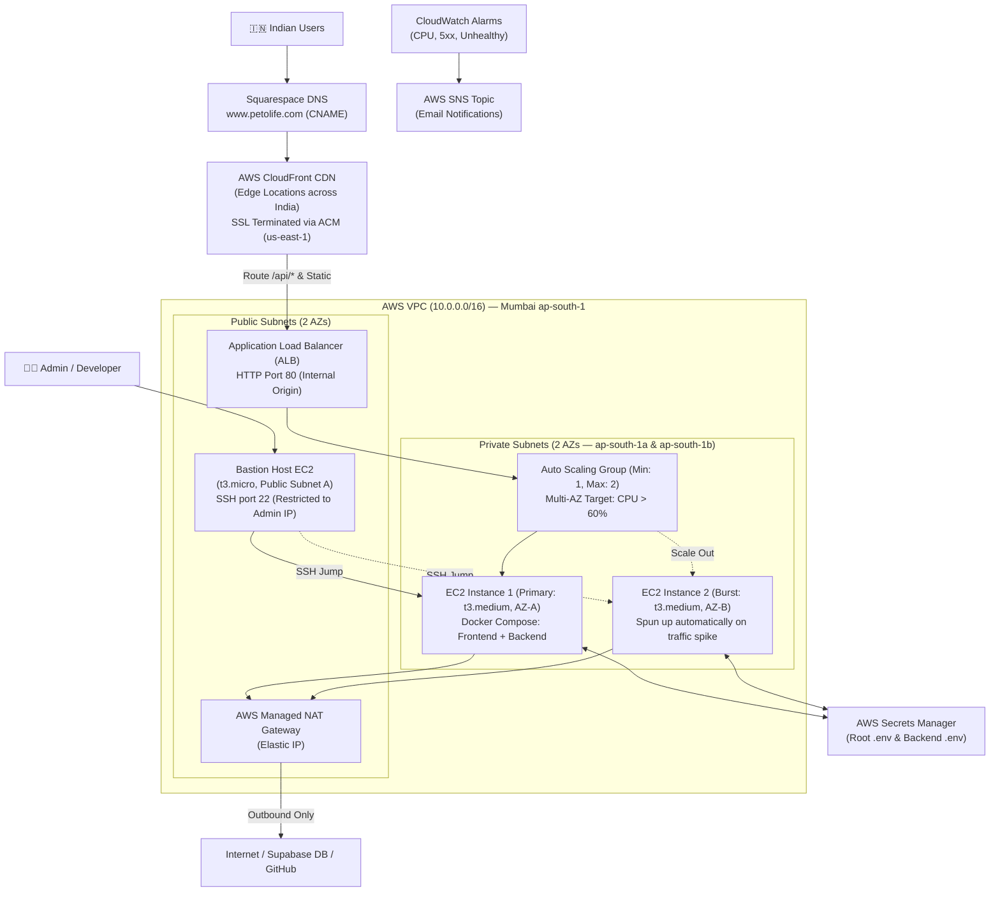

# PetOLife — Production AWS Infrastructure & Deployment Guide

> **Architecture Goal**: A secure, cost-optimized, high-performance, and code-agnostic AWS infrastructure optimized for users in India (`ap-south-1` Mumbai).

---

## 🏗 Architecture & Design Topology



### Key Components & Count

1. **Total EC2 Count (Base State)**: **2 EC2 Instances**
   - **Instance #1**: Bastion Host (`t3.micro`, Public Subnet A, handles SSH access).
   - **Instance #2**: Main App Server (`t3.medium`, Private Subnet A, runs both Frontend static SPA & FastAPI Backend via Docker Compose).
2. **Multi-AZ Networking**: Private Subnets span across 2 Availability Zones (`ap-south-1a` & `ap-south-1b`) for high-availability compute placement. Reuses 1 AWS Managed NAT Gateway for cost optimization.
3. **AWS Managed NAT Gateway**: 1 Gateway in Public Subnet A. Provides one-way internet access to private app instances so they can perform `git pull`, download Docker images, and communicate with external APIs (like Supabase).
4. **AWS CloudFront (CDN)**: Serves assets from edge locations across India with sub-20ms latency. Terminates SSL (HTTPS) using a free ACM certificate.
5. **AWS Application Load Balancer (ALB)**: Receives traffic from CloudFront and routes it to the Auto Scaling Group target instances across both AZs.
6. **AWS Auto Scaling Group (ASG)**: Maintains 1 EC2 instance by default. When CPU utilization exceeds 60%, it spins up Instance #3 (a 2nd app server in AZ-B) to handle excess load. As soon as traffic normalizes, ASG terminates Instance #3 immediately to minimize cost.
7. **AWS Secrets Manager**: Stores `.env` and `backend/.env` configuration securely. The EC2 instance retrieves secrets on boot via an IAM role (no keys hardcoded or stored in Git/S3).
8. **CloudWatch Alarms & SNS Notifications**: Monitors CPU utilization, ALB target health, and 5xx response rates. Sends instant email alerts via AWS SNS whenever an alarm triggers or recovers.

---

## 🛠 Pre-Requisites (Do These BEFORE Deploying Stack)

### Step 1: AWS Console Region
- Log into AWS Console and switch the top-right region selector to **Asia Pacific (Mumbai) `ap-south-1`**.

### Step 2: Create EC2 Key Pair (Mumbai)
1. Go to **EC2 Console** → **Key Pairs** → **Create Key Pair**.
2. Name: `petolife-key-mumbai`
3. Private key format: `.pem`
4. Save the downloaded file securely on your machine (e.g. `C:\Users\YourUser\Downloads\petolife-key-mumbai.pem`).

### Step 3: Request ACM Certificate for CloudFront (N. Virginia)
> ⚠️ **IMPORTANT**: AWS CloudFront distributions require ACM SSL certificates issued specifically in the **`us-east-1` (N. Virginia)** region.

1. Switch your AWS region selector to **US East (N. Virginia) `us-east-1`**.
2. Go to **AWS Certificate Manager (ACM)** → **Request Certificate** → **Public Certificate**.
3. Fully qualified domain names:
   - `petolife.com`
   - `www.petolife.com`
4. Validation method: **DNS validation**.
5. Click **Request**.
6. Copy the generated **CNAME Name** and **CNAME Value**. Add this record to your **Squarespace DNS** settings to complete validation.
7. Once validated (status changes to **Issued**), copy the **Certificate ARN** (e.g. `arn:aws:acm:us-east-1:123456789012:certificate/...`).

### Step 4: Create a GitHub Personal Access Token (PAT)
Since your repository is a private organization repo, EC2 instances need authentication to clone the code.
1. Go to GitHub → **Settings** → **Developer Settings** → **Personal access tokens** → **Tokens (classic)**.
2. Click **Generate new token (classic)**.
3. Note: "PetOLife Deploy Token".
4. Expiration: Select as needed (e.g., No expiration, or 1 year).
5. Scopes: Check the **`repo`** box (Full control of private repositories).
6. Click Generate and **copy the token**. You will need this for the CloudFormation stack.

### Step 5: Get Your Public IP Address
- Visit [whatismyip.com](https://whatismyip.com).
- Copy your IPv4 address and append `/32` (e.g. `183.83.192.61/32`). This is required for locking down SSH access to your Bastion Host.

---

## 🚀 Deploying the CloudFormation Stack

### 1. Launch Stack
1. Switch region back to **Mumbai `ap-south-1`**.
2. Go to **CloudFormation** → **Create Stack** → **With new resources (standard)**.
3. Choose **Upload a template file** and select `infra/cloudformation-full.yml`.
4. Click **Next**.

### 2. Enter Parameters

| Parameter | Recommended Value | Explanation |
|---|---|---|
| **Stack Name** | `petolife-prod` | Name of the CloudFormation deployment stack |
| **EnvironmentName** | `prod` | Prefix added to all AWS resource names |
| **DomainName** | `petolife.com` | Base domain name |
| **GitRepoUrl** | `https://github.com/PetOlife-26/POL_MVP_V2.git` | Your Git repo HTTPS URL |
| **GitBranch** | `deploy` | Branch to clone and run on servers |
| **GitHubToken** | `ghp_xxxxx...` | The GitHub PAT you created in Step 4 |
| **InstanceType** | `t3.medium` | Main server size (4GB RAM, 2 vCPU) |
| **KeyPairName** | `petolife-key-mumbai` | Key pair created in Step 2 |
| **AdminIPCIDR** | `YOUR_IP/32` | Your IP address from Step 5 |
| **CloudFrontCertArn**| `arn:aws:acm:us-east-1:...` | ACM Certificate ARN from Step 3 |
| **AlertNotificationEmail** | `admin@petolife.com` | Your email address to receive CloudWatch alarm notifications |

5. Click **Next** → **Next**.
6. At the bottom of the final page, check the box: **"I acknowledge that AWS CloudFormation might create IAM resources with custom names."**
7. Click **Submit**.
8. Wait ~5 to 8 minutes until stack status reaches `CREATE_COMPLETE`.

---

## 🔑 Post-Deployment Steps (CRITICAL)

### Step 1: Upload Real `.env` Secrets to Secrets Manager
CloudFormation creates placeholder secrets for security. You must populate them with your real environment variables.

**Option A: Using AWS CLI (Recommended)**
Open PowerShell / Terminal on your local laptop:

```powershell
# Set AWS Region
$env:AWS_DEFAULT_REGION="ap-south-1"

# Upload Root .env
aws secretsmanager put-secret-value `
  --secret-id "prod/petolife/app-env" `
  --secret-string (Get-Content -Raw .env)

# Upload Backend .env
aws secretsmanager put-secret-value `
  --secret-id "prod/petolife/backend-env" `
  --secret-string (Get-Content -Raw backend/.env)
```

**Option B: Using AWS Console**
1. Go to **Secrets Manager** → Secrets.
2. Select `prod/petolife/app-env` → Click **Retrieve secret value** → **Edit**.
3. Choose **Plaintext** tab, paste the exact contents of your root `.env` file, and save.
4. Select `prod/petolife/backend-env` → Click **Retrieve secret value** → **Edit**.
5. Choose **Plaintext** tab, paste the exact contents of your `backend/.env` file, and save.

### Step 2: Relaunch App EC2 Instance
Because the initial EC2 instance booted up with placeholder secrets, terminate it so that the Auto Scaling Group launches a fresh instance with your real secrets:

1. Go to **CloudFormation** → Select `petolife-prod` → **Outputs** tab.
2. Open **EC2 Console** → **Instances**.
3. Find the instance named `prod-petolife-app`.
4. Click **Instance State** → **Terminate Instance**.
5. The Auto Scaling Group will automatically launch a replacement instance within 1-2 minutes, which will fetch the updated secrets and spin up Docker containers cleanly.

### Step 3: Configure Squarespace DNS
1. In CloudFormation **Outputs** tab, copy the value of `CloudFrontURL` (e.g. `d12345678abcdef.cloudfront.net`).
2. Log into your **Squarespace Domain Manager** → **DNS Settings**.
3. Add/update the following CNAME record:

| Record Type | Host / Name | Target / Value |
|---|---|---|
| **CNAME** | `www` | `d12345678abcdef.cloudfront.net` |

---

## 💻 How to Access & Manage Your Servers

### SSH into App Server (via Bastion Jump Box)
Since app servers reside in a private subnet without public IPs, SSH access requires jumping through the Bastion Host.

From your local PowerShell/Terminal:

```bash
# Syntax:
# ssh -J ubuntu@<BASTION_PUBLIC_IP> -i "C:\path\to\key.pem" ubuntu@<APP_PRIVATE_IP>

# Example:
ssh -J ubuntu@13.127.X.X -i "C:\Users\YourUsername\Downloads\petolife-key-mumbai.pem" ubuntu@10.0.10.X
```
*(You can obtain the Bastion Public IP from CloudFormation Outputs and the App Private IP from EC2 Console).*

### View Container Logs & Status
Once SSH'd into the App Server:

```bash
cd /home/ubuntu/petolife

# View running containers
docker compose ps

# View container logs
docker compose logs -f backend
docker compose logs -f caddy
```

---

## 🔄 Deploying Code Updates (Application Lifecycle)

### Method 1: In-Place Update (Zero Downtime / Fast)
When you push new updates to your `deploy` branch on GitHub:

1. SSH into the App Server via Bastion Host.
2. Run the update commands:
```bash
cd /home/ubuntu/petolife
git pull origin deploy
docker compose up -d --build
```

### Method 2: Immutable Re-deployment (Recommended for major releases)
Terminate the running app instance in EC2 Console. Auto Scaling will automatically launch a brand new instance that pulls the latest code from GitHub and .env secrets from AWS Secrets Manager.

---

## 🚀 Future CI/CD Integration (GitHub Actions)

To automate deployments whenever code is pushed to the `deploy` branch:

Create `.github/workflows/deploy.yml` in your repository:

```yaml
name: Deploy to Production

on:
  push:
    branches:
      - deploy

jobs:
  deploy:
    runs-on: ubuntu-latest
    steps:
      - name: Checkout Code
        uses: actions/checkout@v4

      - name: Execute Remote Deploy via Bastion
        uses: appleboy/ssh-action@v1.0.3
        with:
          host: ${{ secrets.APP_PRIVATE_IP }}
          username: ubuntu
          key: ${{ secrets.EC2_SSH_KEY }}
          proxy_host: ${{ secrets.BASTION_PUBLIC_IP }}
          proxy_username: ubuntu
          proxy_key: ${{ secrets.EC2_SSH_KEY }}
          script: |
            cd /home/ubuntu/petolife
            git pull origin deploy
            docker compose up -d --build
```

---

## 🛡 Why This Architecture is Code-Agnostic

You can reuse `cloudformation-full.yml` for **any other project or repository** without redesigning infrastructure:
- **Zero hardcoded code logic**: Everything is initialized via CloudFormation parameters (`GitRepoUrl`, `GitBranch`).
- **Standardized runtime environment**: Bootstrap script installs Docker, pulls secrets from Secrets Manager, and executes `docker compose up -d --build`.
- **Decoupled config**: App secrets live in AWS Secrets Manager, independent of source repositories.

---

## ❓ FAQ & Troubleshooting Guide

### 1. The website shows 502 Bad Gateway or Unhealthy in ALB Target Group
* **Cause**: The EC2 instance is still booting up, cloning the repository, or building Docker images.
* **Fix**: Wait 3–4 minutes for the Docker build to complete. SSH into the instance via Bastion and check bootstrap logs:
  ```bash
  tail -f /var/log/petolife-bootstrap.log
  ```

### 2. Updated Secrets in AWS Secrets Manager, but app still uses old values
* **Cause**: Docker Compose reads `.env` files only on container initialization.
* **Fix**: Go to EC2 Console → Terminate the `prod-petolife-app` instance. The Auto Scaling Group will immediately launch a fresh replacement instance that fetches the updated secrets.

### 3. SSH connection to Bastion Host times out
* **Cause**: Your ISP changed your public IP address, so the Bastion Security Group is blocking your new IP.
* **Fix**: Visit [whatismyip.com](https://whatismyip.com), copy your new IPv4 address, go to **EC2 Console** → **Security Groups** → `prod-bastion-sg`, and update the SSH inbound rule with `YOUR_NEW_IP/32`.

### 4. How to allow teammates to SSH into the Bastion Host?
* You manage SSH access directly in the AWS Security Group:
  1. Go to **EC2 Console** → **Security Groups**.
  2. Select **`prod-bastion-sg`** → Click **Edit inbound rules**.
  3. Click **Add rule**:
     - **Type**: `SSH` (Port 22)
     - **Source**: `Custom` → Enter your teammate's IP address ending in `/32` (e.g., `103.21.54.12/32`).
     - **Description**: Teammate Name (e.g., `John's Laptop`).
  4. Click **Save rules**. They can now SSH into the Bastion host!

### 5. How to reduce AWS costs when not actively working?
* **Tip**: Go to EC2 Console → Select `prod-bastion` → **Instance State** → **Stop Instance**. You can keep it stopped when not SSH-ing in and start it whenever needed.

### 6. CloudFront shows SSL / Certificate error
* **Cause**: CloudFront requires ACM certificates to be requested in the **`us-east-1` (N. Virginia)** region specifically.
* **Fix**: Ensure your ACM certificate was created in `us-east-1` and validated via Squarespace DNS.

